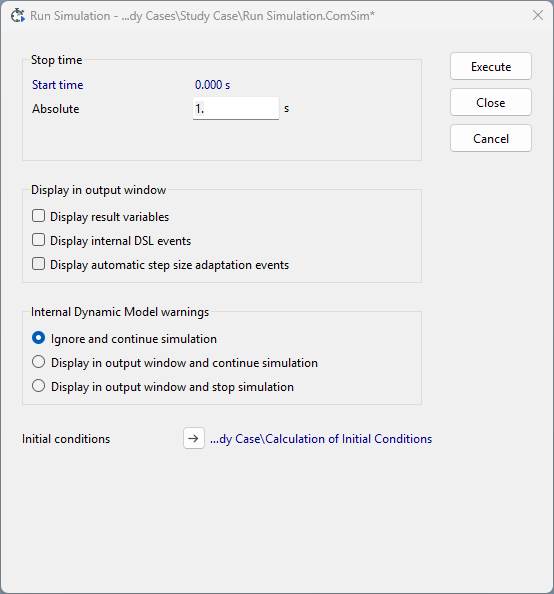
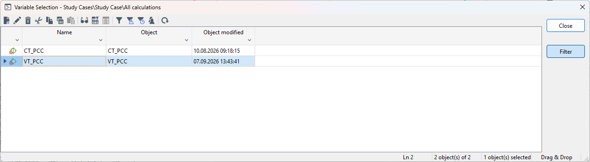

DIgSILENT PowerFactory
----------------------
After the power system with the integrated IEC 61400-27 DLL has been set up, the dynamic simulation can be performed.
Before starting the calculation, the approproate calculation settings must be configured.
By Selecting ``Calculation of Initial Conditions`` the ``Calculation of Initial Conditions`` dialog is opened, as shown in Figure 1.
For the simulation , the relevant settings are the use of the correct ``Simulation Method`` in this case ``Instantaneous values`` since 
a EMT simulation is carried out, and the correct Integration step size which needs to be less or equal the one from Matlab Simulink (see Figure 2).
In this example, an integration time step of 50 µs is used. 
The remaining parameters can be left at their default values.

.. container:: image-row

    ..  figure:: ./images/PowerFactory/SimulationSettings.png
        :alt: Opening the ``Calculation of Initial Conditions`` in DIgSILENT PowerFactory.
        :target: _images/SimulationSettings.png

        Figure 1: Opening the ``Calculation of Initial Conditions`` in DIgSILENT PowerFactory.

    ..  figure:: ./images/PowerFactory/SimulationSettingsStepsize.png
        :alt: Defining the ``Integration step size`` in the ``Calculation of Initial Conditions``.

        Figure 2: Defining the ``Integration step size`` in the ``Calculation of Initial Conditions``.

By clicking the ``Run Simulation`` menu one needs to define the ``Stop time`` of the considered simulation.
In this example, it is set to 1 s, as shown in Figure 3.
A EMT simulation can then be carried out by clicking ``Execute``.

    Figure 3: Final settings of the EMT simulation before simulation execution.

1. Load-Flow Calculation
^^^^^^^^^^^^^^^^^^^^^^^^
Before starting the transient simulation, a load-flow calculation can be performed to determine and verify the initial steady-state operating point of the power system.
By Selecting ``Calculate Load Flow`` or clicking ``Ctrl + F10``, the load-flow calculation is performed. 
The calculation results can be viewed in the ``Edit Result Variables`` menu.
The node results are shown in following table:

+---------------+-------+---------+-----------+
| Node          | Phase | V in pu | phi in °  | 
+===============+=======+=========+===========+
| InnerIBR      | R     | 1.0876  | 25.9      | 
+---------------+-------+---------+-----------+
| InnerIBR      | S     | 1.0876  | -94.1     |
+---------------+-------+---------+-----------+
| InnerIBR      | T     | 1.0876  | 145.9     |
+---------------+-------+---------+-----------+
| PCC           | R     | 1.0456  | 18.06     |
+---------------+-------+---------+-----------+
| PCC           | S     | 1.0456  | -101.89   |
+---------------+-------+---------+-----------+
| PCC           | T     | 1.0456  | 138.12    |
+---------------+-------+---------+-----------+
| InnerThevenin | R     | 1.0     | 0.0       |
+---------------+-------+---------+-----------+
| InnerThevenin | S     | 1.0     | -120.0    |
+---------------+-------+---------+-----------+
| InnerThevenin | T     | 1.0     | 120.0     |
+---------------+-------+---------+-----------+

The branch results are shown in following table:

+----------------------+----------+---------------+-------+---------+-----------+---------+-----------+
| Branch               | Node 1   | Node 2        | Phase | I in kA | phi in °  | P in MW | Q in Mvar | 
+======================+==========+===============+=======+=========+===========+=========+===========+
| Thevenin_Impedance   | PCC      | InnerThevenin | R     | 0.7039  | 6.8014    | 166.67  | 33.33     |
+----------------------+----------+---------------+-------+---------+-----------+---------+-----------+
| Thevenin_Impedance   | PCC      | InnerThevenin | S     | 0.7039  | -113.1986 | 166.67  | 33.33     |
+----------------------+----------+---------------+-------+---------+-----------+---------+-----------+
| Thevenin_Impedance   | PCC      | InnerThevenin | T     | 0.7039  | 126.8014  | 166.67  | 33.33     |
+----------------------+----------+---------------+-------+---------+-----------+---------+-----------+
| IBR_Impedance        | InnerIBR | PCC           | R     | 0.7039  | 6.8014    | 167.05  | 57.83     |
+----------------------+----------+---------------+-------+---------+-----------+---------+-----------+
| IBR_Impedance        | InnerIBR | PCC           | S     | 0.7039  | -113.1986 | 167.05  | 57.83     |
+----------------------+----------+---------------+-------+---------+-----------+---------+-----------+
| IBR_Impedance        | InnerIBR | PCC           | T     | 0.7039  | 126.8014  | 167.05  | 57.83     |
+----------------------+----------+---------------+-------+---------+-----------+---------+-----------+

The reference values for the converter at the PCC are 500 MW and 100 Mvar 
The load-flow results confirm that these reference values are represented by the operating point of the power system.
The active and reactive power values of the individual phasses add up to approximately 500 MW and 100 Mvar, respectively. 

2. Transient Simulation (EMT)
^^^^^^^^^^^^^^^^^^^^^^^^^^^^^
After the load-flow calculation has been succesfully completed, the transient simulation can be performed.
To analyze the simulation results, the signals to be recorded during the simulation must be defined.
By selecting ``Edit Result Variables``, the signals to be recorded can be configured, as shown in Figure 4.
In this example, the following signals are selected:
- the three phase voltages at the PCC (``PCC``)
- the three phase currents of branch ``IBR_Impedance`` at the PCC.
The active and reactive power are calculated afterwards

    Figure 4: Defining the ``Result Variables`` of the dynamic simulations.

The EMT simulation can then be started by clicking ``Execute`` in ``Run Simulation`` menu.
After the simulation has been completed, the results can be analyzed in a ``Plot Page``.

Figure 5 shows the three phase voltages at the PCC together with the amplitude of the voltage space vector. 
Figure 6 shows the three phase currents of branch ``IBR_Impedance`` together with the amplitude of the current space vector. 
Figure 7 shows the active and reactive power at the PCC.

.. container:: image-row

    ..  figure:: ./images/PowerFactory/PowerFactory_voltages.png
        :alt: Phase voltages at the PCC and the amplitude of the voltage space vector.
        :target: _images/PowerFactory_voltages.png

        Figure 5: Phase voltages at the PCC and the amplitude of the voltage space vector.

    
    ..  figure:: ./images/PowerFactory/PowerFactory_currents.png
        :alt: Phase currents of branch Z_IBR and the amplitude of the current space vector.
        :target: _images/PowerFactory_currents.png

        Figure 6: Phase currents of branch Z_IBR and the amplitude of the current space vector.

    ..  figure:: ./images/PowerFactory/PowerFactory_power.png
        :alt: Active and reactive power at the PCC.
        :target: _images/PowerFactory_power.png

        Figure 7: Active and reactive power at the PCC.

The simulation results show that the simulation starts directly from the load-flow operating point with a small initial transient oscillation.
During the fault, the voltage dip leads to an increase in current. This behavior is expected, as the IBR control system attempts to regulate active and reactive power during the voltage disturbance.
After the fault is cleared, the voltage, current, and power signals return to their initial steady-state operating points.

These results demonstrate that the IEC 61400-27 DLL has been successfully integrated into the DIgSILENT PowerFactory model and that communication between the power system model and the DLL is functioning as intended.

PSS®NETOMAC
-----------
After the power system with the integrated IEC 61400-27 DLL has been set up, the dynamic simulation can be performed.
Before starting the calculation, the approproate calculation settings must be configured.
By Selecting ``Calculate`` and ``Settings...`` the ``Calculation Settings`` dialog is opened, as shown in Figure 8.
For the dynamic simulation , the relevant settings are located in the sections ``Common`` → ``Basic Settings`` and ``Calculation`` → ``Dynamics``.
In the ``Basic Settings`` section, the parameter ``Network Representation`` must be set to ``Unbalanced without Coup.``, as shown in Figure 9.
With this setting, each phase of the power system is considered individually. 
This is required because the controlled voltage source in the model is implemented using individually controlled voltage sources for each phase.
The remaining parameters can be left at their default values.

.. container:: image-row

    ..  figure:: ./images/NETOMAC/Calculation_Settings_Open.png
        :alt: Opening the ``Calculation Settings`` in PSS®NETOMAC.
        :target: _images/Calculation_Settings_Open.png

        Figure 8: Opening the ``Calculation Settings`` in PSS®NETOMAC.

    ..  figure:: ./images/NETOMAC/Calculation_Settings_Basic_Settings.png
        :alt: Defining the ``Basic Settings`` in the ``Calculation Settings``.
        :target: _images/Calculation_Settings_Basic_Settings.png

        Figure 9: Defining the ``Basic Settings`` in the ``Calculation Settings``.

In the ``Dynamics`` settings, the type of simulation is selected using the parameter ``Program Section`` in the ``Control`` section. 
For an EMT simulation, the parameter must be set to ``Transient``, as shown in Figure 10.
The remaining parameters can be left at their devault valued.
In the ``Time`` section, the integration time step is defined. 
In this example, an integration time step of 50 µs is used. 
The ``Simulation Stop Time`` must also be specified. 
In this example, it is set to 1 s, as shown in Figure 11.
The remaining parameters can be left at their default values.

.. container:: image-row

    ..  figure:: ./images/NETOMAC/Calculation_Settings_Dynamics_Control.png
        :alt: Defining the ``Control`` settings for dynamic simulations.
        :target: _images/Calculation_Settings_Dynamics_Control.png

        Figure 10: Defining the ``Control`` settings for dynamic simulations.

    ..  figure:: ./images/NETOMAC/Calculation_Settings_Dyamic_Time.png
        :alt: Defining the ``Time`` settings for dynamic simulations.
        :target: _images/Calculation_Settings_Dyamic_Time.png

        Figure 11: Defining the ``Time`` settings for dynamic simulations.

1. Load-Flow Calculation
^^^^^^^^^^^^^^^^^^^^^^^^
Before starting the transient simulation, a load-flow calculation can be performed to determine and verify the initial steady-state operating point of the power system.
By Selecting ``Calculate`` → ``Power Flow``, the load-flow calculation is performed. 
The calculation results can be viewed in the ``Tabular View``.
The node results are shown in following table:

+------+-------+---------+-----------+
| Node | Phase | V in pu | phi in °  | 
+======+=======+=========+===========+
| Bus1 | R     | 1.0     | 0.0       | 
+------+-------+---------+-----------+
| Bus1 | S     | 1.0     | -120.0    |
+------+-------+---------+-----------+
| Bus1 | T     | 1.0     | 120.0     |
+------+-------+---------+-----------+
| Bus2 | R     | 1.0875  | 25.8966   |
+------+-------+---------+-----------+
| Bus2 | S     | 1.0875  | -94.1034  |
+------+-------+---------+-----------+
| Bus2 | T     | 1.0875  | 145.8966  |
+------+-------+---------+-----------+
| Bus3 | R     | 1.0456  | 18.1114   |
+------+-------+---------+-----------+
| Bus3 | S     | 1.0456  | -101.8886 |
+------+-------+---------+-----------+
| Bus3 | T     | 1.0456  | 138.1113  |
+------+-------+---------+-----------+

The branch results are shown in following table:

+--------+--------+--------+-------+---------+-----------+---------+-----------+
| Branch | Node 1 | Node 2 | Phase | I in kA | phi in °  | P in MW | Q in Mvar | 
+========+========+========+=======+=========+===========+=========+===========+
| Z_TH   | Bus1   | Bus2   | R     | 0.7039  | 6.8014    | -166.67 | -33.33    |
+--------+--------+--------+-------+---------+-----------+---------+-----------+
| Z_TH   | Bus1   | Bus2   | S     | 0.7039  | -113.1986 | -166.67 | -33.33    |
+--------+--------+--------+-------+---------+-----------+---------+-----------+
| Z_TH   | Bus1   | Bus2   | T     | 0.7039  | 126.8014  | -166.67 | -33.33    |
+--------+--------+--------+-------+---------+-----------+---------+-----------+
| Z_IBR  | Bus2   | Bus3   | R     | 0.7039  | 6.8014    | -167.05 | -57.83    |
+--------+--------+--------+-------+---------+-----------+---------+-----------+
| Z_IBR  | Bus2   | Bus3   | S     | 0.7039  | -113.1986 | -167.05 | -57.83    |
+--------+--------+--------+-------+---------+-----------+---------+-----------+
| Z_IBR  | Bus2   | Bus3   | T     | 0.7039  | 126.8014  | -167.05 | -57.83    |
+--------+--------+--------+-------+---------+-----------+---------+-----------+

The reference values for the converter at the PCC are 500 MW and 100 Mvar 
The load-flow results confirm that these reference values are represented by the operating point of the power system.
The active and reactive power values of the individual phasses add up to approximately 500 MW and 100 Mvar, respectively. 

2. Transient Simulation (EMT)
^^^^^^^^^^^^^^^^^^^^^^^^^^^^^
After the load-flow calculation has been succesfully completed, the transient simulation can be performed.
To analyze the simulation results, the signals to be recorded during the simulation must be defined.
By selecting ``Calculate`` → ``Plot Definition``, the signals to be recorded can be configured, as shown in Figure 12.
In this example, the following signals are selected:
- the three phase voltages at the PCC (``Bus2``)
- the three phase currents of branch ``Z_IBR`` at the PCC, 
- the active power of branch ``Z_IBR`` at the PCC, and 
- the reactive power of branch ``Z_IBR`` at the PCC.
  
The resulting ``.plo`` file is shown below: 

.. code-block:: netomac
   :linenos:
   
   $
   $ Header lines
   
   E        NEWFORM
   $
   $ Data output definition
   $1......12......23......3AA1....12....23....34....45....56....67...78...89...9ZZ
    Bus2                    R Bus2.R - V [pu]                                     1
    Bus2                    S Bus2.S - V [pu]                                     2
    Bus2                    T Bus2.T - V [pu]                                     3
    Bus2            Z_IBR    RZ_IBR.R, Bus2 - I [MVA]                             4
    Bus2            Z_IBR    SZ_IBR.S, Bus2 - I [MVA]                             5
    Bus2            Z_IBR    TZ_IBR.T, Bus2 - I [MVA]                             6
   PBus2            Z_IBR   1 Z_IBR, Bus2.1 - P [MW]                              7
   QBus2            Z_IBR   1 Z_IBR, Bus2.1 - Q [Mvar]                            8

.. container:: image-row

    ..  figure:: ./images/NETOMAC/Plot_Signals.png
        :alt: Defining the ``Control`` settings for dynamic simulations.
        :target: _images/Plot_Signals.png

        Figure 12: Defining the ``Control`` settings for dynamic simulations.

    ..  figure:: ./images/NETOMAC/Dynamic_Simulation.png
        :alt: Defining the ``Time`` settings for dynamic simulations.
        :target: _images/Dynamic_Simulation.png

        Figure 13: Defining the ``Time`` settings for dynamic simulations.

The EMT simulation can then be started by selecting ``Calculate`` → ``Dynamics (RMS/EMT)``.
After the simulation has been completed, the results can be analyzed in the ``Diagram View``.
New diagram pages can be created, and the recorded signals can be added from the ``Signal Explorer`` using drag and drop.

Figure 14 shows the three phase voltages at the PCC together with the amplitude of the voltage space vector. 
Figure 15 shows the three phase currents of branch ``Z_IBR`` together with the amplitude of the current space vector. 
Figure 16 shows the active and reactive power at the PCC.

.. container:: image-row

    ..  figure:: ./images/NETOMAC/PSSNETOMAC_voltages.png
        :alt: Phase voltages at the PCC and the amplitude of the voltage space vector.
        :target: _images/PSSNETOMAC_voltages.png

        Figure 14: Phase voltages at the PCC and the amplitude of the voltage space vector.

    
    ..  figure:: ./images/NETOMAC/PSSNETOMAC_currents.png
        :alt: Phase currents of branch Z_IBR and the amplitude of the current space vector.
        :target: _images/PSSNETOMAC_currents.png

        Figure 15: Phase currents of branch Z_IBR and the amplitude of the current space vector.

    ..  figure:: ./images/NETOMAC/PSSNETOMAC_power.png
        :alt: Active and reactive power at the PCC.
        :target: _images/PSSNETOMAC_power.png

        Figure 16: Active and reactive power at the PCC.

The simulation results show that the simulation starts directly from the load-flow operating point without significant oscillations.
During the fault, the voltage dip leads to an increase in current. This behavior is expected, as the IBR control system attempts to regulate active and reactive power during the voltage disturbance.
After the fault is cleared, the voltage, current, and power signals return to their initial steady-state operating points.

These results demonstrate that the IEC 61400-27 DLL has been successfully integrated into the PSS®NETOMAC model and that communication between the power system model and the DLL is functioning as intended.

PSCAD™ 
------
After the power system with the integrated IEC 61400-27 DLL has been set up, the dynamic simulation can be performed.
Before starting the calculation, the approproate calculation settings must be configured.
By Selecting ``Project`` the simulation settings menu opens, as shown in Figure 17.
Therein one has to set the ``Duration of Run`` (in this case 1 s) and the ``Solution Time Step`` (in this case 50 µs).
Afterwards the simulation can be started by returning to the ``Home`` menu and click ``Run`` (see Figure 18).

.. container:: image-row

    ..  figure:: ./images/PSCAD/ProjectSettings.png
        :alt: Opening the ``Project Settings`` in PSCAD™.
        :target: _images/ProjectSettings.png

        Figure 17: Opening the ``Project Settings`` in PSCAD™.
    
    ..  figure:: ./images/PSCAD/RunSimulation.png
        :alt: Opening the ``Home`` menu to run Simulation in PSCAD™.
        :target: _images/RunSimulation.png

        Figure 18: Opening the ``Home`` menu to run Simulation in PSCAD™.

1. Load-Flow Calculation
^^^^^^^^^^^^^^^^^^^^^^^^
Since PSCAD™ is purely an EMT simulation tool, it does not support load flow calculations. Therefore, this section is left blank.

2. Transient Simulation (EMT)
^^^^^^^^^^^^^^^^^^^^^^^^^^^^^
Since PSCAD™ does not perform load-flow calculations, the voltage source starts at 0 kV at time 0 or at −1 simulation time step, depending on the source settings, and then ramps them up to their rated voltages.
To analyze the simulation results, the signals to be recorded during the simulation must be defined.
By adding ``master:pgb`` components to the PSCAD™ model and connecting signal names to them, the signals to be recorded can be configured, as shown in Figure 19.
Within the ``Project`` menu one can define that these recorded signals shall be exported as a file (e.g. as a .out), as shown in Figure 20.
In this example, the following signals are selected:
- the three phase voltages at the PCC (``PCC``)
- the three phase currents of branch ``Z_IBR`` at the PCC, 
- the active power of branch ``Z_IBR`` at the PCC, and 
- the reactive power of branch ``Z_IBR`` at the PCC.
  
.. container:: image-row

    ..  figure:: ./images/PSCAD/ResultMonitoring.png
        :alt: Defining the signals to be recorded in PSCAD™.
        :target: _images/ResultMonitoring.png

        Figure 19: Defining the signals to be recorded in PSCAD™.

    ..  figure:: ./images/PSCAD/ProjectSettings.png
        :alt: Setting up the result export in the ``Project Settings`` in PSCAD™.
        :target: _images/ProjectSettings.png

        Figure 20: Setting up the result export in the ``Project Settings`` in PSCAD™.

The EMT simulation can then be started
After the simulation has been completed, the results can be analyzed in the ``Polymeters`` or within the exported ``.out``-file.

Figure 21 shows the three phase voltages at the PCC together with the amplitude of the voltage space vector. 
Figure 22 shows the three phase currents of branch ``Z_IBR`` together with the amplitude of the current space vector. 
Figure 23 shows the active and reactive power at the PCC.

.. container:: image-row

    ..  figure:: ./images/PSCAD/PSCAD_voltages.png
        :alt: Phase voltages at the PCC and the amplitude of the voltage space vector.
        :target: _images/PSCAD_voltages.png

        Figure 21: Phase voltages at the PCC and the amplitude of the voltage space vector.

    
    ..  figure:: ./images/PSCAD/PSCAD_currents.png
        :alt: Phase currents of branch Z_IBR and the amplitude of the current space vector.
        :target: _images/PSCAD_currents.png

        Figure 22: Phase currents of branch Z_IBR and the amplitude of the current space vector.

    ..  figure:: ./images/PSCAD/PSCAD_power.png
        :alt: Active and reactive power at the PCC.
        :target: _images/PSCAD_power.png

        Figure 23: Active and reactive power at the PCC.

The simulation results show that the simulation starts at an initial voltage of 0 kV, causing a transient oscillation. However, the system reaches steady state within a short period of time.
During the fault, the voltage dip leads to an increase in current. This behavior is expected, as the IBR control system attempts to regulate active and reactive power during the voltage disturbance.
After the fault is cleared, the voltage, current, and power signals return to their initial steady-state operating points.

These results demonstrate that the IEC 61400-27 DLL has been successfully integrated into the PSCAD™ model and that communication between the power system model and the DLL is functioning as intended.

Benchmarking of the Power System Simulation Tools
------

This section compares the simulation results obtained with the integrated IEC 61400-27 DLL in the selected power system simulation tools. 
In addition, the results are compared with those of the reference model implemented in MATLAB®/Simulink®.

1. Benchmark Model in MATLAB®/Simulink®
^^^^^^^^^^^^^^^^^^^^^^^^

To provide a comprehenxive analysis of the IEC 61400-27 DLL integration into the selected power system simulation tools, the DLL-based simulation results are compared with the results of a reference model implemented in MATLAB®/Simulink®.
The reference model is located in the ``MATLAB_Simulink`` directory. 
It integrates the IBR control model into a power system consisting of the electrical converter model and a Thevenin equivalent.
The power system is modeled in the Laplace domain without using power system libraries such as the Specialized Power Systems library or Simscape™.

Since the integration of the DLL into the power system simulation introduces a one-step time delay at both the DLL input and output, corresponding time delays are also inculded in the MATLAB®/Simulink® model.
This ensures that the same dynamic behavior is represented in all simulation environments.

Figure 24 shows the three phase voltages at the PCC together with the amplitude of the voltage space vector. 
Figure 25 shows the three phase currents of branch ``Z_IBR`` together with the amplitude of the current space vector. 
Figure 26 shows the active and reactive power at the PCC.

.. container:: image-row

    ..  figure:: ./images/Benchmarking/Simulink_voltages.png
        :alt: Phase voltages at the PCC and the amplitude of the voltage space vector.
        :target: _images/Simulink_voltages.png

        Figure 24: Phase voltages at the PCC and the amplitude of the voltage space vector.

    
    ..  figure:: ./images/Benchmarking/Simulink_currents.png
        :alt: Phase currents of branch Z_IBR and the amplitude of the current space vector.
        :target: _images/Simulink_currents.png

        Figure 25: Phase currents of branch Z_IBR and the amplitude of the current space vector.

    ..  figure:: ./images/Benchmarking/Simulink_power.png
        :alt: Active and reactive power at the PCC.
        :target: _images/Simulink_power.png

        Figure 26: Active and reactive power at the PCC.

The simulation results show that the simulation starts directly from the load-flow operating point without significant oscillations.
During the fault, the voltage dip leads to an increase in current. This behavior is expected, as the IBR control system attempts to regulate active and reactive power during the voltage disturbance.
After the fault is cleared, the voltage, current, and power signals return to their initial steady-state operating points.

2. Comparison between Power System Simulation Tools
^^^^^^^^^^^^^^^^^^^^^^^^

The IEC 61400-27 DLL integration into DIgSILENT PowerFactory, PSS®NETOMAC and PSCAD™ is evaulated by comparing the simulation results obtained for an identical fault scenario.
In addition, the results from the power system simulation tools are compared with those of the MATLAB®/Simulink® benchmark model.

Figure 27 shows the amplitude of the voltage space vector for all simulation tools.
Figure 28 shows the amplitude of the current space vector for all simulation tools.
Figure 29 shows the active power at the point of common coupling (PCC) for all simulation tools.
Figure 30 shows the reavtive power at the PCC for all simulation tools.

.. container:: image-row

    ..  figure:: ./images/Benchmarking/comparison_voltage_space_vector_zoom.png
        :alt: Amplitude of the voltage space vector.
        :target: _images/comparison_voltage_space_vector_zoom.png

        Figure 27: Amplitude of the voltage space vector.

    
    ..  figure:: ./images/Benchmarking/comparison_current_space_vector_zoom.png
        :alt: PAmplitude of the current space vector.
        :target: _images/comparison_current_space_vector_zoom.png

        Figure 28: Amplitude of the current space vector.

.. container:: image-row

    ..  figure:: ./images/Benchmarking/comparison_active_power_zoom.png
        :alt: Active  power at the PCC.
        :target: _images/comparison_active_power_zoom.png

        Figure 29: Active power at the PCC.

    ..  figure:: ./images/Benchmarking/comparison_reactive_power_zoom.png
        :alt: Reactive power at the PCC.
        :target: _images/comparison_reactive_power_zoom.png

        Figure 30: Reactive power at the PCC.

The simulation results show that, after reaching the load-flow operating point, all simulation tools exhibit nearly identical behavior.
When the fault occurs, the voltage dip and the resulting response are nearly identical in all simulation tools.
The same applies to the fault-clearing process.
Only negligible differences in the amplitude of the resulting oscillations can be observed.

For a quantitative comparison, the root mean square error (RSME) is calculated between the simulation results of the individual tools.
The RSME is defined as

.. math::

\mathrm{RMSE}

\sqrt{
\frac{1}{N}
\sum_{k=1}^{N}
\left[
x_{1,k}-x_{2,k}
\right]^2
}.

Here, x_{1,t} denotes the value of one simulation result at the time point t_k, x_2,k denotes the corresponding value of the other simulation result, and N represents the number of data points considered.
The evaluation is performed over the defined time interval from 0.2 s to 1.0 s after all simulation tools have reached their operating point.

To improve the comparability of quantities with different magnitudes, a relative RMSE can additionally be calculated as

.. math::

\mathrm{RMSE}_{\mathrm{rel}}

\frac{\mathrm{RMSE}}{x_{\mathrm{ref}}}
\cdot 100,%.

Here, x_ref is the selected reference value. Since the quantities are expressed in per unit (pu) and the reference value is 1 pu, the relative RMSE is obtained directly by multiplying the RMSE by 100.

The resulting values for the voltage space vector magnitude is shown in the following table:  

+------------------------+-------------------+------------------------+-------------+--------+
|                        | MATLAB®/Simulink® | DIgSILENT PowerFactory | PSS®NETOMAC | PSCAD™ |
+------------------------+-------------------+------------------------+-------------+--------+
| MATLAB®/Simulink®      |                   | 0.646%                 | 0.361%      | 0.343% |
+------------------------+-------------------+------------------------+-------------+--------+
| DIgSILENT PowerFactory | 0.646%            |                        | 0.318%      | 0.306% |
+------------------------+-------------------+------------------------+-------------+--------+
| PSS®NETOMAC            | 0.361%            | 0.318%                 |             | 0.121% |
+------------------------+-------------------+------------------------+-------------+--------+
| PSCAD™                 | 0.343%            | 0.306%                 | 0.121%      |        |
+------------------------+-------------------+------------------------+-------------+--------+

The resulting values for the current space vector magnitude is shown in the following table:  

+------------------------+-------------------+------------------------+-------------+--------+
|                        | MATLAB®/Simulink® | DIgSILENT PowerFactory | PSS®NETOMAC | PSCAD™ |
+------------------------+-------------------+------------------------+-------------+--------+
| MATLAB®/Simulink®      |                   | 0.740%                 | 0.363%      | 0.370% |
+------------------------+-------------------+------------------------+-------------+--------+
| DIgSILENT PowerFactory | 0.740%            |                        | 0.378%      | 0.371% |
+------------------------+-------------------+------------------------+-------------+--------+
| PSS®NETOMAC            | 0.363%            | 0.378%                 |             | 0.031% |
+------------------------+-------------------+------------------------+-------------+--------+
| PSCAD™                 | 0.370%            | 0.371%                 | 0.031%      |        |
+------------------------+-------------------+------------------------+-------------+--------+

The results show that the relative RMSE is below 1% in all cases, indicating negligible differences between the simulation results of the individual tools.
The deviations between PSS®NETOMAC and PSCAD™ are generally smaller than those between the MATLAB®/Simulink® benchmark model or DIgSILENT PowerFactory and the other simulation tools.

