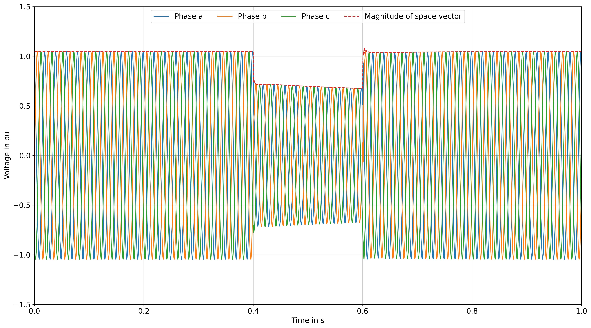
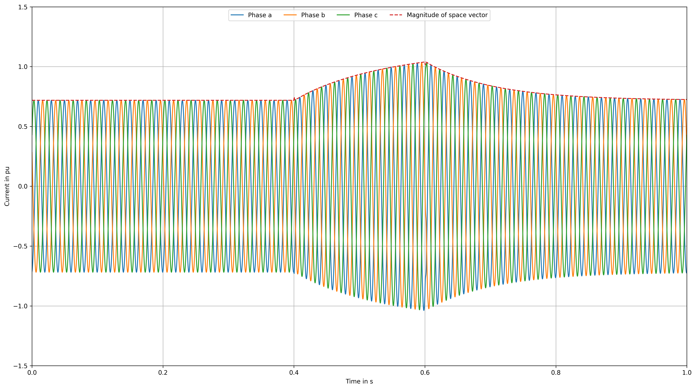
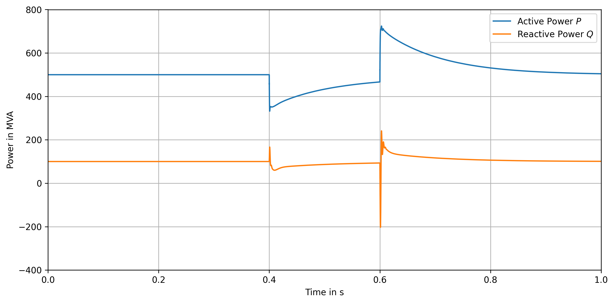

DIgSILENT PowerFactory
----------------------

..  figure:: ./images/PowerFactory/PowerFactory_voltages.png
      :alt: Phase voltages at the PCC and the amplitude of the voltage space vector.

      Figure 56: Phase voltages at the PCC and the amplitude of the voltage space vector.

   
..  figure:: ./images/PowerFactory/PowerFactory_currents.png
      :alt: Phase currents of branch Z_IBR and the amplitude of the current space vector.

      Figure 57: Phase currents of branch Z_IBR and the amplitude of the current space vector.

..  figure:: ./images/PowerFactory/PowerFactory_power.png
      :alt: Active and reactive power at the PCC.

      Figure 58: Active and reactive power at the PCC.

PSS®NETOMAC
-----------
After the power system with the integrated IEC 61400-27 DLL has been set up, the dynamic simulation can be performed.
Before starting the calculation, the approproate calculation settings must be configured.
By Selecting ``Calculate`` and ``Settings...`` the ``Calculation Settings`` dialog is opened, as shown in Figure 50.
For the dynamic simulation , the relevant settings are located in the sections ``Common`` → ``Basic Settings`` and ``Calculation`` → ``Dynamics``.
In the ``Basic Settings`` section, the parameter ``Network Representation`` must be set to ``Unbalanced without Coup.``, as shown in Figure 51.
With this setting, each phase of the power system is considered individually. 
This is required because the controlled voltage source in the model is implemented using individually controlled voltage sources for each phase.
The remaining parameters can be left at their default values.

.. grid:: 2

   .. grid-item::
      ..  figure:: ./images/NETOMAC/Calculation_Settings_Open.png
            :alt: Opening the ``Calculation Settings`` in PSS®NETOMAC.

            Figure 50: Opening the ``Calculation Settings`` in PSS®NETOMAC.

   .. grid-item::
      ..  figure:: ./images/NETOMAC/Calculation_Settings_Basic_Settings.png
            :alt: Defining the ``Basic Settings`` in the ``Calculation Settings``.

            Figure 51: Defining the ``Basic Settings`` in the ``Calculation Settings``.

In the ``Dynamics`` settings, the type of simulation is selected using the parameter ``Program Section`` in the ``Control`` section. 
For an EMT simulation, the parameter must be set to ``Transient``, as shown in Figure 52.
The remaining parameters can be left at their devault valued.
In the ``Time`` section, the integration time step is defined. 
In this example, an integration time step of 50 µs is used. 
The ``Simulation Stop Time`` must also be specified. 
In this example, it is set to 1 s, as shown in Figure 53.
The remaining parameters can be left at their default values.

.. grid:: 2

   .. grid-item::
      ..  figure:: ./images/NETOMAC/Calculation_Settings_Dynamics_Control.png
            :alt: Defining the ``Control`` settings for dynamic simulations.

            Figure 52: Defining the ``Control`` settings for dynamic simulations.

   .. grid-item::
      ..  figure:: ./images/NETOMAC/Calculation_Settings_Dyamic_Time.png
            :alt: Defining the ``Time`` settings for dynamic simulations.

            Figure 53: Defining the ``Time`` settings for dynamic simulations.

1. Load-Flow Calculation
^^^^^^^^^^^^^^^^^^^^^^^^^^^^^^^^^

Before starting the transient simulation, a load-flow calculation can be performed to determine and verify the initial steady-state operating point of the power system.
By Selecting ``Calculate`` → ``Power Flow``, the load-flow calculation is performed. 
The calculation results can be viewed in the ``Tabular View``.
The node results are shown in following table:

+------+-------+---------+-----------+
| Node | Phase | V in pu | phi in °  | 
+======+=======+=========+===========+
| Bus1 | R     | 1.0     | 0.0       | 
+------+-------+---------+-----------+
| Bus1 | S     | 1.0     | -120.0    |
+------+-------+---------+-----------+
| Bus1 | T     | 1.0     | 120.0     |
+------+-------+---------+-----------+
| Bus2 | R     | 1.0875  | 25.8966   |
+------+-------+---------+-----------+
| Bus2 | S     | 1.0875  | -94.1034  |
+------+-------+---------+-----------+
| Bus2 | T     | 1.0875  | 145.8966  |
+------+-------+---------+-----------+
| Bus3 | R     | 1.0456  | 18.1114   |
+------+-------+---------+-----------+
| Bus3 | S     | 1.0456  | -101.8886 |
+------+-------+---------+-----------+
| Bus3 | T     | 1.0456  | 138.1113  |
+------+-------+---------+-----------+

The branch results are shown in following table:

+--------+--------+--------+-------+---------+-----------+---------+-----------+
| Branch | Node 1 | Node 2 | Phase | I in kA | phi in °  | P in MW | Q in Mvar | 
+========+========+========+=======+=========+===========+=========+===========+
| Z_TH   | Bus1   | Bus2   | R     | 0.7039  | 6.8014    | -166.67 | -33.33    |
+--------+--------+--------+-------+---------+-----------+---------+-----------+
| Z_TH   | Bus1   | Bus2   | S     | 0.7039  | -113.1986 | -166.67 | -33.33    |
+--------+--------+--------+-------+---------+-----------+---------+-----------+
| Z_TH   | Bus1   | Bus2   | T     | 0.7039  | 126.8014  | -166.67 | -33.33    |
+--------+--------+--------+-------+---------+-----------+---------+-----------+
| Z_IBR  | Bus2   | Bus3   | R     | 0.7039  | 6.8014    | -167.05 | -57.83    |
+--------+--------+--------+-------+---------+-----------+---------+-----------+
| Z_IBR  | Bus2   | Bus3   | S     | 0.7039  | -113.1986 | -167.05 | -57.83    |
+--------+--------+--------+-------+---------+-----------+---------+-----------+
| Z_IBR  | Bus2   | Bus3   | T     | 0.7039  | 126.8014  | -167.05 | -57.83    |
+--------+--------+--------+-------+---------+-----------+---------+-----------+

The reference values for the converter at the PCC are 500 MW and 100 Mvar 
The load-flow results confirm that these reference values are represented by the operating point of the power system.
The active and reactive power values of the individual phasses add up to approximately 500 MW and 100 Mvar, respectively. 

2. Transient Simulation (EMT)
^^^^^^^^^^^^^^^^^^^^^^^^^^^^^^^^^

After the load-flow calculation has been succesfully completed, the transient simulation can be performed.
To analyze the simulation results, the signals to be recorded during the simulation must be defined.
By selecting ``Calculate`` → ``Plot Definition``, the signals to be recorded can be configured, as shown in Figure 54.
In this example, the following signals are selected:
- the three phase voltages at the PCC (``Bus2``)
- the three phase currents of branch ``Z_IBR`` at the PCC, 
- the active power of branch ``Z_IBR`` at the PCC, and 
- the reactive power of branch ``Z_IBR`` at the PCC.
  
The resulting ``.plo`` file is shown below: 

.. code-block:: netomac
   :linenos:
   
   $
   $ Header lines
   
   E        NEWFORM
   $
   $ Data output definition
   $1......12......23......3AA1....12....23....34....45....56....67...78...89...9ZZ
    Bus2                    R Bus2.R - V [pu]                                     1
    Bus2                    S Bus2.S - V [pu]                                     2
    Bus2                    T Bus2.T - V [pu]                                     3
    Bus2            Z_IBR    RZ_IBR.R, Bus2 - I [MVA]                             4
    Bus2            Z_IBR    SZ_IBR.S, Bus2 - I [MVA]                             5
    Bus2            Z_IBR    TZ_IBR.T, Bus2 - I [MVA]                             6
   PBus2            Z_IBR   1 Z_IBR, Bus2.1 - P [MW]                              7
   QBus2            Z_IBR   1 Z_IBR, Bus2.1 - Q [Mvar]                            8

.. grid:: 2

   .. grid-item::
      ..  figure:: ./images/NETOMAC/Plot Signals.png
            :alt: Defining the ``Control`` settings for dynamic simulations.

            Figure 54: Defining the ``Control`` settings for dynamic simulations.

   .. grid-item::
      ..  figure:: ./images/NETOMAC/Dynamic_Simulation.png
            :alt: Defining the ``Time`` settings for dynamic simulations.

            Figure 55: Defining the ``Time`` settings for dynamic simulations.

The EMT simulation can then be started by selecting ``Calculate`` → ``Dynamics (RMS/EMT)``.
After the simulation has been completed, the results can be analyzed in the ``Diagram View``.
New diagram pages can be created, and the recorded signals can be added from the ``Signal Explorer`` using drag and drop.

Figure 56 shows the three phase voltages at the PCC together with the amplitude of the voltage space vector. 
Figure 57 shows the three phase currents of branch ``Z_IBR`` together with the amplitude of the current space vector. 
Figure 58 shows the active and reactive power at the PCC.

      Figure 56: Phase voltages at the PCC and the amplitude of the voltage space vector.

   

      Figure 57: Phase currents of branch Z_IBR and the amplitude of the current space vector.

      Figure 58: Active and reactive power at the PCC.

The simulation results shows that the simulation starts directly from the load-flow operation point without significant oscillations. 
During the fault condition, the voltage dip leads to an increase in the current.
This behavior is expected because the IBR control system attempts to control the active and reactive power during the voltage disturbance.
After the faul ist cleared, the voltage, current, and power signals return to their initial steady-state operation point.

These results demonstrate that the IEC 61400-27 DLL has been successfully integrated into the PSS®NETOMAC model and that die communication between the power system model and the DLL is working as intended.

PSCAD™ 
------

..  figure:: ./images/PSCAD/PSCAD_voltages.png
      :alt: Phase voltages at the PCC and the amplitude of the voltage space vector.

      Figure 56: Phase voltages at the PCC and the amplitude of the voltage space vector.

   
..  figure:: ./images/PSCAD/PSCAD_currents.png
      :alt: Phase currents of branch Z_IBR and the amplitude of the current space vector.

      Figure 57: Phase currents of branch Z_IBR and the amplitude of the current space vector.

..  figure:: ./images/PSCAD/PSCAD_power.png
      :alt: Active and reactive power at the PCC.

      Figure 58: Active and reactive power at the PCC.