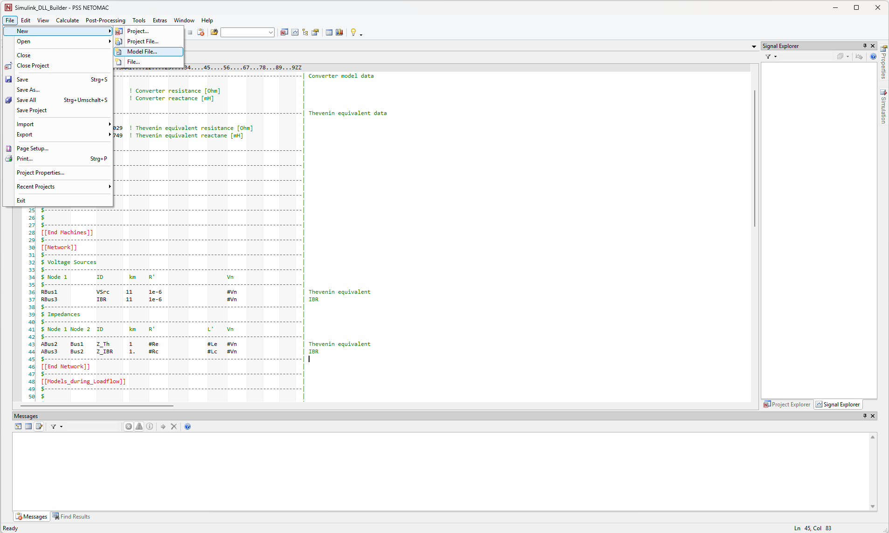
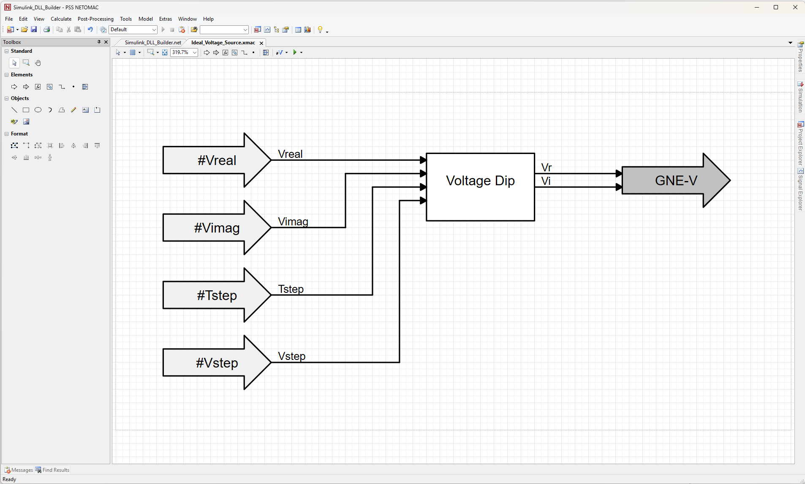
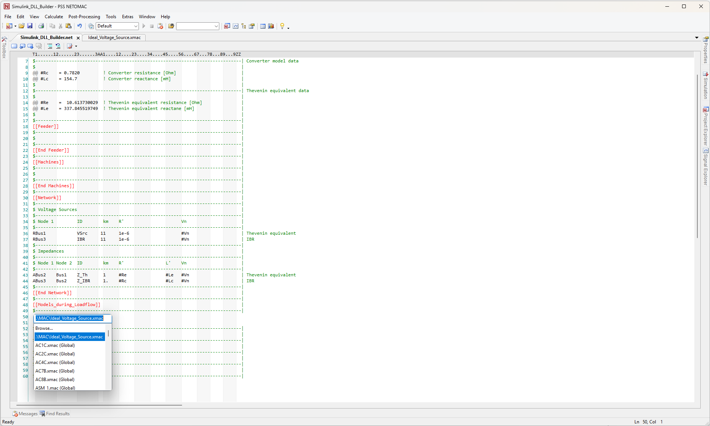
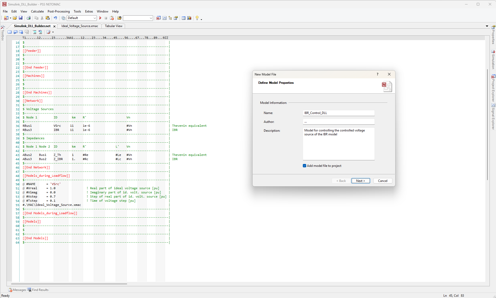
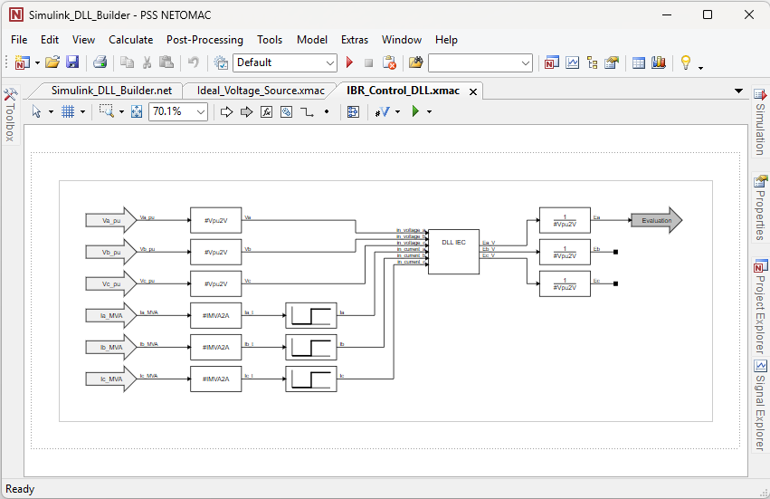
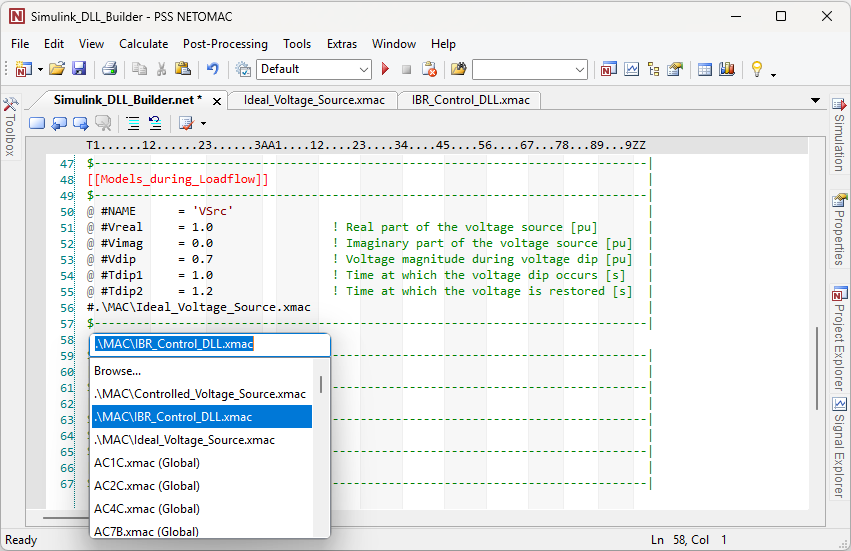

##################
DLL in PSS®Netomac
##################

This chapter describes the step-by-step integration of an IEC 61400-27 DLL into PSS®NETOMAC. 
It first introduces the required software and prerequisites, followed by the setup of the example grid model. 
The subsequent sections describe how to integrate the DLL and establish the required signal connections. 
The model is created from an empty PSS®NETOMAC project.

Prerequisites
-------------
- PSS®NETOMAC (tested for version 22.0)
- IEC 61400-27 DLL (e.g. the one from the `example <FEHLT>`)

Building a model for later DLL integration from scratch 
-------------------------------------------------------
The final model consists of a regulated ideal voltage source and an internal resistance connected at the point of common coupling (PCC). 
The PCC is supplied by a Thevenin equivalent representing the upstream grid. 
The individual components are added and configured step by step, starting from the blank PSS®NETOMAC project.
For this example, the ``Sections`` template is used. 
The empty project file (.net) is shown below:

.. code-block:: netomac
   :linenos:

   $-------------------------------------------------------------------------------|
   ****                                                                            |
   $-------------------------------------------------------------------------------|
   $                                                                               |
   $-------------------------------------------------------------------------------|
   [[Feeder]]                                                                      |
   $-------------------------------------------------------------------------------|
   $                                                                               |
   $-------------------------------------------------------------------------------|
   [[End Feeder]]                                                                  |
   $-------------------------------------------------------------------------------|
   [[Machines]]                                                                    |
   $-------------------------------------------------------------------------------|
   $                                                                               |
   $-------------------------------------------------------------------------------|
   [[End Machines]]                                                                |
   $-------------------------------------------------------------------------------|
   [[Network]]                                                                     |
   $-------------------------------------------------------------------------------|
   $                                                                               |
   $-------------------------------------------------------------------------------|
   [[End Network]]                                                                 |
   $-------------------------------------------------------------------------------|
   [[Models_during_Loadflow]]                                                      |
   $-------------------------------------------------------------------------------|
   $                                                                               |
   $-------------------------------------------------------------------------------|
   [[End Models_during_Loadflow]]                                                  |
   $-------------------------------------------------------------------------------|
   [[Models]]                                                                      |
   $-------------------------------------------------------------------------------|
   $                                                                               |
   $-------------------------------------------------------------------------------|
   [[End Models]]                                                                  |
   $-------------------------------------------------------------------------------|

1. Defining the Global Parameters
^^^^^^^^^^^^^^^^^^^^^^^^^^^^^^^^^

Before defining the power system in the .net file, the global parameters are defined in the first section of the empty project. 
These global parameters can subsequently be used for the power system and the associated models. The relevant power system parameters are defined as global parameters. 
These include the nominal voltage, the converter impedance, and the impedance of the Thevenin equivalent.

A nominal voltage ``#Vn`` of 400 kV is used. 
The converter impedance is defined by a resistance ``#Rc`` of 0.7820 Ω and an inductance ``#Lc`` of 154.7 mH.
The impedance of the Thevenin equivalent is defined by a resistance ``#Re`` of 10.613730029 Ω and an inductance ``#Le`` of 337.845519749 mH.

The resulting part of the parameter section is shown below:

.. code-block:: netomac
   :linenos:

   $-------------------------------------------------------------------------------| Grid data  
   $                                                                               |
   @@ #Vn    = 400            ! Nominal voltage [kV]                               |
   $                                                                               |
   $-------------------------------------------------------------------------------| Converter model data  
   $                                                                               |
   @@ #Rc    = 0.7820         ! Converter resistance [Ohm]                         |
   @@ #Lc    = 154.7          ! Converter reactance [mH]                           | 
   $                                                                               |
   $-------------------------------------------------------------------------------| Thevenin equivalent data 
   $                                                                               |
   @@ #Re    =  10.613730029  ! Thevenin equivalent resistance [Ohm]               |
   @@ #Le    = 337.845519749  ! Thevenin equivalent reactane [mH]                  |
   $                                                                               |
   $-------------------------------------------------------------------------------| 

2. Defining the power system
^^^^^^^^^^^^^^^^^^^^^^^^^^^^^^^^^

..  figure:: 
    :alt: Defining the power system.

    Figure 4: Defining the power system.

The power system consists of a Thevenin equivalent and a controlled voltage source, as described above.
In PSS®NETOMAC, the power system is defined in the ``[[Network]]`` section. 
A voltage source is modeled by an ``R``-line with neglibily small resistance. 
The voltage source is subsequently defined for this branch using a ``SOURCE-V`` or ``GNE-V`` model in the ``[[Models_during_Loadflow]`` section.
An impedance is modeled by an ``A``-line with the corresponding resistance in Ω and inductance in mH. 
For this power system, two ``R``-lines and two ``A``-lines are therefore required. 
One ``R``-line and one ``A``-line represent the Thevenin equivalent, using the parameters ``#Rc`` and ``#Lc``.
The second ``R``-line and one ``A``-line represent the converter and its impedance, using the parameters ``#Rc`` and ``#Lc``.
The impedances and nominal voltage are specified in the global parameters.

The resulting ``[[Network]]`` section is shown below:

.. code-block:: netomac
   :linenos:

   $-------------------------------------------------------------------------------| 
   [[Network]]                                                                     |
   $-------------------------------------------------------------------------------| 
   $ Voltage Sources                                                               |
   $-------------------------------------------------------------------------------|
   $ Node 1         ID        km    R'                      Vn                     |
   $-------------------------------------------------------------------------------|
   RBus1            VSrc     11     1e-6                    #Vn                    | Thevenin equivalent  
   RBus3            IBR      11     1e-6                    #Vn                    | IBR
   $-------------------------------------------------------------------------------| 
   $ Impedances                                                                    |
   $-------------------------------------------------------------------------------|
   $ Node 1 Node 2  ID        km    R'                L'    Vn                     |
   $-------------------------------------------------------------------------------|
   ABus2    Bus1    Z_Th      1     #Re               #Le   #Vn                    | Thevenin equivalent  
   ABus3    Bus2    Z_IBR     1.    #Rc               #Lc   #Vn                    | IBR
   $-------------------------------------------------------------------------------| 
   [[End Network]]                                                                 |
   $-------------------------------------------------------------------------------| 

3. Defining the Model for the Ideal Voltage Source
^^^^^^^^^^^^^^^^^^^^^^^^^^^^^^^^^^^^^^^^^^^^^^^^^^^^^^^^^^^^^^^^^^^^^^^

The voltage source of the Thevenin equivalent is intended to operate as an ideal voltage source with a constant RMS voltage corresponding to the nominal voltage ``#Vn`` under steady-state conditions.
For the fault scenario, a voltage dip is implemented, allowing the RMS voltage to be reduced to, for example, 0.7 pu at a specified time and restored to the nominal voltage at another specified time.
The voltage source is modeled as a three-phase voltage source. 
For this purpose, a ``GNE-V`` model is created.
The ``GNE-V`` model requires the voltage output to be specified as the real and imaginary parts of the voltage phasor.
The voltage phasor is represented in a rotating reference frame rotating at the nominal frequency. 
Therefore the output values are defined as constant quantities in the rotating reference frame rather than as time-varying quantities. 

To create a new ``GNE-V`` model, a new model file is created (see Figure 1). 
The model properties, such as ``Name``, ``Author`` and ``Description``, are then specified (see Figure 2).
With the ``Add model file to project`` option enabled, the model file is saved in the ``./MAC`` subdirectory.
In the next step, the page settings for the model file are defined (see Figure 3).

    Figure 1: Creating a new empty model file (.xmac) in PSS®Netomac.

.. grid:: 2

   .. grid-item::

      ..  figure:: ./images/NETOMAC/Create_Ideal_Voltage_Source_xmac.png
            :alt: Define settings of new empty model file (.xmac) in PSS®Netomac.

            Figure 2: Define settings of new empty model file (.xmac) in PSS®Netomac.

   .. grid-item::

       ..  figure:: ./images/NETOMAC/Define_Page_Size_Ideal_Voltage_Source_xmac.png
            :alt: Define page settings of new empty model file (.xmac) in PSS®Netomac.

            Figure 3: Define page settings of new empty model file (.xmac) in PSS®Netomac.
   
Defining the Model Variables
""""""""""""""""""""""""""""""

Five variables are required to implement the described behavior of the ideal voltage source, including the fault condition.
The variables ``#Vreal`` and ``#Vimag`` represent the real and imaginary parts of the ideal voltage source under steady-state conditions. 
During the load-flow calculation, the ideal voltage source operates as a slack bus.
Therefore, the voltage magnitude and phase angle are defined by the voltage source.
Accordingly, the values ``#Vreal`` = 1.0 pu and ``#Vimag`` = 0.0 pu correspond to a voltage magnitude of 1.0 pu and a phase angle of 0° during the load-flow calculation.

For the fault condition, the parameter ``#Vdip`` specifies the voltage magnitude during the voltage dip.
The parameter ``#Tdip1`` specifies the time at which the voltage dip occurs, while ``#Tdip2`` specifies the time at which the voltage is restored to ist nominal value.

The model variables are shown in following table:

+-----------+--------+---------+---------+-------------+-------------------------------------------------+
| Variables | Value  | Minimum | Maximum | Debug Value | Description                                     |
+===========+========+=========+=========+=============+=================================================+
| #Vreal    | 1.0    | 0.0     | 1E6     | 1.0         | Real part of the ideal voltage source [pu]      |
+-----------+--------+---------+---------+-------------+-------------------------------------------------+
| #Vimag    | 0.0    | 0.0     | 1E6     | 0.0         | Imaginary part of the ideal voltage source [pu] |
+-----------+--------+---------+---------+-------------+-------------------------------------------------+
| #Vdip     | 0.7    | 0.0     | 1E6     | 0.7         | Voltage magnitude during the voltage dip [pu]   |
+-----------+--------+---------+---------+-------------+-------------------------------------------------+
| #Tdip1    | 0.1    | 0.0     | 1E6     | 0.1         | Time at which the voltage dip occurs [s]        |
+-----------+--------+---------+---------+-------------+-------------------------------------------------+
| #Tdip2    | 0.2    | 0.0     | 1E6     | 0.1         | Time at which the voltage is restored [s]       |
+-----------+--------+---------+---------+-------------+-------------------------------------------------+

By selecting ``Variables``, the parameters described above can be defined as new model variables (see Figure 4 and Figure 5). 

.. grid:: 2

   .. grid-item::

      ..  figure:: ./images/NETOMAC/Defining_Variables_in_xmac.png
            :alt: Defining variables in model files (.xmac).

            Figure 4: Defining variables in model files (.xmac).

   .. grid-item::

       ..  figure:: ./images/NETOMAC/Defining_Variables_Ideal_Voltage_Source.png
            :alt: Define variables for ideal voltage source model.

            Figure 5: Define variables for ideal voltage source model..

Defining the Inputs
""""""""""""""""""""""""""""""

The behavior of the model depends only on the defined model variables; therefore, no measurements from the grid are required. 
The model variables are defined as inputs to the models. 
By selecting ``Insert Input``, a ``Constant`` input block can be added (see Figure 6).
The ``Output`` name of the block is specified in the topology section (see Figure 7), while the corresponding variable is specified as the ``Constant Value`` in the ``Data`` section of the block (see Figure 8).

.. grid:: 3

   .. grid-item::

       ..  figure:: ./images/NETOMAC/Defining_Constant_Input.png
            :alt: Creating a constant input block in model files (.xmac).

            Figure 6: Creating a constant input block in model files (.xmac).

   .. grid-item::

        ..  figure:: ./images/NETOMAC/Defining_Topology_Of_Constant_Input.png
            :alt: Define topology of constant input block in model files (.xmac).

            Figure 7: Define topology constant input block in model files (.xmac).

    .. grid-item::

        ..  figure:: ./images/NETOMAC/Defining_Data_Of_Constant_Input.png
            :alt: Define data of constant input block in model files (.xmac).

            Figure 8: Define data of constant input block in model files (.xmac).     

Defining the Fault Definition
""""""""""""""""""""""""""""""

The fault logic can be implemented using an IF statement in FORTRAN code. 
As described above, the voltage source operates with the output values of ``#Vreal`` and ``#Vimag`` outside the time intervall between ``#Tdip1`` and ``#Tdip2``. 
During the voltage dip, the voltage magnitude is set to the value specified by ``#Vstep``.

By selecting the ``FORTRAN`` block via ``Insert Special Block``, a user-defined IF statement can be implemented (see Figure 9). 
The implemented logic is shown below : 

.. code-block:: netomac
   :linenos:

   IF ((TIME.LT.Tdip1).OR.(TIME.GT.Tdip2)) THEN
    Vr = Vreal
    Vi = Vimag
   ELSE
    Vr = Vstep
    Vi = Vimag
   ENDIF

For the ``FORTRAN`` block, the output signal names ``Vr`` and ``Vi`` has to be defined (see Figure 10).
Figure 11 shows the resulting control model.

.. grid:: 2

   .. grid-item::

       ..  figure:: ./images/NETOMAC/Insert_FORTRAN_Block.png
            :alt: Creating an IF statement in model files (.xmac).

            Figure 9: Creating an IF statement in model files (.xmac).

   .. grid-item::

        ..  figure:: ./images/NETOMAC/Voltage_Dip_Logic.png
            :alt: Define the fault logic as IF statement in FORTRAN.

            Figure 10: Define the fault logic as IF statement in FORTRAN. 

Defining the Output
""""""""""""""""""""""""""""""

The output block of the models defines the model type. 
As described above, the ``GNE-V`` output block is used.
By selecting ``Insert Output``, the ``GNE-V`` output block is created (see Figure 11).
In the topology section of the block, the ``Branch for applied voltage``, i.e., the ``R``-line created in the ``[[Network]]`` section, is specified (see Figure 12). 
In this example, the variable ``#NAME`` is used, which represents automatically the name of the model. 
Therefore, the model name must be identical to the corresponding branch name.
In the ``Data`` section the ``Integration type`` is set to ``During network iteration`` (see Figure 13).

.. grid:: 3

   .. grid-item::

       ..  figure:: ./images/NETOMAC/Insert_GNE_V_Output.png
            :alt: Creating a ``GNE-V`` output block in model files (.xmac).

            Figure 11: Creating a ``GNE-V`` output block in model files (.xmac).

   .. grid-item::

        ..  figure:: ./images/NETOMAC/GNE_V_Output_Topology.png
            :alt: Defining the topology data of the ``GNE-V`` output block.

            Figure 12: Defining the topology of the ``GNE-V`` output block.

    .. grid-item::

        ..  figure:: ./images/NETOMAC/GNE_V_Output_Data.png
            :alt: Defining the data of the ``GNE-V`` output block.

            Figure 13: Defining the data of the ``GNE-V`` output block.    

Figure 14 shows the finalized model file for the ideal voltage source of the Thevenin equivalent.

    Figure 14: Resulting ideal voltage source model (.xmac) with fault logic.

Integration of the model into the power system
""""""""""""""""""""""""""""""

To integrate the created model into the power system, the model must be added to the ``.net`` file in the ``[[Models_during_Loadflow]]`` section.
By right-clicking and selecting ``Insert Model``, the model can be added by specifying the path to the model file (see Figure 15).
PSS®NETOMAC automatically creates the variable list for the model.
The Parameter ``#NAME`` must be set to the same name as the branch of the voltage source, ``VSrc``.

    Figure 15: Integration of the ideal voltage source model (.xmac) into the power system.

The resulting ``[[Models_during_Loadflow]]`` section with the integrated model is shown below:

.. code-block:: netomac
   :linenos:

   [[Models_during_Loadflow]]                                                      |
   $-------------------------------------------------------------------------------| 
   @ #NAME      = 'VSrc'                                                           |
   @ #Vreal     = 1.0                 ! Real part of ideal voltage source [pu]     |
   @ #Vimag     = 0.0                 ! Imaginary part of id. volt. source [pu]    |
   @ #Vstep     = 0.7                 ! Step of real part of id. volt. source [pu] |
   @ #Tstep     = 0.1                 ! Time of voltage step [pu]                  |
   #.\MAC\Ideal_Voltage_Source.xmac                                                |
   $-------------------------------------------------------------------------------| 
   [[End Models_during_Loadflow]]                                                  |

4. Defining the Models for Integration of the DLL
^^^^^^^^^^^^^^^^^^^^^^^^^^^^^^^^^^^^^^^^^^^^^^^^^^^^^^^^^^^^^^^^^^^^^^^

The controlled voltage source is operated by an IBR control system implemented in the IEC 62400-27 DLL. 
Two models are required to integrate the DLL into the power system.
One model represents the upper-level model in which the DLL is integrated.
This model is represented by an ``EVALUATE`` model.
The second model represents the interface to the power system for each phase a, b and c.
It is represented by a ``MIMO`` model (Mulitple Inupt, Mulitple Output), which is implemented using three ``SOURCE-V`` output blocks within a signle model file.
The ``MIMO`` model receives the outpus signals from the upper-level model and applies the corresponding signals to the voltage sources.

The model file for the ``EVALUATE`` model is created in a similar way toe the model described in the previous section (see Figure 16).

    Figure 16: Define settings of new ``EVALUATE`` model file (.xmac) in PSS®Netomac.

Defining the Inputs
""""""""""""""""""""""""""""""

The DLL requires the phase voltages at the point of common coupling (PCC) and the phase currents injected into the PCC. 
Therefore, three voltage measurements and three current measurements are required.
By selecting ``Insert Input``, a ``Network Signal Remote`` block is created (see Figure 17).
The ``Output`` name of the block is specified in the topology section, while the type of measurement type is specified as ``Function`` in the ``Data`` section of the block.
For the voltage measurent the function ``Voltage magnitude [pu]`` is required (see Figure 18). 
For the current measurement, the function ``Current magnitude [kA]`` is required (see Figure 19).
By enabling the ``Individual phase definition`` option, the measurement can be assigned to an individual phase.

.. grid:: 3

   .. grid-item::

       ..  figure:: ./images/NETOMAC/Create_Input_IBR_DLL_Model.png
            :alt: Creating a measurement input block in model files (.xmac).

            Figure 17: Creating a measurement input block in model files (.xmac).

   .. grid-item::

        ..  figure:: ./images/NETOMAC/Create_Input_IBR_DLL_Model_Voltage_Function.png
            :alt: Defining the voltage measurement as measurement type.

            Figure 18: Defining the voltage measurement as measurement type.

    .. grid-item::

        ..  figure:: ./images/NETOMAC/Create_Input_IBR_DLL_Model_Current_Function.png
            :alt: Defining the current measurement as measurement type.

            Figure 19: Defining the current measurement as measurement type.

One input block is created for each measurement. 
Therefore, the model contains six input blocks (see Figure 20).

.. grid:: 2

    .. grid-item::

        ..  figure:: ./images/NETOMAC/Result_Inputs_IBR_DLL_Model.png
            :alt: ``EVALUATE`` model with six measurement input blocks.

            Figure 20: ``EVALUATE`` model with six measurement input blocks.

    .. grid-item::

        ..  figure:: ./images/NETOMAC/Variables_IBR_DLL_Model.png
            :alt: Defining the measurement data in variables in model files (.xmac).

            Figure 21: Defining the measurement data in variables in model files (.xmac).

For the inputs, PSS®Netomac automatically creates variables for defining the measurement data (see Figure 21). 
The automatically created variables can be configured under ``Variables`` using the values specified in the following table: 

+-----------+----------+---------+---------+-------------+-----------------------------------------------+
| Variables | Value    | Minimum | Maximum | Debug Value | Description                                   |
+===========+==========+=========+=========+=============+===============================================+
| #Va_pu.N  | 'Bus2'   |         |         | 'Bus2'      | Node for Voltage measurement - phase a        |
+-----------+----------+---------+---------+-------------+-----------------------------------------------+
| #Va_pu.P  | 'R'      |         |         | 'R'         | Phase for Voltage measurement - phase a       |
+-----------+----------+---------+---------+-------------+-----------------------------------------------+
| #Vb_pu.N  | 'Bus2'   |         |         | 'Bus2'      | Node for Voltage measurement - phase b        |
+-----------+----------+---------+---------+-------------+-----------------------------------------------+
| #Vb_pu.P  | 'S'      |         |         | 'S'         | Phase for Voltage measurement - phase b       |
+-----------+----------+---------+---------+-------------+-----------------------------------------------+
| #Vc_pu.N  | 'Bus2'   |         |         | 'Bus2'      | Node for Voltage measurement - phase c        |
+-----------+----------+---------+---------+-------------+-----------------------------------------------+
| #Vc_pu.P  | 'T'      |         |         | 'T'         | Phase for Voltage measurement - phase c       |
+-----------+----------+---------+---------+-------------+-----------------------------------------------+
| #Ia_MVA.N | 'Bus2'   |         |         | 'Bus2'      | Node for Current measurement - phase a        |
+-----------+----------+---------+---------+-------------+-----------------------------------------------+
| #Ia_MVA.B | 'Z_IBR'  |         |         | 'Z_IBR'     | Branch for Current measurement - phase a      |
+-----------+----------+---------+---------+-------------+-----------------------------------------------+
| #Ia_MVA.P | 'R'      |         |         | 'R'         | Phase for Current measurement - phase a       |
+-----------+----------+---------+---------+-------------+-----------------------------------------------+
| #Ib_MVA.N | 'Bus2'   |         |         | 'Bus2'      | Node for Current measurement - phase b        |
+-----------+----------+---------+---------+-------------+-----------------------------------------------+
| #Ib_MVA.B | 'Z_IBR'  |         |         | 'Z_IBR'     | Branch for Current measurement - phase b      |
+-----------+----------+---------+---------+-------------+-----------------------------------------------+
| #Ib_MVA.P | 'S'      |         |         | 'S'         | Phase for Current measurement - phase b       |
+-----------+----------+---------+---------+-------------+-----------------------------------------------+
| #Ic_MVA.N | 'Bus2'   |         |         | 'Bus2'      | Node for Current measurement - phase c        |
+-----------+----------+---------+---------+-------------+-----------------------------------------------+
| #Ic_MVA.B | 'Z_IBR'  |         |         | 'Z_IBR'     | Branch for Current measurement - phase c      |
+-----------+----------+---------+---------+-------------+-----------------------------------------------+
| #Ic_MVA.P | 'T'      |         |         | 'T'         | Phase for Current measurement - phase c       |
+-----------+----------+---------+---------+-------------+-----------------------------------------------+

Defining the conversion factors
""""""""""""""""""""""""""""""

Since the IBR control implemented in the DLL uses volts (V) for voltage and amperes (A) for current, the input values must be converted from pu and MVA to V and A, respectively.
The conversion factors are defined under ``Equations...`` (see Figure 22 and 23). 

.. grid:: 2

   .. grid-item::

       ..  figure:: ./images/NETOMAC/Equations.png
            :alt: Creating equations in model files (.xmac).

            Figure 22: Creating equations in model files (.xmac).

   .. grid-item::

        ..  figure:: ./images/NETOMAC/Equations_Fortran.png
            :alt: Defining the parameters for voltage and current unit conversion in FORTRAN.

            Figure 23: Defining the parameters for voltage and current unit conversion in FORTRAN.

The equations are shown below:

.. code-block:: netomac
   :linenos:

   $ Factor for conversion voltage from pu to V                                    
    #Vpu2V    = SQRT(2) / SQRT(3) * #Vn * 1e3                                      

   $ Factor for conversion voltage from MVA to A 
    #IMVA2A   = SQRT(2) / SQRT(3) / #Vn * 1e3  

The parameters ``#Vpu2V`` and ``#IMVA2A`` are applied using ``Gain`` blocks, which are added via ``Insert Block`` (see Figure 24).
The parameter ``#Vpu2V`` is used for all voltage inputs (see Figure 25), while ``#IMVA2A`` is used for all current inputs (see Figure 26).

.. grid:: 3

   .. grid-item::

        ..  figure:: ./images/NETOMAC/Create_Gain.png
            :alt: Creating a new ``Gain`` block in model files (.xmac).

            Figure 24: Creating a new ``Gain`` block in model files (.xmac).

    .. grid-item::

        ..  figure:: ./images/NETOMAC/Create_Gain_Voltage_data.png
            :alt: Define the gain value for voltage conversion.

            Figure 25: Define the gain value for voltage conversion.

    .. grid-item::

        ..  figure:: ./images/NETOMAC/Create_Gain_Current_data.png
            :alt: Define the gain value for current conversion.

            Figure 26: Define the gain value for current conversion.

Integration of the DLL model
""""""""""""""""""""""""""""""

The DLL model is integrated into the model by selecting ``Insert Special Block`` and then selecting the ``DLL IEC`` block (see Figure 27).
The path to the DLL file (.dll) must be specified. 
PSS®NETOMAC automatically creates an additional model file for the DLL interface in the project subdirectory ``./MAC``. 
In the ``Topology`` section, the output signal names are defined (see Figure 28).
The DLL parameters are listed in the ``Data`` section (see Figure 29).
These parameters are assigned default values automatically.

.. grid:: 3

   .. grid-item::

        ..  figure:: ./images/NETOMAC/Create_DLL_Block.png
            :alt: Creating a ``DLL IEC`` block in model files (.xmac).

            Figure 27: Creating a ``DLL IEC`` block in model files (.xmac).

    .. grid-item::

        ..  figure:: ./images/NETOMAC/Create_DLL_Block_topology.png
            :alt: Defining the output signal names of the ``DLL IEC`` block.

            Figure 28: Defining the output signal names of the ``DLL IEC`` block.

    .. grid-item::

        ..  figure:: ./images/NETOMAC/Create_DLL_Block_data.png
            :alt: Defining the parameters of the ``DLL IEC``.

            Figure 29: Defining the parameters of the ``DLL IEC``.

The output signals of the DLL must be converted to the PSS®NETOMAC format required for integration with the voltage source. 
Therefore, ``Gain`` blocks are added to apply the required conversion factors (see Figure 30). 
For this conversion, the reciprocal value of ``#Vpu2V`` is required (see Figure 31).

.. grid:: 2

   .. grid-item::

        ..  figure:: 
            :alt: Creating the ``Gain`` block for reciprocal voltage conversion.

            Figure 30: Creating the ``Gain`` block for reciprocal voltage conversion.

    .. grid-item::

        ..  figure:: 
            :alt: Define the gain value for reciprocal voltage conversion.

            Figure 31: Define the gain value for reciprocal voltage conversion.

Defining the Output
""""""""""""""""""""""""""""""

By selecting ``Insert Output``, the ``EVALUATE`` output block is created (see Figure 32).
In the ``Data`` section, the ``Integration type`` is set to ``During network iteration`` (see Figure 33).

.. grid:: 2

   .. grid-item::

        ..  figure:: ./images/NETOMAC/Create_Output_DLL_Block.png
            :alt: Creating a ``EVALUATE`` output block in model files (.xmac).

            Figure 32: Creating a ``EVALUATE`` output block in model files (.xmac).

    .. grid-item::

        ..  figure:: ./images/NETOMAC/Create_Output_DLL_Data.png
            :alt: Defining the data of the ``EVALUATE`` output block.  

            Figure 33: Defining the data of the ``EVALUATE`` output block.  

Figure 34 shows the finalized model file for the DLL integration.

    Figure 34: Resulting IBR control model (.xmac) with integrated DLL.

Integration of the model into the power system
""""""""""""""""""""""""""""""

To integrate the created model into the power system, the model must be added to the ``.net`` file in the ``[[Models_during_Loadflow]]`` section.
By right-clicking and selecting ``Insert Model``, the model can be added by specifying the path to the model file (see Figure 35).
PSS®NETOMAC automatically creates the variable list for the model.
The Parameter ``#NAME`` can be freely chosen and does not need to match a specific branch name.

    Figure 35: Integration of the IBR control model (.xmac) into the power system.

The resulting ``[[Models_during_Loadflow]]`` section with the integrated models is shown below:

.. code-block:: netomac
   :linenos:

   [[Models_during_Loadflow]]                                                      |
   $-------------------------------------------------------------------------------| 
   @ #NAME      = 'VSrc'                                                           |
   @ #Vreal     = 1.0                 ! Real part of ideal voltage source [pu]     |
   @ #Vimag     = 0.0                 ! Imaginary part of id. volt. source [pu]    |
   @ #Vstep     = 0.7                 ! Step of real part of id. volt. source [pu] |
   @ #Tstep     = 0.1                 ! Time of voltage step [pu]                  |
   #.\MAC\Ideal_Voltage_Source.xmac                                                |
   $-------------------------------------------------------------------------------| 
   @ #NAME      = 'IBR'                                                            |
   @ #Va_pu.N   = 'Bus2'              ! Node for Voltage measurement - phase a     |
   @ #Va_pu.P   = 'R'                 ! Phase for Voltage measurement - phase a    |
   @ #Vb_pu.N   = 'Bus2'              ! Node for Voltage measurement - phase b     |
   @ #Vb_pu.P   = 'S'                 ! Phase for Voltage measurement - phase b    |
   @ #Vc_pu.N   = 'Bus2'              ! Node for Voltage measurement - phase c     |
   @ #Vc_pu.P   = 'T'                 ! Phase for Voltage measurement - phase c    |
   @ #Ia_MVA.N  = 'Bus2'              ! Node for Current measurement - phase a     |
   @ #Ia_MVA.B  = 'Z_IBR'             ! Branch for Current measurement - phase a   |
   @ #Ia_MVA.P  = 'R'                 ! Phase for Current measurement - phase a    |
   @ #Ib_MVA.N  = 'Bus2'              ! Node for Current measurement - phase b     |
   @ #Ib_MVA.B  = 'Z_IBR'             ! Branch for Current measurement - phase b   |
   @ #Ib_MVA.P  = 'S'                 ! Phase for Current measurement - phase b    |
   @ #Ic_MVA.N  = 'Bus2'              ! Node for Current measurement - phase c     |
   @ #Ic_MVA.B  = 'Z_IBR'             ! Branch for Current measurement - phase c   |
   @ #Ic_MVA.P  = 'T'                 ! Phase for Current measurement - phase c    |
   #.\MAC\IBR_Control_DLL.xmac                                                     |
   $-------------------------------------------------------------------------------|
   [[End Models_during_Loadflow]]                                                  |

5. Defining the Model for the Controlled Voltage Source
^^^^^^^^^^^^^^^^^^^^^^^^^^^^^^^^^^^^^^^^^^^^^^^^^^^^^^^^^^^^^^^^^^^^^^^

A ``MIMO`` model (Mulitple Input, Multiple Output) is created to provide the interface betwwen the DLL model and the voltage source.
Three ``SOURCE-V`` output blocks are used to implement the the ``MIMO`` model.
Each output block represents one phase (a, b, or c).
During the load-flow calculation, a voltage phasor with real and imaginary part is given to each output block. 
Initially, the DLL output is bypassed, and the rotating load-flow voltage values are directly applied to the voltage source until the DLL is ready for operation.
The ``MIMO`` model file is created in a similar way to the models described in the previous sections (see Figure 36).

..  figure:: 
    :alt: Define settings of new ``MIMO`` model file (.xmac) in PSS®Netomac.

    Figure 36: Define settings of new ``MIMO`` model file (.xmac) in PSS®Netomac.

Defining the Model Parameters
""""""""""""""""""""""""""""""

To implement the described behavior of the voltage source, the following parameters with default values are required.

+-----------+---------+---------+---------+-------------+---------------------------------------------------+
| Variables | Value   | Minimum | Maximum | Debug Value | Description                                       |
+===========+=========+=========+=========+=============+===================================================+
| #Model    | 'IBR'   |         |         | 'IBR        | Model Name of the IBR Control Model               |
+-----------+---------+---------+---------+-------------+---------------------------------------------------+
| #Sig_a    | 'Ea_pu' |         |         | 'Ea_pu'     | Signal Name of phase a of the IBR Control Model   |
+-----------+---------+---------+---------+-------------+---------------------------------------------------+
| #Sig_b    | 'Eb_pu' |         |         | 'Eb_pu'     | Signal Name of phase b of the IBR Control Model   |
+-----------+---------+---------+---------+-------------+---------------------------------------------------+
| #Sig_c    | 'Ec_pu' |         |         | 'Ec_pu'     | Signal Name of phase c of the IBR Control Model   |
+-----------+---------+---------+---------+-------------+---------------------------------------------------+
| #Vmag     | 1.08753 | 0.0     | 1E3     | 1.08753     | Load-flow voltage magnitude [pu]                  |
+-----------+---------+---------+---------+-------------+---------------------------------------------------+
| #Vang     | 25.8966 | 0.0     | 360     | 25.8966     | Load-flow voltage angle [°]                       |
+-----------+---------+---------+---------+-------------+---------------------------------------------------+
| #Tfrz     | 1.5e-5  | 0.0     | 1E6     | 0.1         | Freezing Time at dynamic start for bypass DLL [s] |
+-----------+---------+---------+---------+-------------+---------------------------------------------------+ 
 
By selecting ``Variables``, the parameters described above can be defined as new model variables (see Figure 37). 

Defining the Inputs
""""""""""""""""""""""""""""""

The model requires the output of the IBR control model, which provide the voltage signals for the voltage source.
By selecting ``Insert Input``, a ``Model Variable`` input block is created (see Figure 38 and 39).
The  ``Output`` name of the block is specified in the topology section, while the ``Model type``, ``Model name`` and ``Output name`` is specified in the ``Data`` section (see Figure 40).
The ``Model Type`` is set to ``EVALUATE``.
For the ``Model name``, the parameter ``#Model`` is used.
The parameters ``#Sig_a``, ``#Sig_b`` and ``#Sig_c`` are used for the ``Output name`` of phases a, b, and c, respectively.

.. grid:: 3

   .. grid-item::

        ..  figure:: 
            :alt: Creating a ``Model Variable`` input block in model files (.xmac)

            Figure 38: Creating a ``Model Variable`` input block in model files (.xmac)

    .. grid-item::

        ..  figure:: 
            :alt: Defining a ``Model Variable`` input block for each phase.

            Figure 39: Defining a ``Model Variable`` input block for each phase.

    .. grid-item::

        ..  figure:: 
            :alt: Defining the data of the ``Model Variable`` input block.

            Figure 40: Defining the data of the ``Model Variable`` input block.

Defining the bypass of the DLL
""""""""""""""""""""""""""""""

The DLL is bypassed during the load-flow calculation and at the beginning of the dynamic simulation until the time ``#Tfrz`` is reached.
During the load-flow calculation, the voltage phasor for each phase is required as an output, inculding its real and imaginary components. 
Therefore, the load-flow voltage phasor is calculated from the magnitude and angle specified by the parameters ``#Vmag`` and ``#Vang``.

At the beginning of the dynamic simulation, the load-flow voltage phasors are rotated to generate the corresponding EMT signals. 
The imaginary part of the output block is not used during the dynamic simulation. 

This behavior is implemented using an IF statement in FORTRAN code.
As described above, the voltage source uses the values specified by ``#Vmag`` and ``#Vang`` during the load-flow calculation (``BOSL_MODE`` = 1) and at the beginning of dynamic simulation until ``#Tfrz`` is reached.

By selecting the ``FORTRAN`` block via ``Insert Special Block``, a user-defined IF statement can be implemented (see Figure 41). 
The implemented logic is shown below : 

.. code-block:: netomac
    :linenos:

   IF ((BOSL_MODE.EQ.1).OR.(TIME.LE.Tfrz)) THEN
    wta = #Vang + 360 * FNOM * TIME
    wtb = #Vang + 360 * FNOM * TIME - 120
    wtc = #Vang + 360 * FNOM * TIME - 240
    
    Ea_r = #Vmag * COS(wt)
    Ea_i = #Vmag * SIN(wt)  
    Eb_r = #Vmag * COS(wt)
    Eb_i = #Vmag * SIN(wt)  
    Ec_r = #Vmag * COS(wt)
    Ec_i = #Vmag * SIN(wt)      
   ELSE 
    Ea_r = Ea
    Eb_r = Eb
    Ec_r = Ec
   ENDIF

..  figure:: 
    :alt: Define the DLL bypass logic as IF statement in FORTRAN.

    Figure 41: Define DLL bypass logic as IF statement in FORTRAN. 

Defining the Output
""""""""""""""""""""""""""""""

By selecting ``Insert Output``, the ``SOURCE-V`` output block is created (see Figure 42).
In the ``Topology`` section of the block, the ``Branch for applied voltage``, i.e., the ``R``-line created in the ``[[Network]]`` section, is specified (see Figure 43). 
In this example, the variable ``#NAME`` is used, which automatically represents the name of the model. 
Therefore, the model name must be identical to the corresponding branch name.
In the ``Data`` section the ``Integration type`` is set to ``During network iteration`` (see Figure 44).

.. grid:: 3

   .. grid-item::

       ..  figure:: 
            :alt: Creating a ``SOURCE-V`` output block in model files (.xmac).

            Figure 42: Creating a ``SOURCE-V`` output block in model files (.xmac).

   .. grid-item::

        ..  figure:: 
            :alt: Defining the topology data of the ``SOURCE-V`` output block.

            Figure 43: Defining the topology of the ``SOURCE-V`` output block.

    .. grid-item::

        ..  figure:: 
            :alt: Defining the data of the ``SOURCE-V`` output block.

            Figure 44: Defining the data of the ``SOURCE-V`` output block.    

Figure 45 shows the finalized model file for the ideal voltage source of the Thevenin equivalent.

..  figure:: 
    :alt: Resulting ideal voltage source model (.xmac) with bypass function.

    Figure 45: Resulting voltage source model (.xmac) with bypass function.

Integration of the model into the power system
""""""""""""""""""""""""""""""

To integrate the created model into the power system, the model must be added to the ``.net`` file in the ``[[Models_during_Loadflow]]`` section.
By right-clicking and selecting ``Insert Model``, the model can be added by specifying the path to the model file (see Figure 46).
PSS®NETOMAC automatically creates the variable list for the model.
The Parameter ``#NAME`` must be set to the same name as the branch of the voltage source, ``IBR``.

    Figure 46: Integration of the voltage source model (.xmac) into the power system.

The resulting ``[[Models_during_Loadflow]]`` section with the integrated model is shown below:

.. code-block:: netomac
   :linenos:

   [[Models_during_Loadflow]]                                                      |
   $-------------------------------------------------------------------------------| 
   @ #NAME      = 'VSrc'                                                           |
   @ #Vreal     = 1.0                 ! Real part of ideal voltage source [pu]     |
   @ #Vimag     = 0.0                 ! Imaginary part of id. volt. source [pu]    |
   @ #Vstep     = 0.7                 ! Step of real part of id. volt. source [pu] |
   @ #Tstep     = 0.1                 ! Time of voltage step [pu]                  |
   #.\MAC\Ideal_Voltage_Source.xmac                                                |
   $-------------------------------------------------------------------------------| 
   [[End Models_during_Loadflow]]                                                  |

Simulation using the IEC 61400-27 DLL
-------------------------------------------------------