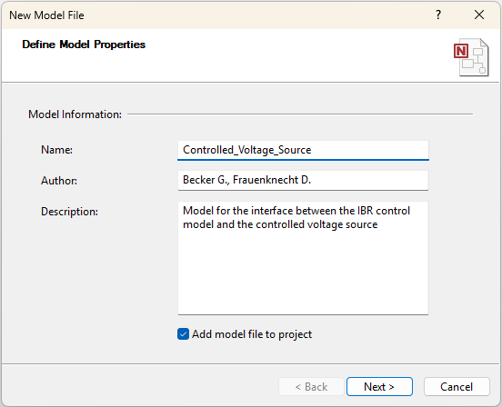
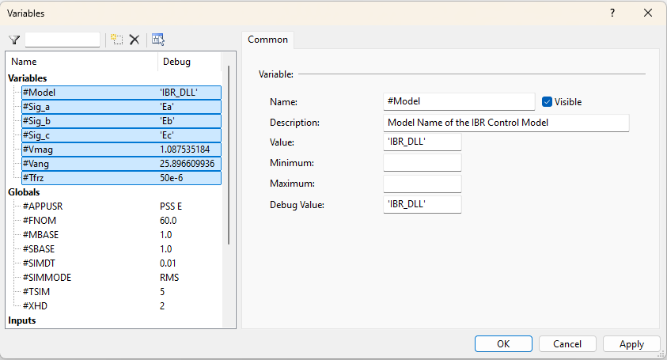
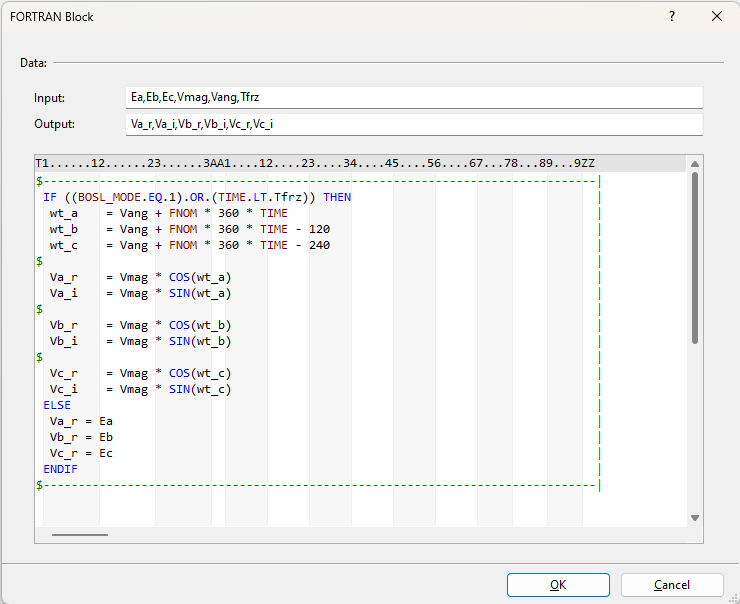
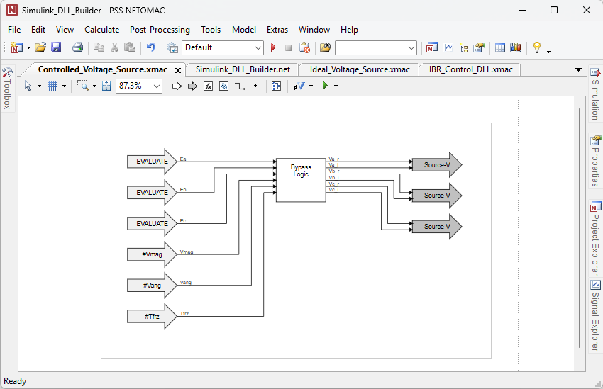
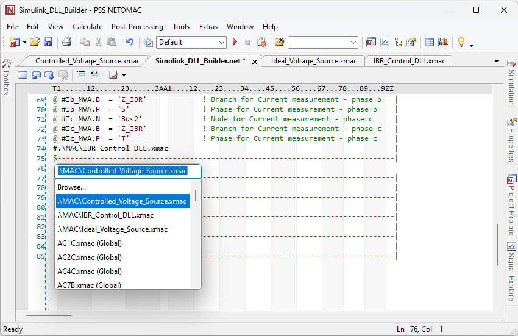

##################
DLL Integration in PSS®NETOMAC
##################

This chapter describes the step-by-step integration of an IEC 61400-27 DLL into PSS®NETOMAC. 
It introduces the required software and prerequisites, explains how to create the example power-system model, 
and describes the integration of the DLL together with the required signal interfaces.

The model is created from an empty PSS®NETOMAC project.

Prerequisites
-------------
The following software and components are required:
- PSS®NETOMAC (tested for version 22.0)
- IEC 61400-27 DLL (e.g. the one from the `example <FEHLT>`)

Building a Model for Subsequent DLL Integraion  
-------------------------------------------------------
The final model consists of a controlled ideal voltage source with an internal impedance connected to the point of common coupling (PCC). 
The PCC is supplied by a Thevenin equivalent representing the upstream grid. 
The individual components are added and configured step by step, starting from an empty PSS®NETOMAC project.
For this example, the ``Sections`` template is used. 
The empty project file (.net) is shown below:

.. code-block:: netomac
   :linenos:

   $-------------------------------------------------------------------------------|
   ****                                                                            |
   $-------------------------------------------------------------------------------|
   $                                                                               |
   $-------------------------------------------------------------------------------|
   [[Feeder]]                                                                      |
   $-------------------------------------------------------------------------------|
   $                                                                               |
   $-------------------------------------------------------------------------------|
   [[End Feeder]]                                                                  |
   $-------------------------------------------------------------------------------|
   [[Machines]]                                                                    |
   $-------------------------------------------------------------------------------|
   $                                                                               |
   $-------------------------------------------------------------------------------|
   [[End Machines]]                                                                |
   $-------------------------------------------------------------------------------|
   [[Network]]                                                                     |
   $-------------------------------------------------------------------------------|
   $                                                                               |
   $-------------------------------------------------------------------------------|
   [[End Network]]                                                                 |
   $-------------------------------------------------------------------------------|
   [[Models_during_Loadflow]]                                                      |
   $-------------------------------------------------------------------------------|
   $                                                                               |
   $-------------------------------------------------------------------------------|
   [[End Models_during_Loadflow]]                                                  |
   $-------------------------------------------------------------------------------|
   [[Models]]                                                                      |
   $-------------------------------------------------------------------------------|
   $                                                                               |
   $-------------------------------------------------------------------------------|
   [[End Models]]                                                                  |
   $-------------------------------------------------------------------------------|

1. Defining the Global Parameters
^^^^^^^^^^^^^^^^^^^^^^^^^^^^^^^^^

Before defining the power system in the ``.net`` file, the global parameters are defined in the first section of the project file. 
These global parameters can subsequently be used throughout the power-system model and the associated control models.
The relevant electrical parameters are therefore defined globally.
The parameters include:
- the nominal voltage
- the converter impedance, and
- the impedance of the Thevenin equivalent.

A nominal voltage ``#Vn`` of 400 kV is used. 
The converter impedance is defined by a resistance ``#Rc`` of 0.7820 Ω and an inductance ``#Lc`` of 154.7 mH.
The impedance of the Thevenin equivalent is defined by a resistance ``#Re`` of 10.613730029 Ω and an inductance ``#Le`` of 337.845519749 mH.

The resulting part of the parameter section is shown below:

.. code-block:: netomac
   :linenos:

   $-------------------------------------------------------------------------------| Grid data  
   $                                                                               |
   @@ #Vn    = 400            ! Nominal voltage [kV]                               |
   $                                                                               |
   $-------------------------------------------------------------------------------| Converter model data  
   $                                                                               |
   @@ #Rc    = 0.7820         ! Converter resistance [Ohm]                         |
   @@ #Lc    = 154.7          ! Converter reactance [mH]                           | 
   $                                                                               |
   $-------------------------------------------------------------------------------| Thevenin equivalent data 
   $                                                                               |
   @@ #Re    =  10.613730029  ! Thevenin equivalent resistance [Ohm]               |
   @@ #Le    = 337.845519749  ! Thevenin equivalent reactane [mH]                  |
   $                                                                               |
   $-------------------------------------------------------------------------------| 

2. Defining the power system
^^^^^^^^^^^^^^^^^^^^^^^^^^^^^^^^^

The power system consists of a Thevenin equivalent and a controlled voltage source, as described above.
In PSS®NETOMAC, the power system is defined in the ``[[Network]]`` section. 
A voltage source is represented by an ``R``-line with neglibily small resistance. 
The voltage source associated with this branch is subsequently defined using a ``SOURCE-V`` or ``GNE-V`` model in the ``[[Models_during_Loadflow]`` section.
An impedance is represented by an ``A``-line with the corresponding resistance in Ω and inductance in mH. 
For this power system, two ``R``-lines and two ``A``-lines are therefore required. 
One ``R``-line and one ``A``-line represent the Thevenin equivalent, using the parameters ``#Re`` and ``#Le``.
The second ``R``-line and one ``A``-line represent the converter and its impedance using the parameters ``#Rc`` and ``#Lc``.
The impedances and the nominal voltage are specified in the global parameters.

The resulting ``[[Network]]`` section is shown below:

.. code-block:: netomac
   :linenos:

   $-------------------------------------------------------------------------------| 
   [[Network]]                                                                     |
   $-------------------------------------------------------------------------------| 
   $ Voltage Sources                                                               |
   $-------------------------------------------------------------------------------|
   $ Node 1         ID        km    R'                      Vn                     |
   $-------------------------------------------------------------------------------|
   RBus1            VSrc     11     1e-6                    #Vn                    | Thevenin equivalent  
   RBus3            IBR      11     1e-6                    #Vn                    | IBR
   $-------------------------------------------------------------------------------| 
   $ Impedances                                                                    |
   $-------------------------------------------------------------------------------|
   $ Node 1 Node 2  ID        km    R'                L'    Vn                     |
   $-------------------------------------------------------------------------------|
   ABus2    Bus1    Z_Th      1     #Re               #Le   #Vn                    | Thevenin equivalent  
   ABus3    Bus2    Z_IBR     1.    #Rc               #Lc   #Vn                    | IBR
   $-------------------------------------------------------------------------------| 
   [[End Network]]                                                                 |
   $-------------------------------------------------------------------------------| 

3. Defining the Model for the Ideal Voltage Source
^^^^^^^^^^^^^^^^^^^^^^^^^^^^^^^^^^^^^^^^^^^^^^^^^^^^^^^^^^^^^^^^^^^^^^^

The voltage source of the Thevenin equivalent is intended to operate as an ideal voltage source with a constant RMS voltage corresponding to the nominal voltage ``#Vn`` under steady-state conditions.
For the fault scenario, a voltage dip is implemented. 
This allows the RMS voltage to be reduced, for example, to 0.7 pu at a specified time and restored to its nominal voltage at a later specified time.
The voltage source is modeled as a three-phase voltage source. 
For this purpose, a ``GNE-V`` model is created.
The ``GNE-V`` model requires the voltage output to be specified as the real and imaginary components of the voltage phasor.
The voltage phasor is represented in a rotating reference frame rotating with the nominal frequency. 
Therefore, the output values are defined as constant quantities in the rotating reference frame rather than as time-varying quantities. 

To create a new ``GNE-V`` model, a new model file is created, as shown in Figure 1. 
The model properties, such as ``Name``, ``Author`` and ``Description``, are then specified, as shown in Figure 2.
With the ``Add model file to project`` option enabled, the model file is saved in the ``./MAC`` subdirectory.
In the next step, the page settings for the model file are defined, as shown in Figure 3.

.. grid:: 3

   .. grid-item::
      ..  figure:: ./images/NETOMAC/Create_new_model_file.png
            :alt: Creating a new empty model file (.xmac) in PSS®NETOMAC.

            Figure 1: Creating a new empty model file (.xmac) in PSS®NETOMAC.

   .. grid-item::
      ..  figure:: ./images/NETOMAC/Create_Ideal_Voltage_Source_xmac.png
            :alt: Defining the settings of a new empty model file (.xmac) in PSS®NETOMAC.

            Figure 2: Defining settings of new empty model file (.xmac) in PSS®NETOMAC.

   .. grid-item::
      ..  figure:: ./images/NETOMAC/Define_Page_Size_Ideal_Voltage_Source_xmac.png
            :alt: Defining the page settings of new empty model file (.xmac) in PSS®NETOMAC.

            Figure 3: Defining the page settings of new empty model file (.xmac) in PSS®NETOMAC.
   
Defining the Model Variables
""""""""""""""""""""""""""""""

Five variables are required to implement the described behavior of the ideal voltage source, including the voltage-dip condition.
The variables ``#Vreal`` and ``#Vimag`` represent the real and imaginary components of the ideal voltage source under steady-state conditions. 
During the load-flow calculation, the ideal voltage source operates as a slack bus.
Therefore, the voltage magnitude and phase angle are defined by the voltage source.
Accordingly, the values ``#Vreal = 1.0 pu`` and ``#Vimag = 0.0 pu`` correspond to a voltage magnitude of 1.0 pu and a phase angle of 0° during the load-flow calculation.

For the fault condition, the parameter ``#Vdip`` specifies the voltage magnitude during the voltage dip.
The parameter ``#Tdip1`` specifies the time at which the voltage dip begins, while ``#Tdip2`` specifies the time at which the voltage is restored to its nominal value.

The model variables are shown in following table:

+-----------+--------+---------+---------+-------------+-------------------------------------------------+
| Variables | Value  | Minimum | Maximum | Debug Value | Description                                     |
+===========+========+=========+=========+=============+=================================================+
| #Vreal    | 1.0    | 0.0     | 1E6     | 1.0         | Real part of the ideal voltage source [pu]      |
+-----------+--------+---------+---------+-------------+-------------------------------------------------+
| #Vimag    | 0.0    | 0.0     | 1E6     | 0.0         | Imaginary part of the ideal voltage source [pu] |
+-----------+--------+---------+---------+-------------+-------------------------------------------------+
| #Vdip     | 0.7    | 0.0     | 1E6     | 0.7         | Voltage magnitude during the voltage dip [pu]   |
+-----------+--------+---------+---------+-------------+-------------------------------------------------+
| #Tdip1    | 0.1    | 0.0     | 1E6     | 0.1         | Time at which the voltage dip occurs [s]        |
+-----------+--------+---------+---------+-------------+-------------------------------------------------+
| #Tdip2    | 0.2    | 0.0     | 1E6     | 0.1         | Time at which the voltage is restored [s]       |
+-----------+--------+---------+---------+-------------+-------------------------------------------------+

By selecting ``Variables``, the parameters described above can be defined as new model variables, as shown in Figures 4 and 5. 

.. grid:: 2

   .. grid-item::

      ..  figure:: ./images/NETOMAC/Defining_Variables_in_xmac.png
            :alt: Defining variables in model files (.xmac).

            Figure 4: Defining variables in model files (.xmac).

   .. grid-item::

      ..  figure:: ./images/NETOMAC/Defining_Variables_Ideal_Voltage_Source.png
            :alt: Define the variables for the ideal voltage source model.

            Figure 5:  Define the variables for the ideal voltage source model.

Defining the Inputs
""""""""""""""""""""""""""""""

The behavior of the model depends only on the defined model variables.
Therefore, no measurements from the electrical grid are required. 
The model variables are provided to the model through input blocks. 
By selecting ``Insert Input``, a ``Constant`` input block can be added, as shown in Figure 6.
The ``Output`` name of the block is specified in the topology section, as shown in Figure 7. 
The corresponding variable is specified as the ``Constant Value`` in the ``Data`` section of the block, as shown in Figure 8.

.. grid:: 3

   .. grid-item::

      ..  figure:: ./images/NETOMAC/Defining_Constant_Input.png
            :alt: Creating a constant input block in model files (.xmac).

            Figure 6: Creating a constant input block in model files (.xmac).

   .. grid-item::

      ..  figure:: ./images/NETOMAC/Defining_Topology_Of_Constant_Input.png
            :alt: Defining the topology of constant input block in model files (.xmac).

            Figure 7: Defining the topology of constant input block in model files (.xmac).

   .. grid-item::

      ..  figure:: ./images/NETOMAC/Defining_Data_Of_Constant_Input.png
            :alt: Defining the data of a constant input block in model files (.xmac).

            Figure 8: Defining the data of a constant input block in model files (.xmac).     

Defining the Fault Logic
""""""""""""""""""""""""""""""

The fault logic can be implemented using an ``IF`` statement in FORTRAN code. 
As described above, the voltage source operates with the output values ``#Vreal`` and ``#Vimag`` outside the time interval between ``#Tdip1`` and ``#Tdip2``. 
During the voltage dip, the voltage magnitude is set to the value specified by ``#Vdip``.

By selecting the ``FORTRAN`` block via ``Insert Special Block``, a user-defined ``IF`` statement can be implemented, as shown in Figure 9. 
The implemented logic is shown below : 

.. code-block:: netomac
   :linenos:

   $-------------------------------------------------------------------------------|
    IF ((TIME.LE.Tdip1).OR.(TIME.GT.(Tdip2+SIMDT))) THEN                           |
     Vr = Vreal                                                                    |
     Vi = Vimag                                                                    |
    ELSE                                                                           |
     Vr = Vdip                                                                     |
     Vi = Vimag                                                                    |
    ENDIF                                                                          |
   $-------------------------------------------------------------------------------|

For the ``FORTRAN`` block, the output signal names ``Vr`` and ``Vi`` must be defined, as shown in Figure 10.
Figure 11 shows the resulting control model.

.. grid:: 2

   .. grid-item::

       ..  figure:: ./images/NETOMAC/Insert_FORTRAN_Block.png
            :alt: Creating an IF statement in a model file (.xmac).

            Figure 9: Creating an IF statement in a model file (.xmac).

   .. grid-item::

        ..  figure:: ./images/NETOMAC/Voltage_Dip_Logic.png
            :alt: Defining the fault logic as IF statement in FORTRAN.

            Figure 10: Defining the fault logic as IF statement in FORTRAN. 

Defining the Output
""""""""""""""""""""""""""""""

The output block defines the model type. 
As described above, the ``GNE-V`` output block is used.
By selecting ``Insert Output``, the ``GNE-V`` output block is created, as shown in Figure 11.
In the topology section of the block, the ``Branch for applied voltage``, i.e., the ``R``-line created in the ``[[Network]]`` section, is specified, as shown in Figure 12. 
In this example, the variable ``#NAME`` is used. 
This variable automatically represents the name of the model. 
Therefore, the model name must be identical to the corresponding branch name.
In the ``Data`` section, the ``Integration type`` is set to ``During network iteration``, as shown in Figure 13.

.. grid:: 3

   .. grid-item::

       ..  figure:: ./images/NETOMAC/Insert_GNE_V_Output.png
            :alt: Creating a ``GNE-V`` output block in model file (.xmac).

            Figure 11: Creating a ``GNE-V`` output block in model file (.xmac).

   .. grid-item::

       ..  figure:: ./images/NETOMAC/GNE_V_Output_Topology.png
            :alt: Defining the topology data of the ``GNE-V`` output block.

            Figure 12: Defining the topology of the ``GNE-V`` output block.

   .. grid-item::

       ..  figure:: ./images/NETOMAC/GNE_V_Output_Data.png
            :alt: Defining the data of the ``GNE-V`` output block.

            Figure 13: Defining the data of the ``GNE-V`` output block.    

Figure 14 shows the finalized model file for the ideal voltage source of the Thevenin equivalent.

..  figure:: ./images/NETOMAC/GNE_V_Results.png
    :alt: Resulting ideal voltage source model (.xmac) with fault logic.

    Figure 14: Resulting ideal voltage source model (.xmac) with fault logic.

Integration of the Model into the Power System
""""""""""""""""""""""""""""""

To integrate the created model into the power system, the model must be added to the ``.net`` file in the ``[[Models_during_Loadflow]]`` section.
By right-clicking and selecting ``Insert Model``, the model can be added by specifying the path to the model file, as shown in Figure 15.
PSS®NETOMAC automatically creates the variable list for the model.
The Parameter ``#NAME`` must be set to the same name as the branch of the voltage source, ``VSrc``.

..  figure:: ./images/NETOMAC/Insert_GNE_V.png
    :alt: Integrating the ideal voltage source model (.xmac) into the power system.

    Figure 15: Integrating the ideal voltage source model (.xmac) into the power system.

The resulting ``[[Models_during_Loadflow]]`` section is shown below:

.. code-block:: netomac
   :linenos:

   [[Models_during_Loadflow]]                                                      |
   $-------------------------------------------------------------------------------| 
   @ #NAME      = 'VSrc'                                                           |
   @ #Vreal     = 1.0                 ! Real part of the voltage source [pu]       |
   @ #Vimag     = 0.0                 ! Imaginary part of the voltage source [pu]  |
   @ #Vdip      = 0.7                 ! Voltage magnitude during voltage dip [pu]  |
   @ #Tdip1     = 1.0                 ! Time at which the voltage dip occurs [s]   |
   @ #Tdip2     = 1.2                 ! Time at which the voltage is restored [s]  |
   #.\MAC\Ideal_Voltage_Source.xmac                                                |
   $-------------------------------------------------------------------------------| 
   [[End Models_during_Loadflow]]                                                  |

Integrating the DLL Using the Graphical Model Builder in PSS®NETOMAC 
-------------------------------------------------------

The controlled voltage source is operated by an IBR control system implemented in an IEC 62400-27 DLL. 
Two models are required to integrate the DLL into the power system:
- an upper-level model in which the DLL is integrated, and
- an interface model connecting the DLL outputs to the power system.
The upper-level model is implemented as an ``EVALUATE`` model.
The interface to the power system is implemented as a ``MIMO`` model (Mulitple Inupt, Mulitple Output).
The ``MIMO`` model uses three ``SOURCE-V`` output blocks within a single model file, one for each phase. 
The ``MIMO`` model receives the outpus signals from the upper-level model and applies the corresponding signals to the voltage sources.

1. Defining the Model for Integration of the IEC 61400-27 DLL
^^^^^^^^^^^^^^^^^^^^^^^^^^^^^^^^^^^^^^^^^^^^^^^^^^^^^^^^^^^^^^^^^^^^^^^

The model file for the ``EVALUATE`` model is created in a similar way to the model described in the previous section, as shown in Figure 16.

..  figure:: ./images/NETOMAC/Create_IBR_DLL_Model.png
    :alt: Defining the settings of a new ``EVALUATE`` model file (.xmac) in PSS®NETOMAC.

    Figure 16: Defining the settings of a new ``EVALUATE`` model file (.xmac) in PSS®NETOMAC.

Defining the Inputs
""""""""""""""""""""""""""""""

The DLL requires the phase voltages at the point of common coupling (PCC) and the phase currents injected into the PCC. 
Therefore, three voltage measurements and three current measurements are required.
By selecting ``Insert Input``, a ``Network Signal Remote`` block is created, as shown in Figure 17.
The ``Output`` name of the block is specified in the topology section.
The measurement function is specified as ``Function`` in the ``Data`` section of the block.
For the voltage measurements, the function ``Voltage magnitude [pu]`` is required, as shown in Figure 18. 
For the current measurements, the function ``Current magnitude [kA]`` is required, as shown in Figure 19.
By enabling the ``Individual phase definition`` option, the measurement can be assigned to an individual phase.

.. grid:: 3

   .. grid-item::

      ..  figure:: ./images/NETOMAC/Create_Input_IBR_DLL_Model.png
            :alt: Creating a measurement input block in a model file (.xmac).

            Figure 17: Creating a measurement input block in a model file (.xmac).

   .. grid-item::
      ..  figure:: ./images/NETOMAC/Create_Input_IBR_DLL_Model_Voltage_Function.png
            :alt: Defining the voltage measurement function.

            Figure 18: Defining the voltage measurement function.

   .. grid-item::
      ..  figure:: ./images/NETOMAC/Create_Input_IBR_DLL_Model_Current_Function.png
            :alt: Defining the current measurement function.

            Figure 19: Defining the current measurement function.

One input block is created for each measurement. 
Therefore, the model contains six input blocks, as shown in Figure 20.

.. grid:: 2

   .. grid-item::
      ..  figure:: ./images/NETOMAC/Result_Inputs_IBR_DLL_Model.png
            :alt: ``EVALUATE`` model with six measurement input blocks.

            Figure 20: ``EVALUATE`` model with six measurement input blocks.

   .. grid-item::
      ..  figure:: ./images/NETOMAC/Variables_IBR_DLL_Model.png
            :alt: Defining the measurement configuration variables in the model file (.xmac).

            Figure 21: Defining the measurement configuration variables in the model file (.xmac).

For these inputs, PSS®NETOMAC automatically creates variables for defining the measurement configuration. 
The automatically created variables can be configured under ``Variables`` using the values specified in the following table: 

+-----------+----------+---------+---------+-------------+-----------------------------------------------+
| Variables | Value    | Minimum | Maximum | Debug Value | Description                                   |
+===========+==========+=========+=========+=============+===============================================+
| #Va_pu.N  | 'Bus2'   |         |         | 'Bus2'      | Node for Voltage measurement - phase a        |
+-----------+----------+---------+---------+-------------+-----------------------------------------------+
| #Va_pu.P  | 'R'      |         |         | 'R'         | Phase for Voltage measurement - phase a       |
+-----------+----------+---------+---------+-------------+-----------------------------------------------+
| #Vb_pu.N  | 'Bus2'   |         |         | 'Bus2'      | Node for Voltage measurement - phase b        |
+-----------+----------+---------+---------+-------------+-----------------------------------------------+
| #Vb_pu.P  | 'S'      |         |         | 'S'         | Phase for Voltage measurement - phase b       |
+-----------+----------+---------+---------+-------------+-----------------------------------------------+
| #Vc_pu.N  | 'Bus2'   |         |         | 'Bus2'      | Node for Voltage measurement - phase c        |
+-----------+----------+---------+---------+-------------+-----------------------------------------------+
| #Vc_pu.P  | 'T'      |         |         | 'T'         | Phase for Voltage measurement - phase c       |
+-----------+----------+---------+---------+-------------+-----------------------------------------------+
| #Ia_MVA.N | 'Bus2'   |         |         | 'Bus2'      | Node for Current measurement - phase a        |
+-----------+----------+---------+---------+-------------+-----------------------------------------------+
| #Ia_MVA.B | 'Z_IBR'  |         |         | 'Z_IBR'     | Branch for Current measurement - phase a      |
+-----------+----------+---------+---------+-------------+-----------------------------------------------+
| #Ia_MVA.P | 'R'      |         |         | 'R'         | Phase for Current measurement - phase a       |
+-----------+----------+---------+---------+-------------+-----------------------------------------------+
| #Ib_MVA.N | 'Bus2'   |         |         | 'Bus2'      | Node for Current measurement - phase b        |
+-----------+----------+---------+---------+-------------+-----------------------------------------------+
| #Ib_MVA.B | 'Z_IBR'  |         |         | 'Z_IBR'     | Branch for Current measurement - phase b      |
+-----------+----------+---------+---------+-------------+-----------------------------------------------+
| #Ib_MVA.P | 'S'      |         |         | 'S'         | Phase for Current measurement - phase b       |
+-----------+----------+---------+---------+-------------+-----------------------------------------------+
| #Ic_MVA.N | 'Bus2'   |         |         | 'Bus2'      | Node for Current measurement - phase c        |
+-----------+----------+---------+---------+-------------+-----------------------------------------------+
| #Ic_MVA.B | 'Z_IBR'  |         |         | 'Z_IBR'     | Branch for Current measurement - phase c      |
+-----------+----------+---------+---------+-------------+-----------------------------------------------+
| #Ic_MVA.P | 'T'      |         |         | 'T'         | Phase for Current measurement - phase c       |
+-----------+----------+---------+---------+-------------+-----------------------------------------------+

Defining the Conversion Factors
""""""""""""""""""""""""""""""

Since the IBR control implemented in the DLL uses volts (V) for voltage and amperes (A) for current, the input values must be converted from pu and MVA to V and A, respectively.
The conversion factors are defined under ``Equations...``, as shown in Figures 22 and 23. 

.. grid:: 2

   .. grid-item::

      ..  figure:: ./images/NETOMAC/Equations.png
            :alt: Creating equations in a model file (.xmac).

            Figure 22: Creating equations in a model file (.xmac).

   .. grid-item::

      ..  figure:: ./images/NETOMAC/Equations_Fortran.png
            :alt: Defining the parameters for voltage and current unit conversion.

            Figure 23: Defining the parameters for voltage and current unit conversion.

The equations are defined as follows:

.. code-block:: netomac
   :linenos:

   $-------------------------------------------------------------------------------|
   $ Factor for conversion voltage from pu to V                                    |
    #Vpu2V    = SQRT(2) / SQRT(3) * #Vn * 1e3                                      |
   $-------------------------------------------------------------------------------|
   $ Factor for conversion voltage from MVA to A                                   |
    #IMVA2A   = SQRT(2) / SQRT(3) / #Vn * 1e3                                      |
   $-------------------------------------------------------------------------------|

The parameters ``#Vpu2V`` and ``#IMVA2A`` are applied using ``Gain`` blocks, which are added via ``Insert Block``, as shown in Figure 24.
The parameter ``#Vpu2V`` is used for all voltage inputs, as shown in Figure 25.
The parameter ``#IMVA2A`` is used for all current inputs, as shown in Figure 26.

.. grid:: 3

   .. grid-item::
      ..  figure:: ./images/NETOMAC/Create_Gain.png
            :alt: Creating a new ``Gain`` block in a model file (.xmac).

            Figure 24: Creating a new ``Gain`` block in a model file (.xmac).

   .. grid-item::
      ..  figure:: ./images/NETOMAC/Create_Gain_Voltage_data.png
            :alt: Defining the gain value for voltage conversion.

            Figure 25: Defining the gain value for voltage conversion.

   .. grid-item::
      ..  figure:: ./images/NETOMAC/Create_Gain_Current_data.png
            :alt: Defining the gain value for current conversion.

            Figure 26: Defining the gain value for current conversion.

For performance reasons, an additional ``Deadtime`` block  is introduced to delay the current measurement by one simulation time step.
By selecting ``Insert Block`` a ``Deadtime`` block is created, as shown in Figure 27.
In the ``Data`` section the global Parameter ``#SIMDT`` is used as delay parameter, as shown in Figure 28.

.. grid:: 2

   .. grid-item::

      ..  figure:: ./images/NETOMAC/Create_DeadTime_block.png
            :alt: Creating a new ``Deadtime`` block in a model file (.xmac).

            Figure 27: Creating a new ``Deadtime`` block in a model file (.xmac).

   .. grid-item::

      ..  figure:: ./images/NETOMAC/Create_DeadTime_data.png
            :alt: Defining the deadtime value.

            Figure 28: Defining the deadtime value.

Integration the IEC 61400-27 DLL
""""""""""""""""""""""""""""""

The DLL is integrated into the model by selecting ``Insert Special Block`` and then selecting the ``DLL IEC`` block, as shown in Figure 29.
The path to the DLL file (.dll) must then be specified. 
PSS®NETOMAC automatically creates an additional model file for the DLL interface in the project subdirectory ``./MAC``. 
In the ``Topology`` section, the output signal names are defined, as shown in Figure 30.
The DLL parameters are listed in the ``Data`` section, as shown in Figure 31.
These parameters are automatically assigned default values.

.. grid:: 3

   .. grid-item::

      ..  figure:: ./images/NETOMAC/Create_DLL_Block.png
            :alt: Creating a ``DLL IEC`` block in a model file (.xmac).

            Figure 29: Creating a ``DLL IEC`` block in a model file (.xmac).

   .. grid-item::

      ..  figure:: ./images/NETOMAC/Create_DLL_Block_topology.png
            :alt: Defining the output signal names of the ``DLL IEC`` block.

            Figure 30: Defining the output signal names of the ``DLL IEC`` block.

   .. grid-item::

      ..  figure:: ./images/NETOMAC/Create_DLL_Block_data.png
            :alt: Defining the parameters of the ``DLL IEC`` block.

            Figure 31: Defining the parameters of the ``DLL IEC`` block.

Defining the Back-Conversion Factors
""""""""""""""""""""""""""""""
The output signals of the DLL must be converted to the PSS®NETOMAC format required for integration with the voltage source. 
Therefore, ``Gain`` blocks are added to apply the required conversion factors, as shown in Figure 32. 
For this conversion, the reciprocal value of ``#Vpu2V`` is used, as shown in Figure 33.

.. grid:: 2

   .. grid-item::
      ..  figure:: ./images/NETOMAC/Create_Gain_Voltage_data_return.png
            :alt: Creating a ``Gain`` block for the back-conversion.

            Figure 32: Creating a ``Gain`` block for the back-conversion.

    .. grid-item::
      ..  figure:: ./images/NETOMAC/Create_Gain_Voltage_data_return.png
            :alt: Defining the data of the Gain blocks.

            Figure 33: Defining the data of the Gain blocks.

Defining the output
""""""""""""""""""""""""""""""

By selecting ``Insert Output``, the ``EVALUATE`` output block is created, as shown in Figure 34.
In the ``Data`` section, the ``Integration type`` is set to ``During network iteration``, as shown in Figure 35.

.. grid:: 2

   .. grid-item::
      ..  figure:: ./images/NETOMAC/Create_Output_DLL_Block.png
            :alt: Creating an ``EVALUATE`` output block in a model file (.xmac).

            Figure 34: Creating an ``EVALUATE`` output block in a model file (.xmac).

   .. grid-item::
      ..  figure:: ./images/NETOMAC/Create_Output_DLL_Data.png
            :alt: Defining the data of the ``EVALUATE`` output block.

            Figure 35: Defining the data of the ``EVALUATE`` output block. 

Figure 36 shows the finalized model file for the DLL integration.

..  figure:: ./images/NETOMAC/Resulting_IBR_DLL_Model.png
    :alt: Resulting IBR control model (.xmac) with integrated DLL.

    Figure 36: Resulting IBR control model (.xmac) with integrated DLL.

Integration of the model into the power system
""""""""""""""""""""""""""""""

To integrate the created model into the power system, the model must be added to the ``.net`` file in the ``[[Models_during_Loadflow]]`` section.
By right-clicking and selecting ``Insert Model``, the model can be added by specifying the path to the model file, as shown in Figure 37.
PSS®NETOMAC automatically creates the variable list for the model.
The Parameter ``#NAME`` can be freely chosen and does not need to match a specific branch name.

..  figure:: ./images/NETOMAC/Integration_IBR_DLL_Model.png
    :alt: Integrating the IBR control model (.xmac) into the power system.

    Figure 37: Integrating the IBR control model (.xmac) into the power system.

The resulting ``[[Models_during_Loadflow]]`` section with the integrated models is shown below:

.. code-block:: netomac
   :linenos:

   [[Models_during_Loadflow]]                                                      |
   $-------------------------------------------------------------------------------| 
   @ #NAME      = 'VSrc'                                                           |
   @ #Vreal     = 1.0                 ! Real part of ideal voltage source [pu]     |
   @ #Vimag     = 0.0                 ! Imaginary part of id. volt. source [pu]    |
   @ #Vstep     = 0.7                 ! Step of real part of id. volt. source [pu] |
   @ #Tstep     = 0.1                 ! Time of voltage step [pu]                  |
   #.\MAC\Ideal_Voltage_Source.xmac                                                |
   $-------------------------------------------------------------------------------| 
   @ #NAME      = 'IBR'                                                            |
   @ #Va_pu.N   = 'Bus2'              ! Node for Voltage measurement - phase a     |
   @ #Va_pu.P   = 'R'                 ! Phase for Voltage measurement - phase a    |
   @ #Vb_pu.N   = 'Bus2'              ! Node for Voltage measurement - phase b     |
   @ #Vb_pu.P   = 'S'                 ! Phase for Voltage measurement - phase b    |
   @ #Vc_pu.N   = 'Bus2'              ! Node for Voltage measurement - phase c     |
   @ #Vc_pu.P   = 'T'                 ! Phase for Voltage measurement - phase c    |
   @ #Ia_MVA.N  = 'Bus2'              ! Node for Current measurement - phase a     |
   @ #Ia_MVA.B  = 'Z_IBR'             ! Branch for Current measurement - phase a   |
   @ #Ia_MVA.P  = 'R'                 ! Phase for Current measurement - phase a    |
   @ #Ib_MVA.N  = 'Bus2'              ! Node for Current measurement - phase b     |
   @ #Ib_MVA.B  = 'Z_IBR'             ! Branch for Current measurement - phase b   |
   @ #Ib_MVA.P  = 'S'                 ! Phase for Current measurement - phase b    |
   @ #Ic_MVA.N  = 'Bus2'              ! Node for Current measurement - phase c     |
   @ #Ic_MVA.B  = 'Z_IBR'             ! Branch for Current measurement - phase c   |
   @ #Ic_MVA.P  = 'T'                 ! Phase for Current measurement - phase c    |
   #.\MAC\IBR_Control_DLL.xmac                                                     |
   $-------------------------------------------------------------------------------|
   [[End Models_during_Loadflow]]                                                  |

2. Defining the Interface Model to the Power System
^^^^^^^^^^^^^^^^^^^^^^^^^^^^^^^^^^^^^^^^^^^^^^^^^^^^^^^^^^^^^^^^^^^^^^^

A ``MIMO`` model (Mulitple Input, Multiple Output) is created to provide the interface between the IBR control model and the controlled voltage source.
Three ``SOURCE-V`` output blocks are used to implement the ``MIMO`` model.
Each output block represents one phase: a, b or c.
During the load-flow calculation, a voltage phasor consisting of a real and an imaginary component is provided to each output block. 
Initially, the DLL output is bypassed, and the rotating load-flow voltage values are applied directly to the voltage source until the DLL is ready for operation.
The ``MIMO`` model file is created in a similar manner to the models described in the previous sections, as shown in Figure 38.

    Figure 38: Defining the settings of a new ``MIMO`` model file (.xmac) in PSS®NETOMAC.

Defining the Model Parameters
""""""""""""""""""""""""""""""

The following parameters are required to implement the described behavior of the controlled voltage source:

+-----------+---------+---------+---------+-------------+---------------------------------------------------+
| Variables | Value   | Minimum | Maximum | Debug Value | Description                                       |
+===========+=========+=========+=========+=============+===================================================+
| #Model    | 'IBR'   |         |         | 'IBR        | Model Name of the IBR Control Model               |
+-----------+---------+---------+---------+-------------+---------------------------------------------------+
| #Sig_a    | 'Ea_pu' |         |         | 'Ea_pu'     | Signal Name of phase a of the IBR Control Model   |
+-----------+---------+---------+---------+-------------+---------------------------------------------------+
| #Sig_b    | 'Eb_pu' |         |         | 'Eb_pu'     | Signal Name of phase b of the IBR Control Model   |
+-----------+---------+---------+---------+-------------+---------------------------------------------------+
| #Sig_c    | 'Ec_pu' |         |         | 'Ec_pu'     | Signal Name of phase c of the IBR Control Model   |
+-----------+---------+---------+---------+-------------+---------------------------------------------------+
| #Vmag     | 1.08753 | 0.0     | 1E3     | 1.08753     | Load-flow voltage magnitude [pu]                  |
+-----------+---------+---------+---------+-------------+---------------------------------------------------+
| #Vang     | 25.8966 | 0.0     | 360     | 25.8966     | Load-flow voltage angle [°]                       |
+-----------+---------+---------+---------+-------------+---------------------------------------------------+
| #Tfrz     | 1.5e-5  | 0.0     | 1E6     | 0.1         | Freezing Time at dynamic start for bypass DLL [s] |
+-----------+---------+---------+---------+-------------+---------------------------------------------------+ 
 
By selecting ``Variables``, the parameters described above can be defined as model variables, as shown in Figure 39. 

    Figure 39: Defining the model variables of the ``MIMO`` model.

Defining the Inputs
""""""""""""""""""""""""""""""

The model requires the outputs of the IBR control model, which provide the voltage signals for the controlled voltage source.
By selecting ``Insert Input``, a ``Model Variable`` input block is created, as shown in Figure 40.
The  ``Output`` name of the block is specified in the ``Topology`` section.
The ``Model type``, ``Model name`` and ``Output name`` are specified in the ``Data`` section, as shown in Figure 41.
The ``Model Type`` is set to ``EVALUATE``.
For the ``Model name``, the parameter ``#Model`` is used.
The parameters ``#Sig_a``, ``#Sig_b`` and ``#Sig_c`` are used for the ``Output name`` of phases a, b, and c, respectively.
n addition, three ``Constant`` input blocks are defined for the parameters ``#Vmag``, ``#Vang``, and ``#Tfrz``. 
These blocks provide the load-flow voltage magnitude, the load-flow voltage angle, and the DLL bypass freezing time, respectively, as shown in Figure 42.

.. grid:: 3

   .. grid-item::
      ..  figure:: ./images/NETOMAC/Create_Model_Variable_Block.png
            :alt: Creating a ``Model Variable`` input block in a model files (.xmac)

            Figure 40: Creating a ``Model Variable`` input block in a model files (.xmac)

   .. grid-item::
      ..  figure:: ./images/NETOMAC/Create_Model_Variable_Block_data.png
            :alt: Defining the data of ``Model Variable`` input block for each phase.

            Figure 41: Defining the data of ``Model Variable`` input block for each phase.

   .. grid-item::
      ..  figure:: ./images/NETOMAC/Result_Inputs_of_MIMO.png
            :alt: Defining the data of the ``Model Variable`` input block.

            Figure 42: Defining the data of the ``Model Variable`` input block.

Defining the DLL Bypass
""""""""""""""""""""""""""""""

The DLL is bypassed during the load-flow calculation and at the beginning of the dynamic simulation until the time specified by ``#Tfrz`` is reached.
During the load-flow calculation, a voltage phasor, including its real and imaginary components, is required as the output for each phase.
Therefore, the load-flow voltage phasors are calculated from the magnitude and angle specified by the parameters ``#Vmag`` and ``#Vang``.

At the beginning of the dynamic simulation, the load-flow voltage phasors are rotated to generate the corresponding EMT signals. 
The imaginary component of the output block is not used during the dynamic simulation. 

This behavior is implemented using an ``IF`` statement in FORTRAN code.
As described above, the controlled voltage source uses the values specified by ``#Vmag`` and ``#Vang`` during the load-flow calculation (``BOSL_MODE = 1``) and at the beginning of dynamic simulation until ``#Tfrz`` is reached.

By selecting the ``FORTRAN`` block via ``Insert Special Block``, a user-defined ``IF`` statement can be implemented, as shown in Figure 43. 
The implemented logic is shown below : 

.. code-block:: netomac
    :linenos:

   $-------------------------------------------------------------------------------|
    IF ((BOSL_MODE.EQ.1).OR.(TIME.LT.Tfrz)) THEN                                   |   
     wt_a    = Vang + FNOM * 360 * TIME                                            |
     wt_b    = Vang + FNOM * 360 * TIME - 120                                      |
     wt_c    = Vang + FNOM * 360 * TIME - 240                                      |
   $                                                                               |
     Va_r    = Vmag * COS(wt_a)                                                    |    
     Va_i    = Vmag * SIN(wt_a)                                                    |
   $                                                                               |
     Vb_r    = Vmag * COS(wt_b)                                                    |    
     Vb_i    = Vmag * SIN(wt_b)                                                    |
   $                                                                               |
     Vc_r    = Vmag * COS(wt_c)                                                    |    
     Vc_i    = Vmag * SIN(wt_c)                                                    |  
    ELSE                                                                           | 
     Va_r = Ea                                                                     |                    
     Vb_r = Eb                                                                     |
     Vc_r = Ec                                                                     |
    ENDIF                                                                          |
   $-------------------------------------------------------------------------------|

    Figure 43: Defining the DLL bypass logic as an IF statement in FORTRAN.

Defining the Outputs
""""""""""""""""""""""""""""""

By selecting ``Insert Output``, a ``SOURCE-V`` output block is created, as shown in Figure 43.
Three ``SOURCE-V`` output blocks are required, one for each phase.
In the ``Topology`` section of each block, the ``Branch for applied voltage``, i.e., the ``R``-line created in the ``[[Network]]`` section, is specified. 
In this example, the variable ``#NAME`` is used, which automatically represents the name of the model. 
Therefore, the model name must be identical to the corresponding branch name.
The ``Phase Branch`` is set to the individual phase, as shown in Figure 45, 46 and 47.
Additionally the ``Output Name`` needs a unique name, realizing by the Suffix ``.R``, ``.S`` and ``.T``.
In the ``Data`` section the ``Integration type`` is set to ``During network iteration``, as shown in Figure 44.

.. grid:: 5

   .. grid-item::
      ..  figure:: ./images/NETOMAC/Create_MIMO_Output.png
            :alt: Creating a ``SOURCE-V`` output block in a model file (.xmac).

            Figure 43: Creating a ``SOURCE-V`` output block in a model file (.xmac).

   .. grid-item::
      ..  figure:: ./images/NETOMAC/Create_MIMO_Output_Data.png
            :alt: Defining the data of the ``SOURCE-V`` output block.

            Figure 44: Defining the of the ``SOURCE-V`` output block.

   .. grid-item::
      ..  figure:: ./images/NETOMAC/Create_MIMO_Output_Topology_R.png
            :alt: Defining the topology for phase R of the ``SOURCE-V`` output block.

            Figure 45: Defining the topology for phase R of the ``SOURCE-V`` output block.

   .. grid-item::
      ..  figure:: ./images/NETOMAC/Create_MIMO_Output_Topology_S.png
            :alt: Defining the topology for phase S of the ``SOURCE-V`` output block.

            Figure 46: Defining the topology for phase S of the ``SOURCE-V`` output block.

   .. grid-item:: 
      ..  figure:: ./images/NETOMAC/Create_MIMO_Output_Topology_T.png
            :alt: Defining the topology for phase T of the ``SOURCE-V`` output block.

            Figure 47: Defining the topology for phase T of the ``SOURCE-V`` output block.

Figure 48 shows the finalized ``MIMO`` model file for the controlled voltage source, including the DLL bypass function.

    Figure 48: Resulting voltage source model (.xmac) with DLL bypass functionality.

Integration of the model into the power system
""""""""""""""""""""""""""""""

To integrate the created model into the power system, the model must be added to the ``.net`` file in the ``[[Models_during_Loadflow]]`` section.
By right-clicking and selecting ``Insert Model``, the model can be added by specifying the path to the model file, as shown in Figure 49.
PSS®NETOMAC automatically creates the variable list for the model.
The Parameter ``#NAME`` must be set to the same name as the branch of the voltage source, ``IBR``.

    Figure 49: Integrating the controlled voltage source model (.xmac) into the power system.

The resulting ``[[Models_during_Loadflow]]`` section with the integrated model is shown below:

.. code-block:: netomac
   :linenos:

   [[Models_during_Loadflow]]                                                      |
   $-------------------------------------------------------------------------------|
   @ #NAME      = 'VSrc'                                                           |
   @ #Vreal     = 1.0                 ! Real part of the voltage source [pu]       |
   @ #Vimag     = 0.0                 ! Imaginary part of the voltage source [pu]  |
   @ #Vdip      = 0.7                 ! Voltage magnitude during voltage dip [pu]  |
   @ #Tdip1     = 1.0                 ! Time at which the voltage dip occurs [s]   |
   @ #Tdip2     = 1.2                 ! Time at which the voltage is restored [s]  |
   #.\MAC\Ideal_Voltage_Source.xmac                                                |
   $-------------------------------------------------------------------------------|
   @ #NAME      = 'IBR_DLL'                                                        |
   @ #Va_pu.N   = 'Bus2'              ! Node for Voltage measurement - phase a     |
   @ #Va_pu.P   = 'R'                 ! Phase for Voltage measurement - phase a    |
   @ #Vb_pu.N   = 'Bus2'              ! Node for Voltage measurement - phase b     |
   @ #Vb_pu.P   = 'S'                 ! Phase for Voltage measurement - phase b    |
   @ #Vc_pu.N   = 'Bus2'              ! Node for Voltage measurement - phase c     |
   @ #Vc_pu.P   = 'T'                 ! Phase for Voltage measurement - phase c    |
   @ #Ia_MVA.N  = 'Bus2'              ! Node for Current measurement - phase a     |
   @ #Ia_MVA.B  = 'Z_IBR'             ! Branch for Current measurement - phase a   |
   @ #Ia_MVA.P  = 'R'                 ! Phase for Current measurement - phase a    |
   @ #Ib_MVA.N  = 'Bus2'              ! Node for Current measurement - phase b     |
   @ #Ib_MVA.B  = 'Z_IBR'             ! Branch for Current measurement - phase b   |
   @ #Ib_MVA.P  = 'S'                 ! Phase for Current measurement - phase b    |
   @ #Ic_MVA.N  = 'Bus2'              ! Node for Current measurement - phase c     |
   @ #Ic_MVA.B  = 'Z_IBR'             ! Branch for Current measurement - phase c   |
   @ #Ic_MVA.P  = 'T'                 ! Phase for Current measurement - phase c    |
   #.\MAC\IBR_Control_DLL.xmac                                                     |
   $-------------------------------------------------------------------------------|
   @ #NAME      = 'IBR'                                                            |
   @ #Model     = 'IBR_DLL'           ! Model Name of the IBR Control Model        |
   @ #Sig_a     = 'Ea'                ! Signal Name for phase a                    |
   @ #Sig_b     = 'Eb'                ! Signal Name for phase b                    |
   @ #Sig_c     = 'Ec'                ! Signal Name for phase c                    |
   @ #Vmag      = 1.087535184         ! Load-flow voltage magnitude [pu]           |
   @ #Vang      = 25.896609936        ! Load-flow voltage angle [°]                |
   @ #Tfrz      = 50e-6               ! Freezing time at dynamic start [s]         |
   #.\MAC\Controlled_Voltage_Source.xmac                                           |
   $-------------------------------------------------------------------------------|
   [[End Models_during_Loadflow]]                                                  |

Simulation using the IEC 61400-27 DLL
-------------------------------------------------------