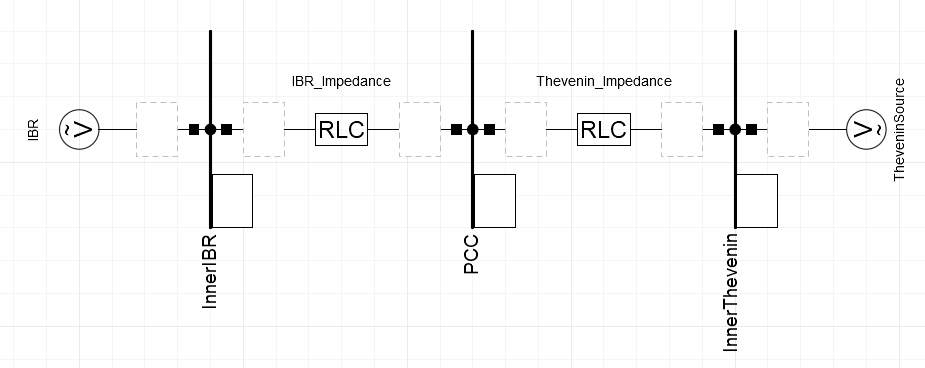
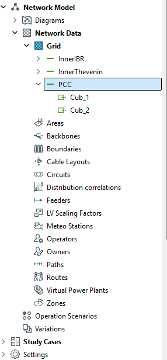
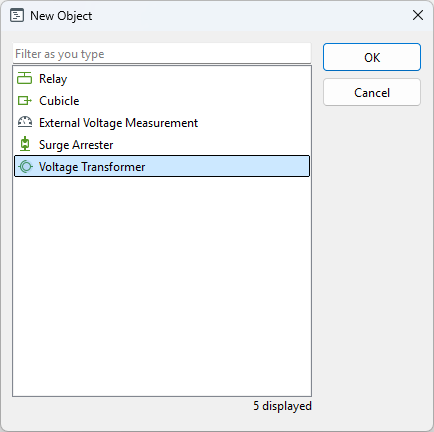
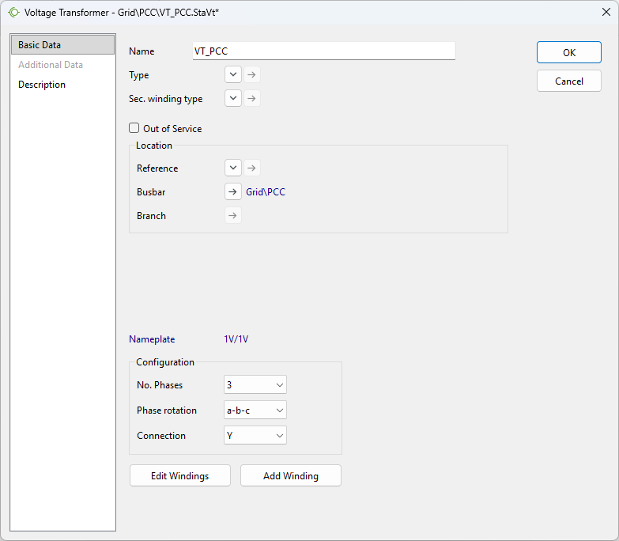
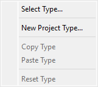
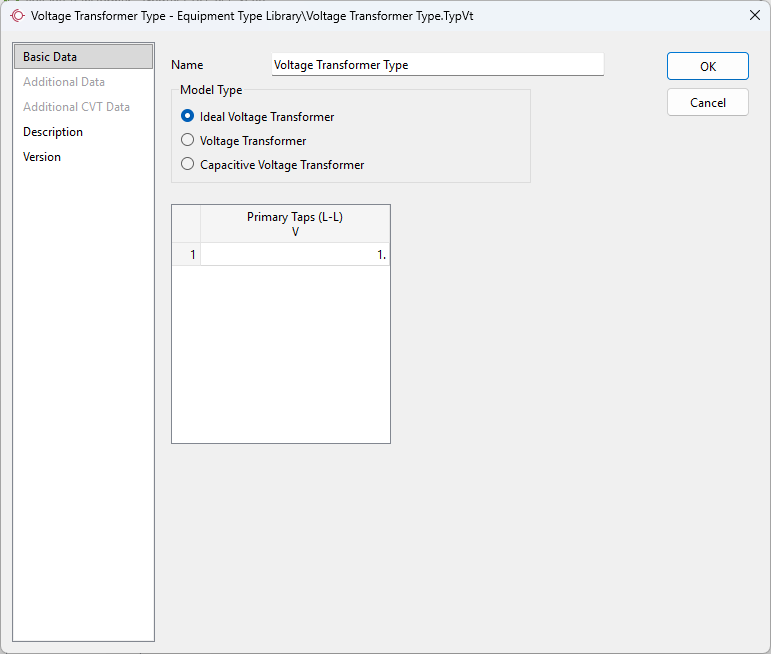
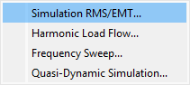
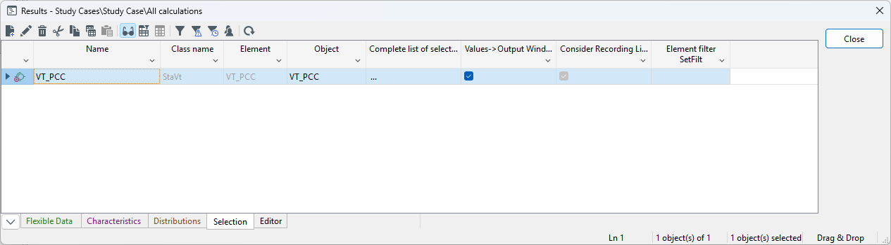

#############################
DLL in DIgSILENT PowerFactory
#############################

This chapter provides a step-by-step description of the integration and use of an IEC 61400-27 DLL in DIgSILENT PowerFactory. 
The required prerequisites, including the necessary software and supported software versions, are presented first. 
The chapter then describes the configuration of the example grid model and the integration of the IEC 61400-27 DLL. 
An empty DIgSILENT PowerFactory project is used as the starting point for the model implementation.

Prerequisites
-------------
- DIgSILENT PowerFactory (tested for 2024 SP4)
- IEC 61400-27 DLL (e.g. the one from the `example <FEHLT>`)

Builing a model for later DLL integration from scratch 
------------------------------------------------------
The final model consists of a regulated ideal voltage source and an internal resistance connected at the point of common coupling (PCC). 
The PCC is supplied by a Thevenin equivalent representing the upstream grid. 
The individual components are added and configured step by step, starting from the blank DIgSILENT PowerFactory project.

1. Builing a thevenin equivalent
^^^^^^^^^^^^^^^^^^^^^^^^^^^^^^^^
..  figure:: ./images/TheveninPowerFactory.png
    :alt: Thevenin equivalent connect to PCC in PowerFactory.

    Thevenin equivalent connect to PCC in PowerFactory.

By definition, a Thevenin equivalent consists of an ideal voltage source and a series-connected internal impedance. 
In this model, the ideal voltage source applies a voltage of 1 p.u. to the bus at its terminals (“InnerThevenin”). 
For the example considered here, this corresponds to a line-to-line RMS voltage of 400 kV with a phase angle of 0°.

The internal impedance determines the short-circuit power, and therefore the strength, of the upstream grid. 
In the present example, the impedance is defined by a resistance of R = 10.6137 Ω and an inductance of L = 0.3378455 H.

A simulation can already be performed using these two components alone. 
However, such a simulation is of limited significance, as the Thevenin equivalent only provides the voltage supply at the PCC without representing any connected equipment or grid interaction.

2. Building the external controlled voltage source (Grid following IBR)
^^^^^^^^^^^^^^^^^^^^^^^^^^^^^^^^^^^^^^^^^^^^^^^^^^^^^^^^^^^^^^^^^^^^^^^

    IBR in a SMIB configuraiton in DIgSILENT PowerFactory.

The regulated ideal voltage source is now connected to the PCC through a series impedance, thereby forming the equivalent circuit of a grid-following IBR.

The voltage source is an ideal voltage source which will be controlled by a dynamic model later on. 

In the present example, the DLL provides a line-to-line RMS voltage of 400 kV. 
Therefore, no additional transformer is required, and only the internal impedance of the IBR needs to be represented. 
The impedance is defined by a resistance of R = 0.782 Ω and an inductance of L = 0.1574 H.

In this configuration, two ideal voltage sources with identical setpoints are connected in series through two series impedances. 
Since the voltage sources have the same voltage, no current flows between them. 
The control of the IBR voltage source will be addressed in a subsequent step. 
Nevertheless, a simulation can be performed at this stage to verify the correct operation of the model and the signal connections.

3. Adding the necessary measurements for the DLL
^^^^^^^^^^^^^^^^^^^^^^^^^^^^^^^^^^^^^^^^^^^^^^^^
The next step is to measure the PCC signals (line-to-ground voltages and current) that will subsequently be used by the DLL for control purposes. 
To achieve this, a voltage transformer as well as a current transformer are added to the model.

Adding the voltage transformer
""""""""""""""""""""""""""""""
The measurement names for the phase-to-ground voltage and current are then defined for each phase.

    Choice of the PCC busbar in the PowerFactory model menu.

Add a new component to the PCC busbar by clicking ``New Object`` in the top right corner of the window.

    Adding a new voltage transformer to the PCC busbar in PowerFactory.

Clicking ``Ok`` brings up a new menu containing the voltage transformer data. Define the voltage transformers name and click the menu beside ``Type`` afterwards.

    Pop-up window of the new generated voltage transformer at the PCC busbar in PowerFactory.

Clickling ``New Project Type`` opens up the next window for the voltage transformer type definition.

    Pop-up window for the choice of the new generated voltage transformer's type.

Within the next upcoming Pop-up one is able to define the voltage transformer type data. The easiest but most unrealistic one is a ideal measure using ``Ideal Voltage Transformer``.

    Pop-up window for the definition of a voltage transformer type.

At this point no measurement data of the voltage transformer is captured. Therefore one needs to right-click the new generated voltage transformer and click ``Result Variables`` afterwards.

    Pop-up window after right-clicking the new voltage transformer.

Within the next Pop-up one might choose the ``Simulation RMS/EMT...`` button. 

    Choosing Simulation RMS/EMT result variables.

Finally the signals of the secondary line to ground voltages need to be captured.

    Adding the necessary voltage measurements to the result log.
