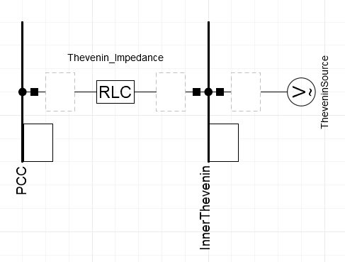
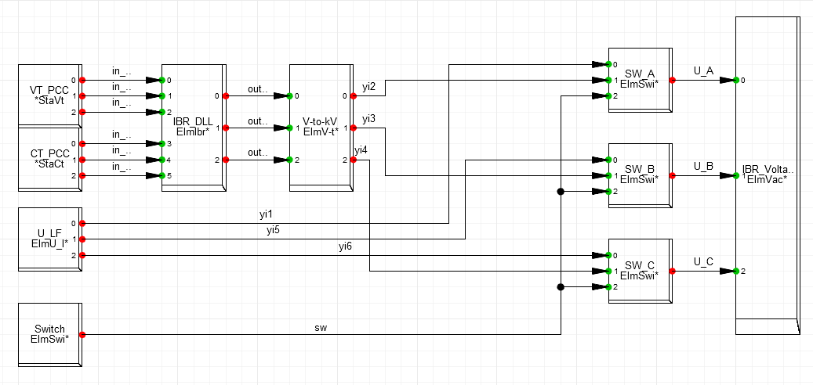
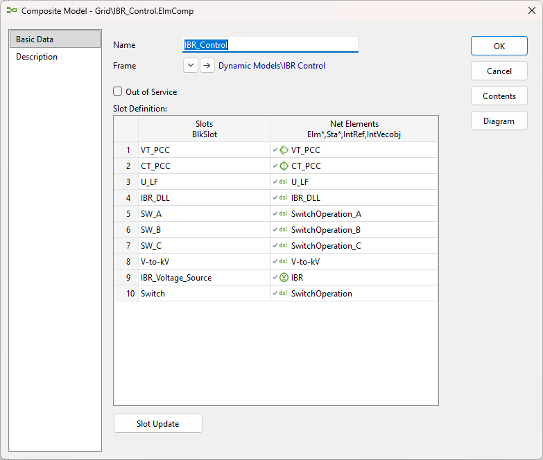
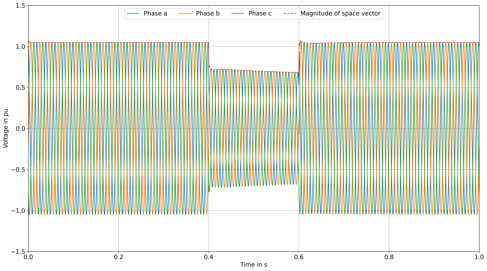
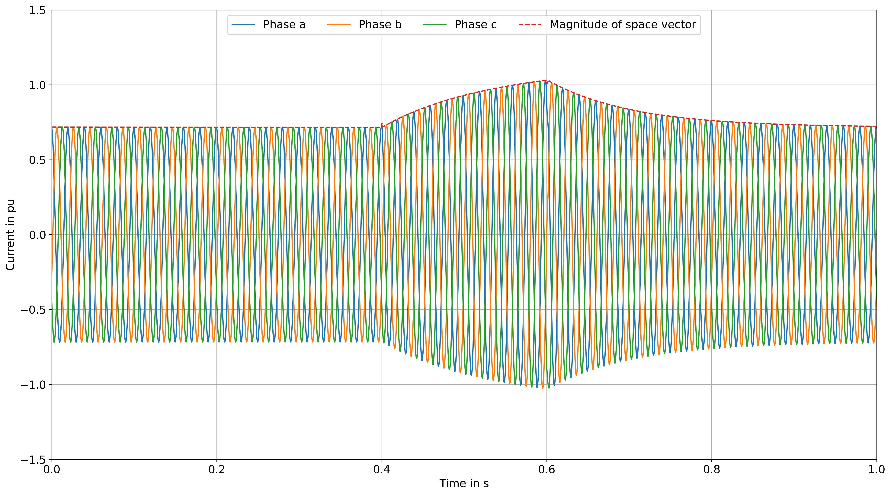
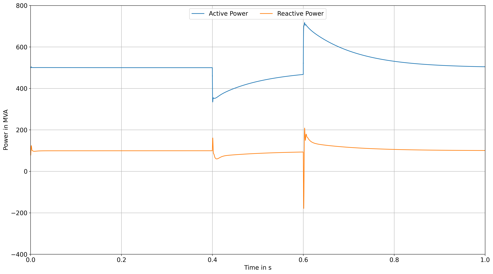

#############################
DLL in DIgSILENT PowerFactory
#############################

This chapter describes the step-by-step integration of an IEC 61400-27 DLL into DIgSILENT PowerFactory. 
It first introduces the required software and prerequisites, followed by the setup of the example grid model. 
The subsequent sections describe how to integrate the DLL and establish the required signal connections. 
The model is built from an empty DIgSILENT PowerFactory project.

Prerequisites
-------------
- DIgSILENT PowerFactory (tested for 2024 SP4)
- IEC 61400-27 DLL (e.g. the one from the `example <FEHLT>`)

Building a model for later DLL integration from scratch 
-------------------------------------------------------
The final model consists of a regulated ideal voltage source and an internal resistance connected at the point of common coupling (PCC). 
The PCC is supplied by a Thevenin equivalent representing the upstream grid. 
The individual components are added and configured step by step, starting from the blank DIgSILENT PowerFactory project.

1. Building a thevenin equivalent
^^^^^^^^^^^^^^^^^^^^^^^^^^^^^^^^^

    Figure 1: Thevenin equivalent connect to PCC in PowerFactory.

By definition, a Thevenin equivalent consists of an ideal voltage source and a series-connected internal impedance. 
In this model, the ideal voltage source applies a voltage of 1 p.u. to the bus at its terminal (“InnerThevenin”). 
For the example considered here, this corresponds to a line-to-line RMS voltage of 400 kV with a phase angle of 0°.
The internal impedance determines the short-circuit power, and therefore the strength, of the upstream grid. 
In the present example, the impedance is defined by a resistance of R = 10.6137 Ω and an inductance of L = 0.3378455 H.

A simulation can already be performed using these two components.
However, the simulation is of limited significance at this stage, as the Thevenin equivalent only provides the voltage supply at the PCC and no connected equipment or grid interaction is yet represented.

2. Building the external controlled voltage source (Grid following IBR)
^^^^^^^^^^^^^^^^^^^^^^^^^^^^^^^^^^^^^^^^^^^^^^^^^^^^^^^^^^^^^^^^^^^^^^^
..  figure:: ./images/PowerFactory/SMIB_IBR_PowerFactory.png
    :alt: IBR in a SMIB configuraiton in DIgSILENT PowerFactory.
    :width: 50%

    Figure 2: IBR in a SMIB configuraiton in DIgSILENT PowerFactory.

The regulated ideal voltage source is now connected to the PCC through a series impedance, thereby forming the equivalent circuit of a grid-following IBR. 
The voltage source will subsequently be controlled by the dynamic model provided by the IEC 61400-27 DLL.
In the present example, the DLL provides a line-to-line RMS voltage of 400 kV. 
Therefore, no additional transformer is required, and only the internal impedance of the IBR needs to be represented. 
The impedance is defined by a resistance of R = 0.782 Ω and an inductance of L = 0.1574 H.

At this stage, two ideal voltage sources with identical voltage setpoints are connected through their respective series impedances. 
As the voltage sources have the same voltage, no current flows between them. The control of the IBR voltage source will be addressed in a subsequent step. 
Nevertheless, a simulation can already be performed to verify the correct operation of the model.

3. Adding the required measurements for the DLL
^^^^^^^^^^^^^^^^^^^^^^^^^^^^^^^^^^^^^^^^^^^^^^^
The next step is to add the measurements required by the DLL. 
The relevant electrical quantities at the PCC are the three phase-to-ground voltages and the three phase currents. 
These quantities are measured using voltage and current transformers and are subsequently provided to the DLL as input signals.

Adding the voltage transformer
''''''''''''''''''''''''''''''
The voltage transformer is used to measure the three phase-to-ground voltages at the PCC and provide them as input signals to the IEC 61400-27 DLL. 
An ideal voltage transformer is used for this purpose, as no transformer losses or other transformer-specific effects need to be considered in the present example.
To add the voltage transformer, select the PCC busbar (see Figure 3) and create a new object using the New Object button in the upper-left corner of the window. 
Select Voltage Transformer from the list of available components (see Figure 4) and assign a suitable name to the new component (see Figure 5).

.. grid:: 3

   .. grid-item::

      ..  figure:: ./images/PowerFactory/PCCPowerFactory.png
            :alt: Choice of the PCC busbar in the PowerFactory model menu.
            :height: 40vh

            Figure 3: Choice of the PCC busbar in the PowerFactory model menu.

   .. grid-item::

       ..  figure:: ./images/PowerFactory/VT_PowerFactory.png
            :alt: Adding a new voltage transformer to the PCC busbar in PowerFactory.
            :height: 40vh

            Figure 4: Adding a new voltage transformer to the PCC busbar in PowerFactory.

   .. grid-item::

      ..  figure:: ./images/PowerFactory/VT_PowerFactory2.png
            :alt: Pop-up window of the new generated voltage transformer at the PCC busbar in PowerFactory.
            :height: 40vh

            Figure 5: Pop-up window of the new generated voltage transformer at the PCC busbar in PowerFactory.

After creating the voltage transformer, open its configuration by double-clicking the component. 
In the transformer configuration dialog, create a new transformer type (see Figure 5) and select Ideal Voltage Transformer (see Figure 6). 
The ideal transformer is sufficient for the present application because the purpose of the component is to provide the required voltage measurements rather than to model the physical behavior of a transformer.

   .. figure:: ./images/PowerFactory/VT_PowerFactory4.png
      :alt: Pop-up window for the definition of a voltage transformer type.
      :height: 30em

      Figure 6: Pop-up window for the definition of a voltage transformer type.

The voltage transformer is now connected to the PCC and can be used to obtain the three phase-to-ground voltage signals required by the DLL (see Figure 8 - 10).

.. grid:: 3

   .. grid-item::

      ..  figure:: ./images/PowerFactory/VT_PowerFactory5.png
            :alt: Pop-up window after right-clicking the new voltage transformer.
            :height: 40vh

            Figure 8: Pop-up window after right-clicking the new voltage transformer.

   .. grid-item::

       ..  figure:: ./images/PowerFactory/VT_PowerFactory7.png
            :alt: Opening the voltage transformer result variable window by double-clicking.
            :height: 40vh

            Figure 9: Opening the voltage transformer result variable window by double-clicking.

   .. grid-item::

      ..  figure:: ./images/PowerFactory/VT_PowerFactory8.png
            :alt: Adding the necessary voltage measurements to the result log.
            :height: 40vh

            Figure 10: Adding the necessary voltage measurements to the result log.

Adding the current transformer
""""""""""""""""""""""""""""""
The current transformer is used to measure the three phase currents at the PCC and provide them as input signals to the IEC 61400-27 DLL. 
An ideal current transformer is used for this purpose, as no transformer losses or other transformer-specific effects need to be considered in the present example.

To add the current transformer, select the cubicle of the PCC busbar connected to the thevenin impedance (see Figure 11) and create a new object using the New Object button in the upper-right corner of the window. 
Select Current Transformer from the list of available components (see Figure 12) and assign a suitable name to the new component (see Figure 13).

.. grid:: 3

   .. grid-item::

      ..  figure:: ./images/PowerFactory/PCC_Cub1_PowerFactory.png
            :alt: Choice of the cubicle of the PCC busbar connected to the thevenin impedance in the PowerFactory model menu.

            Figure 11: Choice of the cubicle of the PCC busbar connected to the thevenin impedance in the PowerFactory model menu.

   .. grid-item::

       ..  figure:: ./images/PowerFactory/CT_PowerFactory.png
            :alt: Adding a new current transformer to the cubicle of the PCC busbar connected to the thevenin impedance in PowerFactory.

            Figure 12: Adding a new current transformer to the cubicle of the PCC busbar connected to the thevenin impedance in PowerFactory.

   .. grid-item::

      ..  figure:: ./images/PowerFactory/CT_PowerFactory2.png
            :alt: Pop-up window of the new generated current transformer at cubicle of the PCC busbar connected to the thevenin impedance in PowerFactory.

            Figure 13: Pop-up window of the new generated current transformer at cubicle of the PCC busbar connected to the thevenin impedance in PowerFactory.

After creating the current transformer, open its configuration by double-clicking the component. 
In the transformer configuration dialog, create a new transformer type and select Current Transformer Type (TypCt) (see Figure 14) and select Ideal Current Transformer (see Figure 15). 
The ideal transformer is sufficient for the present application because the purpose of the component is to provide the required current measurements rather than to model the physical behavior of a transformer.

.. grid:: 2

   .. grid-item::

      .. figure:: ./images/PowerFactory/CT_PowerFactory3.png
         :alt: Pop-up window for the choice of the newly generated current transformer's type.

         Figure 14: Pop-up window for the choice of the newly generated current transformer's type.

   .. grid-item::

      .. figure:: ./images/PowerFactory/CT_PowerFactory4.png
         :alt: Pop-up window for the definition of a current transformer type.

         Figure 15: Pop-up window for the definition of a current transformer type.

The voltage transformer is now connected to the cubicle of the PCC and can be used to obtain the three phase current signals required by the DLL (see Figure 16 - 18).

.. grid:: 3

   .. grid-item::

      ..  figure:: ./images/PowerFactory/CT_PowerFactory5.png
            :alt: Pop-up window after right-clicking the new current transformer.
            :align: center
            :width: 50%

            Figure 16: Pop-up window after right-clicking the new current transformer.

   .. grid-item::

      ..  figure:: ./images/PowerFactory/CT_PowerFactory6.png
            :alt: Opening the current transformer result variable window by double-clicking.
            :align: center

            Figure 17: Opening the current transformer result variable window by double-clicking.

   .. grid-item::

      ..  figure:: ./images/PowerFactory/CT_PowerFactory7.png
            :alt: Adding the necessary current measurements to the result log.
            :align: center

            Figure 18: Adding the necessary current measurements to the result log.

DLL integration using a dynamic model in PowerFactory
-----------------------------------------------------
After setting up the electrical components of the grid model along with the required voltage and current measurements at the PCC, the next step is to integrate the DLL itself into the model. 
This integration is performed via a so-called Composite Model Frame, which defines the signal connections between the measured quantities, the DLL, and the controlled voltage source.

1. Creating an empty composite model frame definition
^^^^^^^^^^^^^^^^^^^^^^^^^^^^^^^^^^^^^^^^^^^^^^^^^^^^^

First, a new, empty Composite Model Frame is created (see Figure 19). 
In the corresponding input window, the name and basic settings of the frame are defined (see Figure 20). 
The graphical editing interface of the still-empty frame then opens, in which the individual slots (blocks) and their signal connections are defined in the subsequent steps (see Figure 21).

.. grid:: 3

   .. grid-item::
      ..  figure:: ./images/PowerFactory/CompositeModelFrame.png
            :alt: Creating a new empty composite model frame.
            :align: center

            Figure 19: Creating a new empty composite model frame.

   .. grid-item::
      ..  figure:: ./images/PowerFactory/CompositeModelFrame1.png
            :alt: Input mask of the composite model frame definition.
            :align: center

            Figure 20: Input mask of the composite model frame definition.

   .. grid-item::
      ..  figure:: ./images/PowerFactory/CompositeModelFrame2.png
            :alt: Empty composite model frame defintion.
            :align: center

            Figure 21: Empty composite model frame defintion.

2. Adding measurment slots to the composite model frame definition
^^^^^^^^^^^^^^^^^^^^^^^^^^^^^^^^^^^^^^^^^^^^^^^^^^^^^^^^^^^^^^^^^^

The first slots to be created are those for the measured quantities. 
A slot for the voltage transformer is created to feed the three phase-to-ground voltages at the PCC into the frame (see Figure 22). 
Similarly, a slot for the current transformer is added, through which the three phase currents are provided (see Figure 23). 
Figure 24 shows the frame after both measurement slots have been added.

.. grid:: 3

   .. grid-item::
      ..  figure:: ./images/PowerFactory/CompositeModelFrame3.png
            :alt: Creating a voltage transformer slot in the composite model frame.
            :align: center

            Figure 22: Creating a voltage transformer slot in the composite model frame.

   .. grid-item::
      ..  figure:: ./images/PowerFactory/CompositeModelFrame4.png
            :alt: Creating a current transformer slot in the composite model frame.
            :align: center

            Figure 23: Creating a current transformer slot in the composite model frame.

   .. grid-item::
      ..  figure:: ./images/PowerFactory/CompositeModelFrame5.png
            :alt: Composite model frame containing the measurement slots for three phase voltage and current.
            :align: center

            Figure 24: Composite model frame containing the measurement slots for three phase voltage and current.

3. Adding the DLL as compiled model to the composite model frame definition
^^^^^^^^^^^^^^^^^^^^^^^^^^^^^^^^^^^^^^^^^^^^^^^^^^^^^^^^^^^^^^^^^^^^^^^^^^^

Next, a slot for the DLL itself is created (see Figure 25). 
The previously compiled IEC 61400-27 DLL is loaded into this slot as a Compiled Model (see Figure 26). 
Figure 27 shows the frame with the integrated DLL slot, whose inputs and outputs are now available for further signal wiring.

.. grid:: 3

   .. grid-item::
      ..  figure:: ./images/PowerFactory/CompositeModelFrame6.png
            :alt: Creating a DLL slot in the composite model frame.
            :align: center

            Figure 25: Creating a DLL slot in the composite model frame.

   .. grid-item::
      ..  figure:: ./images/PowerFactory/CompositeModelFrame7.png
            :alt: Imported DLL as compiled model in the DLL slot of the composite model frame.
            :align: center

            Figure 26: Imported DLL as compiled model in the DLL slot of the composite model frame.

   .. grid-item::
      ..  figure:: ./images/PowerFactory/CompositeModelFrame8.png
            :alt: Composite model frame containing the DLL slot.
            :align: center

            Figure 27: Composite model frame containing the DLL slot.

4. Convert the DLL outputs to the PowerFactory required units
^^^^^^^^^^^^^^^^^^^^^^^^^^^^^^^^^^^^^^^^^^^^^^^^^^^^^^^^^^^^^

Since the output quantities of the DLL do not directly match the unit required by the controlled voltage source (kilovolts), in PowerFactory, an additional conversion slot is inserted (see Figure 28). 
This slot contains the corresponding conversion equations, which transform the DLL output signals into the format required by the voltage source (see Figure 29). 
Figure 30 shows the frame after the conversion slot has been added.

.. grid:: 3

   .. grid-item::
      ..  figure:: ./images/PowerFactory/CompositeModelFrame9.png
            :alt: Creating a conversion slot in the composite model frame.
            :align: center

            Figure 28: Creating a conversion slot in the composite model frame.

   .. grid-item::
      ..  figure:: ./images/PowerFactory/CompositeModelFrame10.png
            :alt: Equations of the conversion slot in the composite model frame.
            :align: center

            Figure 29: Equations of the conversion slot in the composite model frame.

   .. grid-item::
      ..  figure:: ./images/PowerFactory/CompositeModelFrame11.png
            :alt: Composite model frame containing the conversion slot.
            :align: center

            Figure 30: Composite model frame containing the conversion slot.

5. Adding the voltage source input slot and wiring of the slots
^^^^^^^^^^^^^^^^^^^^^^^^^^^^^^^^^^^^^^^^^^^^^^^^^^^^^^^^^^^^^^^

Finally, a slot is created for the regulated ideal voltage source, which was previously introduced as part of the IBR equivalent circuit (see Figure 31). 
Figure 32 shows the complete frame containing all four slots: voltage measurement, current measurement, DLL, and voltage source.

In the last step, the inputs and outputs of the individual slots are connected to one another: the measured voltages and currents are fed into the DLL slot as input signals, the DLL's output quantities are converted into the required format via the conversion slot, and the result is then passed to the controlled voltage source as its setpoint. 
Figure 33 shows the fully wired Composite Model Frame. 
This completes the integration of the DLL into the PowerFactory model, and simulations with dynamic behavior according to IEC 61400-27 can now be carried out.

.. grid:: 3

   .. grid-item::
      ..  figure:: ./images/PowerFactory/CompositeModelFrame12.png
            :alt: Creating a voltage source slot in the composite model frame.
            :align: center

            Figure 31: Creating a voltage source slot in the composite model frame.

   .. grid-item::
      ..  figure:: ./images/PowerFactory/CompositeModelFrame13.png
            :alt: Composite model frame containing the voltage source slot.
            :align: center

            Figure 32: Composite model frame containing the voltage source slot.

   .. grid-item::
      ..  figure:: ./images/PowerFactory/CompositeModelFrame14.png
            :alt: Composite model frame containing the signal connection of the slots.
            :align: center

            Figure 33: Composite model frame containing the signal connection of the slots.

Up to this point, only the required block definitions have been created. 
These definitions do not affect the simulation results until they are instantiated and integrated into the network topology. 
The next step is therefore to integrate the created components into the simulation model.

6. Creating the two DSL Model required by the composite model Frame
^^^^^^^^^^^^^^^^^^^^^^^^^^^^^^^^^^^^^^^^^^^^^^^^^^^^^^^^^^^^^^^^^^^
To begin integrating the previously defined blocks, the required DSL models must first be created. Open the network associated with the current project in the ``Data Manager`` (see Figure 34) and create a new object. 
In the ``Add New Object`` dialog, select ``DSL Model`` (see Figure 35). 
This starts the process of creating the DSL components required for the subsequent integration of the previously defined blocks.

.. grid:: 2

   .. grid-item::
      ..  figure:: ./images/PowerFactory/CompositeModelFrame15.png
            :alt: Navigating to the grid topology of the considered PowerFactory model.
            :align: center

            Figure 34: Navigating to the grid topology of the considered PowerFactory model.

   .. grid-item::
      ..  figure:: ./images/PowerFactory/CompositeModelFrame16.png
            :alt: Adding a new DSL model to the model.
            :align: center

            Figure 35: Adding a new DSL model to the model.

7. Filling the two DSL Model required by the composite model Frame
^^^^^^^^^^^^^^^^^^^^^^^^^^^^^^^^^^^^^^^^^^^^^^^^^^^^^^^^^^^^^^^^^^
The next step is to create the two DSL models required by the composite model frame created previously. 
The first DSL model is used to convert voltage values from volts to kilovolts (see Figure 36). 
The second DSL model is an instance of the DLL interface, which is responsible for handling the communication between PowerFactory and the IEC 61400-27 DLL (see Figure 37).

.. grid:: 2

   .. grid-item::
      ..  figure:: ./images/PowerFactory/CompositeModelFrame17.png
            :alt: Conversion DSL model of the composite model frame.
            :align: center

            Figure 36: Conversion DSL model of the composite model frame.

   .. grid-item::
      ..  figure:: ./images/PowerFactory/CompositeModelFrame18.png
            :alt: DLL interface DSL model of the composite model frame.
            :align: center

            Figure 37: DLL interface DSL model of the composite model frame.

8. Adding the IBR Control composite model frame as network component
^^^^^^^^^^^^^^^^^^^^^^^^^^^^^^^^^^^^^^^^^^^^^^^^^^^^^^^^^^^^^^^^^^^^
Finally, a ``Composite Model`` object is created in the project network (see Figure 38). 
This object is configured using the previously created composite model frame, ``IBR_Control``. 
The required measurement points, DSL models, and controlled voltage source are then assigned to the Composite Model object through its user interface (see Figure 39).

.. grid:: 2

   .. grid-item::
      ..  figure:: ./images/PowerFactory/CompositeModelFrame19.png
            :alt: Adding a new composite model to the model.
            :align: center

            Figure 38: Adding a new composite model to the model.

   .. grid-item::
      ..  figure:: ./images/PowerFactory/CompositeModelFrame20.png
            :alt: Filling the composite model.
            :align: center

            Figure 39: Filling the composite model.

With this configuration, the IEC 61400-27 DLL is fully integrated into the PowerFactory simulation environment. 
The DLL can process the measured electrical quantities during the simulation, while its calculated output signals are fed back into the EMT model through the configured composite model. 
This enables the dynamic behavior implemented in the DLL to directly influence the EMT simulation performed in PowerFactory.

Initialization of a DLL in PowerFactory
---------------------------------------
EMT simulations of electrical power systems are commonly used to investigate system stability and to validate protection concepts. 
It is important to note that such simulations are not initiated from an unknown initial state. 
Instead, the initial operating condition can generally be determined or approximated based on the specified operating point of the system.

During the development of the IEC 61400-27 Builder, the dynamic behavior of the DLL within the PowerFactory simulation environment was investigated in detail. 
Based on these investigations, several measures were derived to achieve an initialization that is as accurate as possible. 
The objective is to ensure that the DLL starts from an operating point consistent with the surrounding PowerFactory model, thereby minimizing the need for subsequent balancing operations.

The initialization measures developed for this purpose are described in more detail in the following sections.

1. Loadflow conditions (Sample 0)
^^^^^^^^^^^^^^^^^^^^^^^^^^^^^^^^^
First, the network topology is analyzed with respect to the power flow, as this provides the basis for determining the initial conditions and, consequently, for the subsequent dynamic simulation. 
Without any modifications to the network topology, the voltage magnitude and phase angle at every bus of the investigated topology remains 1 p.u. and 0°. Due to the fact of zero current (see Figure 40).

The objective, however, is to ensure that the IBR supplies the specified active and reactive power from the beginning of the simulation, with only minor power deviations requiring subsequent balancing. 
To achieve this, the voltage magnitude and phase angle at the IBR terminals must first be determined. 
These values are then entered into the load-flow settings of the AC voltage source (see Figure 41). 

By specifying the corresponding voltage magnitude and phase angle, the desired power flow can be established at the PCC (see Figure 42).
In the example considered, the target operating point at the PCC is P = 500 MW and Q = 100 MVAr. 
This ensures that the initial operating condition of the IBR is consistent with the intended power-flow conditions before the EMT simulation is started.

.. grid:: 3

   .. grid-item::
      ..  figure:: ./images/PowerFactory/Loadflow_wo_adaptions.png
            :alt: Calculation of unbalance power flow without adpating the IBR voltage source conditions.
            :align: center

            Figure 40: Calculation of unbalance power flow without adpating the IBR voltage source conditions.

   .. grid-item::
      ..  figure:: ./images/PowerFactory/IBR_voltage_source_LF.png
            :alt: Filling the load flow conditions (voltage magnitude and angle) in the IBR voltage source.
            :align: center

            Figure 41: Filling the load flow conditions (voltage magnitude and angle) in the IBR voltage source.

   .. grid-item::
      ..  figure:: ./images/PowerFactory/Loadflow_after_adaptions.png
            :alt: Calculation of unbalance power flow after adpating the IBR voltage source conditions.
            :align: center

            Figure 42: Calculation of unbalance power flow after adpating the IBR voltage source conditions.

2. Start of the dynamic simulation using a DLL (Sample 1 & 2)
^^^^^^^^^^^^^^^^^^^^^^^^^^^^^^^^^^^^^^^^^^^^^^^^^^^^^^^^^^^^^
Due to the order in which the differential equations of the network topology and the dynamic models, such as the DLL, are solved, the DLL output values deviate from the expected voltage values during the first two samples of the simulation. 
The first sample represents the result of the initialization process. 
At this point, the input values have already been assigned, while the corresponding output values have not yet been calculated. 
This can be regarded as a zero sample. 
In the second sample, these initially calculated zero values are propagated to the subsequent simulation step, resulting in an undesired deviation from the expected voltage.

To overcome this initialization effect, a workaround is implemented in which the output values of an ideal symmetrical AC voltage source, corresponding to the values determined during the load-flow calculation, are applied directly to the controlled IBR voltage source during the first two samples of the dynamic simulation.

To implement this workaround, the composite model frame (the block definition of ``IBR_Control``), must first be extended accordingly. 
The first step is to disconnect the signal path between the volt-to-kilovolt conversion block and the controlled voltage source (see Figure 43). 
Signal switches are then inserted at this point. 
These switches select either input ``yi1`` or input ``y2``, depending on the value of the variable ``sw``. 
When ``sw`` changes from 0 to 1, the switch changes from ``yi1`` to ``yi2`` (see Figure 44).

The corresponding logic for selecting the signal based on the ``sw`` variable is shown in Figure 45. 
This switching mechanism allows the initialization values from the ideal AC voltage source to be applied during the first two simulation samples before the signal path is switched to the output of the DLL.

.. grid:: 3

   .. grid-item::
      ..  figure:: ./images/PowerFactory/CompositeModelFrame21.png
            :alt: Cutting the signal between the conversion block and the controlled voltage source in the composite model frame.
            :align: center

            Figure 43: Cutting the signal between the conversion block and the controlled voltage source in the composite model frame.

   .. grid-item::
      ..  figure:: ./images/PowerFactory/CompositeModelFrame22.png
            :alt: Adding the signal switches for each phase to the composite model frame.
            :align: center

            Figure 44: Adding the signal switches for each phase to the composite model frame.

   .. grid-item::
      ..  figure:: ./images/PowerFactory/CompositeModelFrame23.png
            :alt: Logic of the signal switches in the composite model frame.
            :align: center

            Figure 45: Logic of the signal switches in the composite model frame. ``sw`` is the switch attribute, ``yi1`` and ``yi2`` are the two input signal streams while ``yo`` is the output signal stream.

Building an ideal three phase AC voltage signal with a user defined magnitude and angle
"""""""""""""""""""""""""""""""""""""""""""""""""""""""""""""""""""""""""""""""""""""""
PowerFactory does not provide a signal generator for sine and cosine functions with user-defined amplitude and phase angle. 
Therefore, the required signal generation is implemented directly within the composite model frame as a dedicated slot (see Figure 46).

The corresponding logic is shown in Figure 47 while the parameter and output labels are presented in Figure 48. 
It generates the three-phase sinusoidal signals with the specified amplitude and phase angle, with each phase shifted by 120° relative to the others. 

.. math::
   :name: three phase voltage sine wave

   U_\mathrm{LF,A} = \frac{(\sqrt(2) \cdot U_\mathrm{LF,RMS})}{\sqrt(3)} \cdot cos(\phi_\mathrm{LF} \cdot \frac{\pi}{180} + 2 \cdot \pi \cdot 50 \cdot t) \\
   U_\mathrm{LF,B} = \frac{(\sqrt(2) \cdot U_\mathrm{LF,RMS})}{\sqrt(3)} \cdot cos((\phi_\mathrm{LF}-120) \cdot \frac{\pi}{180} + 2 \cdot \pi \cdot 50 \cdot t) \\
   U_\mathrm{LF,C} = \frac{(\sqrt(2) \cdot U_\mathrm{LF,RMS})}{\sqrt(3)} \cdot cos((\phi_\mathrm{LF}-240) \cdot \frac{\pi}{180} + 2 \cdot \pi \cdot 50 \cdot t) \\

This provides the three-phase voltage signals required for the initialization of the controlled IBR voltage source.

.. grid:: 3

   .. grid-item::
      ..  figure:: ./images/PowerFactory/CompositeModelFrame24.png
            :alt: Adding the user defined sine wave generator to the composite model frame.
            :align: center

            Figure 46: Adding the user defined sine wave generator to the composite model frame.

   .. grid-item::
      ..  figure:: ./images/PowerFactory/CompositeModelFrame25.png
            :alt: Logical/Mathematical definition of the sine wave generator of an ideal three phase AC voltage source.
            :align: center

            Figure 47: Logical/Mathematical definition of the sine wave generator of an ideal three phase AC voltage source.

   .. grid-item::
      ..  figure:: ./images/PowerFactory/CompositeModelFrame26.png
            :alt: Output/Parameter definition of the three phase voltage sine wave generator.
            :align: center

            Figure 48: Output/Parameter definition of the three phase voltage sine wave generator.

Switch signal generator 
"""""""""""""""""""""""
A signal generator is required to switch the initialization logic from the predefined voltage signal to the DLL output after a specified simulation time. 
The signal generator changes its state from 0 to 1 once the simulation time defined by the parameter ``Time_of_Switch`` has elapsed.

The signal generator is added to the composite model frame as shown in Figure 49. 
The corresponding switching logic is defined in Figure 50, while Figure 51 shows the configuration of the output signal and the `SwitchOperation` parameter. 
This parameter determines the duration for which the initialization signal is applied before the DLL-generated voltage signals are passed to the controlled IBR voltage source.

.. grid:: 3

   .. grid-item::
      ..  figure:: ./images/PowerFactory/CompositeModelFrame27.png
            :alt: Adding the switch signal generator to the composite model frame.
            :align: center

            Figure 49: Adding the switch signal generator to the composite model frame.

   .. grid-item::
      ..  figure:: ./images/PowerFactory/CompositeModelFrame28.png
            :alt: Logical/Mathematical definition of the switch signal generator.
            :align: center

            Figure 50: Logical/Mathematical definition of the switch signal generator

   .. grid-item::
      ..  figure:: ./images/PowerFactory/CompositeModelFrame26.png
            :alt: Output/Parameter definition of the switch signal generator.
            :align: center

            Figure 51: Output/Parameter definition of the switch signal generator.

3. Connecting the new created signals as well as the DLL output to the signal switches
^^^^^^^^^^^^^^^^^^^^^^^^^^^^^^^^^^^^^^^^^^^^^^^^^^^^^^^^^^^^^^^^^^^^^^^^^^^^^^^^^^^^^^
Finally, all newly added blocks and functions must be interconnected using the appropriate signal paths. 
The resulting structure is shown in Figure 52 and represents the final definition of the ``IBR_Control`` Composite Model Frame. 
This configuration combines the initialization logic, the signal generation, the switching mechanism, and the DLL-based control into a single composite model frame, providing the complete signal flow required for the subsequent EMT simulation.

      Figure 52: Signal wiring in the composite model frame after adding the new slots.

4. Creating the DSL Models from the Block definitions and add them to the composite model
^^^^^^^^^^^^^^^^^^^^^^^^^^^^^^^^^^^^^^^^^^^^^^^^^^^^^^^^^^^^^^^^^^^^^^^^^^^^^^^^^^^^^^^^^
To use the newly designed functionality, five additional DSL models must first be created, following the same procedure used for the original functionality (see Figure 53). 
These models include three DSL models implementing the signal-switching logic, one for each phase, as well as two DSL models for the signal generators.

The signal-switch DSL models do not require any additional parameters, as their operation is fully defined by the switching logic. 
In contrast, the two signal-generator models require parameter inputs to define their respective behavior. The corresponding parameter input dialogs are shown in Figures 54 and 55.

.. grid:: 3

   .. grid-item::
      ..  figure:: ./images/PowerFactory/CompositeModelFrame31.png
            :alt: Adding five DSL Models to the investigated network model.
            :align: center

            Figure 53: Adding five DSL Models to the investigated network model.

   .. grid-item::
      ..  figure:: ./images/PowerFactory/CompositeModelFrame32.png
            :alt: Parameter input mask of the switching signal generator.
            :align: center

            Figure 54: Parameter input mask of the switching signal generator.

   .. grid-item::
      ..  figure:: ./images/PowerFactory/CompositeModelFrame33.png
            :alt: Parameter input mask of the three phase sine wave signal generator.
            :align: center

            Figure 55: Parameter input mask of the three phase sine wave signal generator.

The final step is to integrate the newly created DSL models into the ``IBR_Control`` composite model (see Figure 56). 
This completes the initialization setup in PowerFactory and ensures that the required switching and signal-generation functions are incorporated into the overall model.

The remaining configuration is performed within the control parameters of the Simulink model implemented in the IEC 61400-27 DLL. 
In particular, the parameters related to phase correction and the freeze functionality must be configured accordingly. These settings are described in more detail in the section **DESCRIPTION OF PHASE CORRECTION AND FREEZE.**

      Figure 56: Adding the five DSL Model blocks to the IBR Control composite model.

Simulation using the IEC 61400-27 DLL 
-------------------------------------

      Figure 56: Phase voltages at the PCC and the amplitude of the voltage space vector.

   

      Figure 57: Phase currents of branch Z_IBR and the amplitude of the current space vector.

      Figure 58: Active and reactive power at the PCC.