############
DLL in PSCAD
############

This chapter provides a step-by-step description of the integration and use of an IEC 61400-27 DLL in PSCAD. 
The required prerequisites, including the necessary software and supported software versions, are presented first. 
The chapter then describes the configuration of the example grid model and the integration of the IEC 61400-27 DLL. 
An empty PSCAD project is used as the starting point for the model implementation.

Prerequisites
-------------
- PSCAD Version 5.x (tested for PSCAD v5.0.2)
- Intel Fortran Compiler (Installation instruction can be found `here <FEHLT>`)
- IEC 61400-27 DLL (e.g. the one from the `example <FEHLT>`)

Builing a model for later DLL integration from scratch 
------------------------------------------------------
The final model consists of a regulated ideal voltage source and an internal resistance connected at the point of common coupling (PCC). 
The PCC is supplied by a Thevenin equivalent representing the upstream grid. 
The individual components are added and configured step by step, starting from the blank PSCAD project.

1. Builing a thevenin equivalent
^^^^^^^^^^^^^^^^^^^^^^^^^^^^^^^^
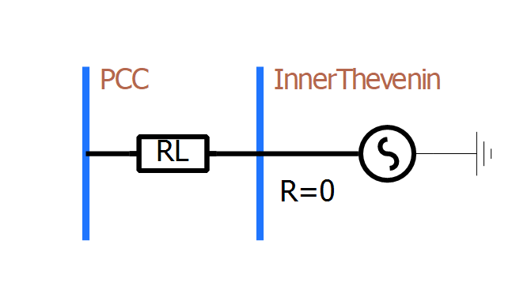

    Thevenin equivalent connect to PCC in PSCAD.

By definition, a Thevenin equivalent consists of an ideal voltage source and a series-connected internal impedance. 
In this model, the ideal voltage source applies a voltage of 1 p.u. to the bus at its terminals (“InnerThevenin”). 
For the example considered here, this corresponds to a line-to-line RMS voltage of 400 kV with a phase angle of 0°.

The internal impedance determines the short-circuit power, and therefore the strength, of the upstream grid. 
In the present example, the impedance is defined by a resistance of R = 10.6137 Ω and an inductance of L = 0.3378455 H.

A simulation can already be performed using these two components alone. 
However, such a simulation is of limited significance, as the Thevenin equivalent only provides the voltage supply at the PCC without representing any connected equipment or grid interaction.

2. Building the external controlled voltage source (Grid following IBR)
^^^^^^^^^^^^^^^^^^^^^^^^^^^^^^^^^^^^^^^^^^^^^^^^^^^^^^^^^^^^^^^^^^^^^^^
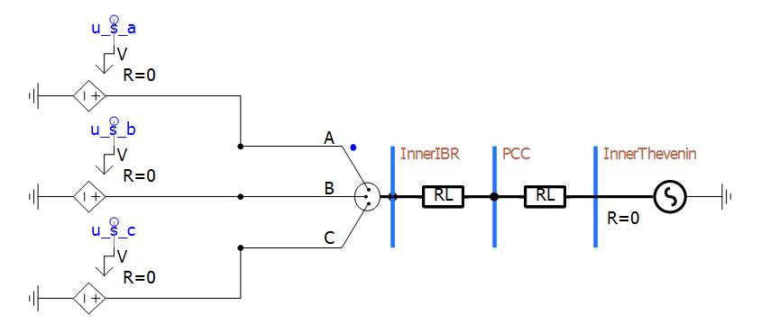

    IBR in a SMIB configuraiton in PSCAD.

The regulated ideal voltage source is now connected to the PCC through a series impedance, thereby forming the equivalent circuit of a grid-following IBR.

The voltage source consists of three independent single-phase DC voltage sources. 
This configuration is necessary because the DLL will later provide the three-phase carrier signal as three sinusoidal signals. 
The regulated DC voltage sources allow these signals to be directly applied to the simulation and used to represent the three-phase voltage at the PCC.

In the present example, the DLL provides a line-to-line RMS voltage of 400 kV. 
Therefore, no additional transformer is required, and only the internal impedance of the IBR needs to be represented. 
The impedance is defined by a resistance of R = 0.782 Ω and an inductance of L = 0.1574 H.

At this stage, the power system model cannot yet be simulated because the required signals ``u_s_a``, ``u_s_b`` and ``u_s_c`` have not yet been defined. 
These signals will be introduced in a subsequent step.

3. Adding the necessary measurements for the DLL
^^^^^^^^^^^^^^^^^^^^^^^^^^^^^^^^^^^^^^^^^^^^^^^^
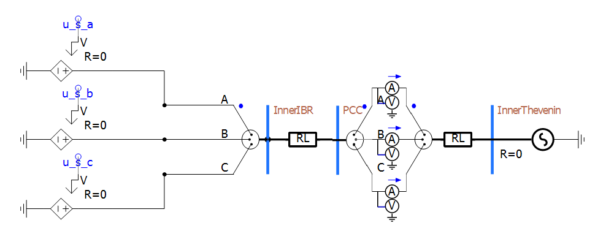

    IBR in a SMIB configuraiton containing the DLL relevant measurements in PSCAD.

The next step is to measure the PCC signals (line-to-ground voltages and current) that will subsequently be used by the DLL for control purposes. 
To achieve this, three single-phase multimeters are added to the model, one for each phase. 
The measurement names for the phase-to-ground voltage and current are then defined for each phase.

..  figure:: ./images/PSCAD/Multimeter.png
    :alt: PSCAD multimeter configuration pane of the phase a measurement at the PCC.

    PSCAD multimeter configuration pane of the phase a measurement at the PCC.

    
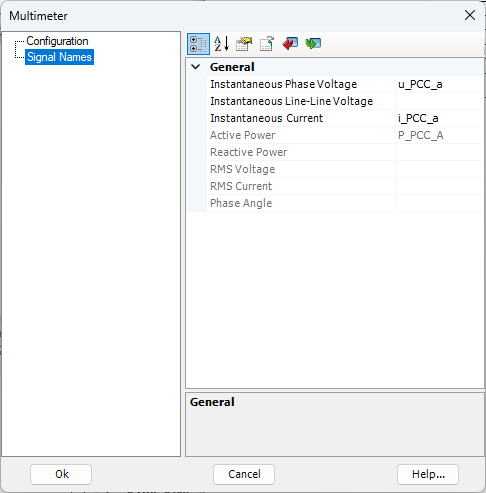

    PSCAD multimeter signal names pane of the phase a measurement at the PCC.

At this stage, the power system model cannot yet be simulated because the required signals ``u_s_a``, ``u_s_b`` and ``u_s_c`` have not yet been defined. 
These signals will be introduced in a subsequent step. At this point, all required PSCAD components, with the exception of the DLL block, have been added to the model. 
The DLL can now be imported and integrated into the PSCAD model.

Importing the DLL to PSCAD via the self developed importer
----------------------------------------------------------

1. Importing
^^^^^^^^^^^^
PSCAD does not natively provide an interface for integrating IEC 61400-27 DLLs. 
Therefore, a dedicated importer was developed in parallel to this project. 
The importer is available in the repository `PSCAD-import-tool-for-IEC-61400-27-DLLs <https://github.com/Institute-of-Electrical-Energy-Systems/PSCAD-import-tool-for-IEC-61400-27-DLLs/tree/main>` and is included as a submodule within the repository. 
The executable file `IEC_DLL_PSCAD_Import_Tool.exe` is located in the PSCAD directory.

To start the importer, double-click the executable file. This opens a Python-based Tkinter graphical user interface. 

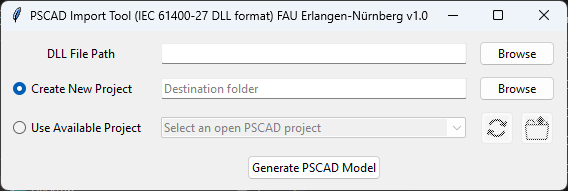

    GUI of the PSCAD IEC 61400-27 DLL importer.

The first step is to select the IEC 61400-27 DLL to be imported. The DLL path can either be selected using the `Browse` button or entered manually.

The importer provides two options for integrating the DLL. 
A new PSCAD project can be created with the imported DLL automatically added as the first component. 
Alternatively, the DLL can be integrated into an existing PSCAD project. When this option is selected, the importer displays all PSCAD projects available for import.

In this example, the existing PSCAD project is selected, as the required model has already been created in the previous steps.

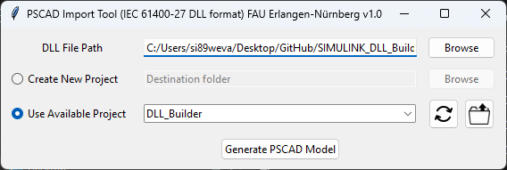

    Filled GUI of the PSCAD IEC 61400-27 DLL importer.

By clicking ``Generate PSCAD Model`` the IEC Block generation process is triggered and results in a new block in your PSCAD model as well as a f90 wrapper within your projects resources. 

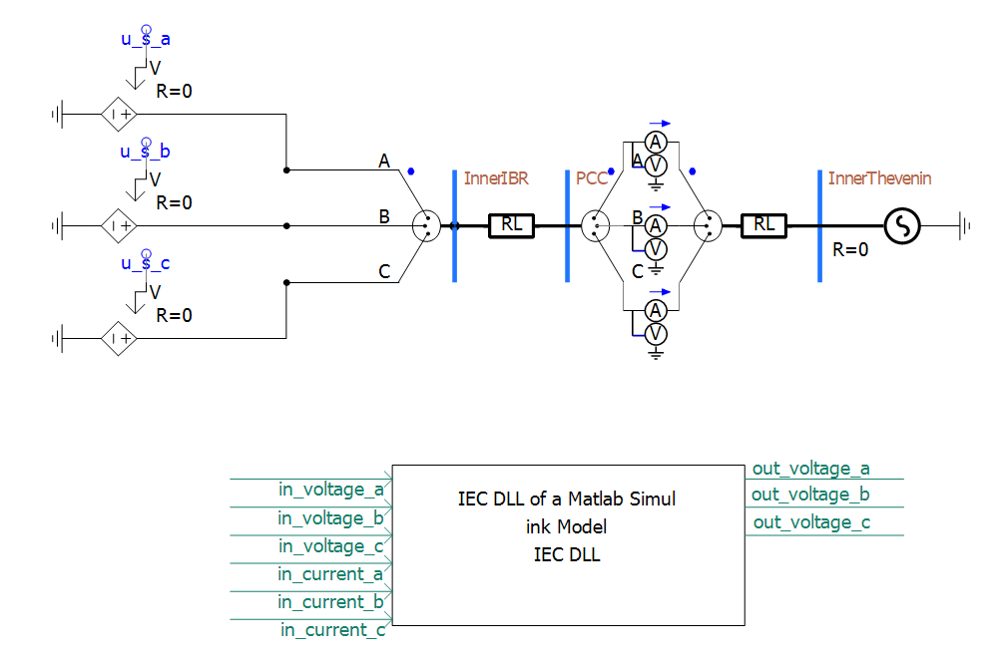

    IEC DLL Model Block for the control of the IBR in a SMIB configuraiton containing the DLL relevant measurements in PSCAD.

At this stage, the DLL is not yet operational, as the measured signals and the calculated voltage signals have not yet been connected to the model. 
The next step is therefore to establish the required signal connections between the DLL and the voltage source.

2. Binding to the model 
^^^^^^^^^^^^^^^^^^^^^^^
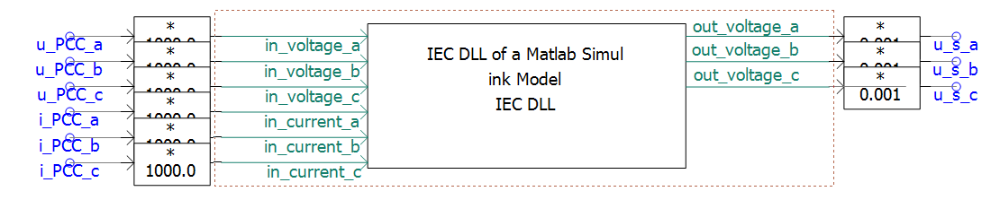

    Connection of the PSCAD signals to the IEC DLL Model Block in PSCAD.    

The next step is to connect the signals from the PCC measurement points to the IEC 61400-27 DLL. 
It is important to note that the DLL expects voltage and current values in volts and amperes, respectively, whereas PSCAD uses kilovolt and kiloampere. 
Therefore, the measured quantities must be converted to the units required by the DLL before being passed to it.

The same principle applies to the connection between the DLL and the regulated DC voltage sources. 
The DLL provides the calculated voltage signals in volts, while PSCAD expects the input values in kilovolts. 
Consequently, the voltage signals must also be converted before being connected to the voltage sources.

3. Optional: Changing parameters and initial values. 
^^^^^^^^^^^^^^^^^^^^^^^^^^^^^^^^^^^^^^^^^^^^^^^^^^^^
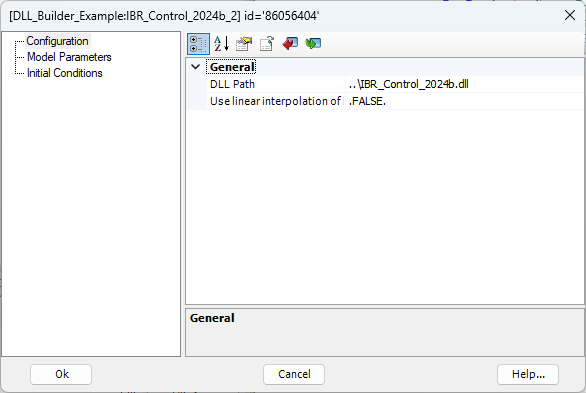

    Configuration pane of the IEC 61400-27 DLL PSCAD block.

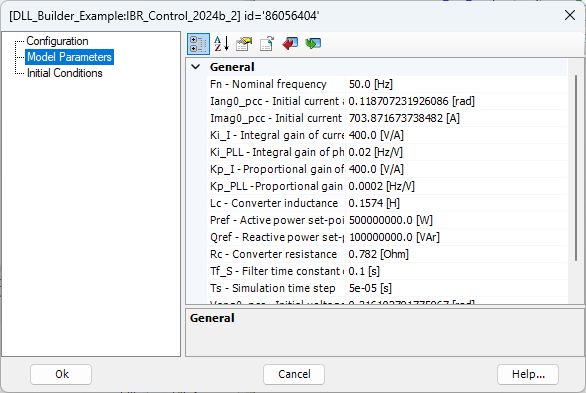

    Model Parameters pane of the IEC 61400-27 DLL PSCAD block.

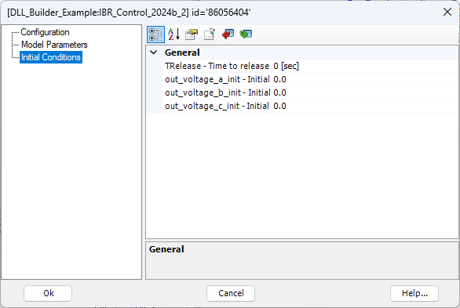

    Initial Conditions pane of the IEC 61400-27 DLL PSCAD block.

By double-clicking the created DLL block, the externally editable attributes of the DLL can be configured. The interface provides three menus for this purpose.

The ``Configuration`` menu contains the basic DLL settings. 
Here, the DLL path can be specified and interpolation can be enabled or disabled. 

The ``Model Parameters``, in contrast, directly influence the behavior of the inverter model. 

The ``Initial Conditions`` can be used to define the initial values applied up to the specified ``TRelease`` time. 
However, these settings are of limited relevance for the application described in this document.

The example model is provided with an initial set of parameters derived from the Simulink model presented in this document.

Simulation using the IEC 61400-27 DLL Block 
------------------------------------------------------

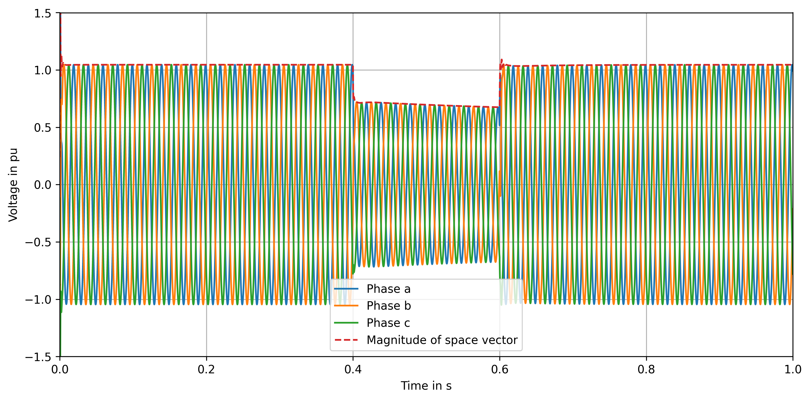

      Figure 56: Phase voltages at the PCC and the amplitude of the voltage space vector.

   
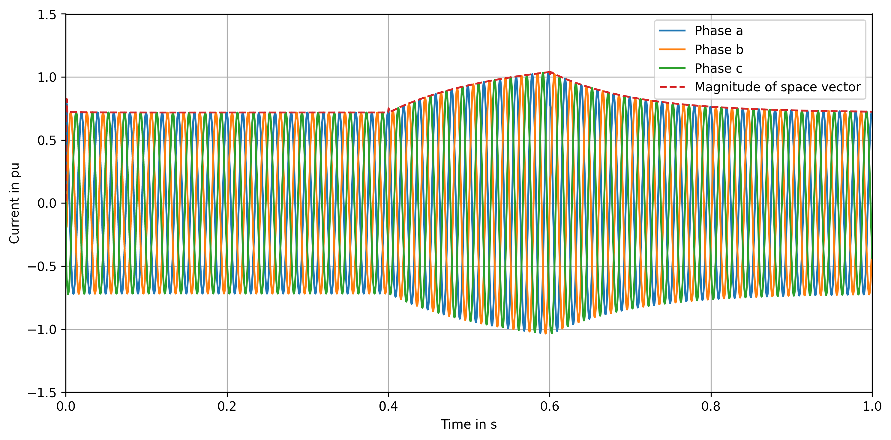

      Figure 57: Phase currents of branch Z_IBR and the amplitude of the current space vector.

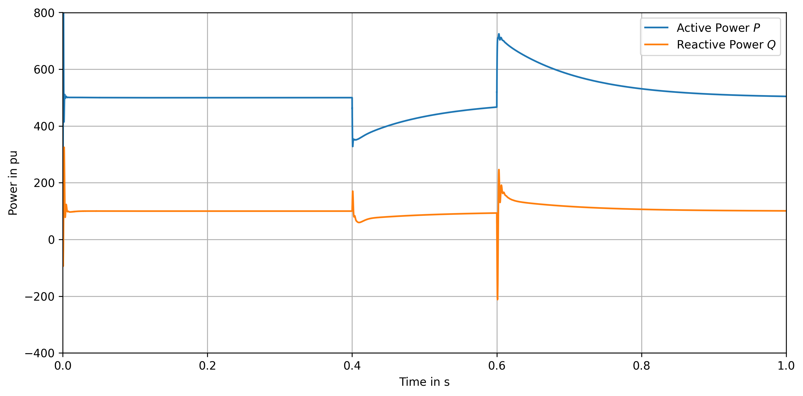

      Figure 58: Active and reactive power at the PCC.