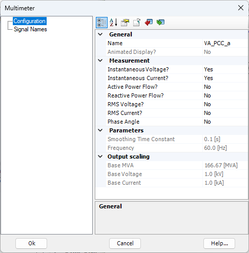
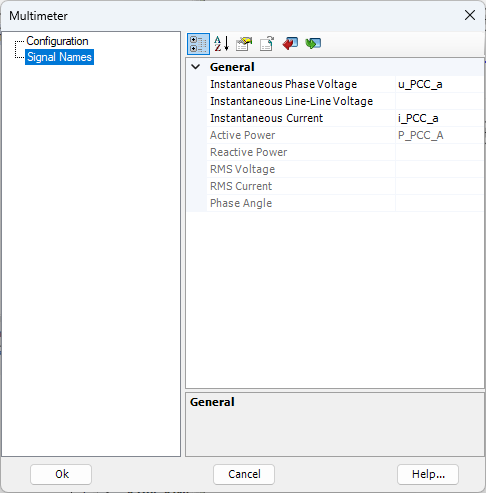

############
DLL in PSCAD
############

This chapter provides a step-by-step description of the integration and use of an IEC 61400-27 DLL in PSCAD. 
The required prerequisites, including the necessary software and supported software versions, are presented first. 
The chapter then describes the configuration of the example grid model and the integration of the IEC 61400-27 DLL. 
An empty PSCAD project is used as the starting point for the model implementation.

Prerequisites
-------------
- PSCAD Version 5.x (tested for PSCAD v5.0.2)
- Intel Fortran Compiler (Installation instruction can be found `here <FEHLT>`)
- IEC 61400-27 DLL (e.g. the one from the `example <FEHLT>`)

Builing a model for later DLL integration from scratch 
------------------------------------------------------
The final model consists of a regulated ideal voltage source and an internal resistance connected at the point of common coupling (PCC). 
The PCC is supplied by a Thevenin equivalent representing the upstream grid. 
The individual components are added and configured step by step, starting from the blank PSCAD project.

1. Builing a thevenin equivalent
^^^^^^^^^^^^^^^^^^^^^^^^^^^^^^^^
..  figure:: ./images/TheveninPSCAD.png
    :alt: Thevenin equivalent connect to PCC in PSCAD.

    Thevenin equivalent connect to PCC in PSCAD.

By definition, a Thevenin equivalent consists of an ideal voltage source and a series-connected internal impedance. 
In this model, the ideal voltage source applies a voltage of 1 p.u. to the bus at its terminals (“InnerThevenin”). 
For the example considered here, this corresponds to a line-to-line RMS voltage of 400 kV with a phase angle of 0°.

The internal impedance determines the short-circuit power, and therefore the strength, of the upstream grid. 
In the present example, the impedance is defined by a resistance of R = 10.6137 Ω and an inductance of L = 0.3378455 H.

A simulation can already be performed using these two components alone. 
However, such a simulation is of limited significance, as the Thevenin equivalent only provides the voltage supply at the PCC without representing any connected equipment or grid interaction.

2. Building the external controlled voltage source (Grid following IBR)
^^^^^^^^^^^^^^^^^^^^^^^^^^^^^^^^^^^^^^^^^^^^^^^^^^^^^^^^^^^^^^^^^^^^^^^
..  figure:: ./images/SMIB_IBR_PSCAD.png
    :alt: IBR in a SMIB configuraiton in PSCAD.

    IBR in a SMIB configuraiton in PSCAD.

The regulated ideal voltage source is now connected to the PCC through a series impedance, thereby forming the equivalent circuit of a grid-following IBR.

The voltage source consists of three independent single-phase DC voltage sources. 
This configuration is necessary because the DLL will later provide the three-phase carrier signal as three sinusoidal signals. 
The regulated DC voltage sources allow these signals to be directly applied to the simulation and used to represent the three-phase voltage at the PCC.

In the present example, the DLL provides a line-to-line RMS voltage of 400 kV. 
Therefore, no additional transformer is required, and only the internal impedance of the IBR needs to be represented. 
The impedance is defined by a resistance of R = 0.782 Ω and an inductance of L = 0.1574 H.

At this stage, the power system model cannot yet be simulated because the required signals ``u_s_a``, ``u_s_b`` and ``u_s_c`` have not yet been defined. 
These signals will be introduced in a subsequent step.

3. Adding the necessary measurements for the DLL
^^^^^^^^^^^^^^^^^^^^^^^^^^^^^^^^^^^^^^^^^^^^^^^^
..  figure:: ./images/PSCADMeasurementmodel.png
    :alt: IBR in a SMIB configuraiton containing the DLL relevant measurements in PSCAD.

    IBR in a SMIB configuraiton containing the DLL relevant measurements in PSCAD.

The next step is to measure the PCC signals (line-to-ground voltages and current) that will subsequently be used by the DLL for control purposes. 
To achieve this, three single-phase multimeters are added to the model, one for each phase. 
The measurement names for the phase-to-ground voltage and current are then defined for each phase.

    PSCAD multimeter configuration pane of the phase a measurement at the PCC.

    

    PSCAD multimeter signal names pane of the phase a measurement at the PCC.

At this stage, the power system model cannot yet be simulated because the required signals ``u_s_a``, ``u_s_b`` and ``u_s_c`` have not yet been defined. 
These signals will be introduced in a subsequent step.