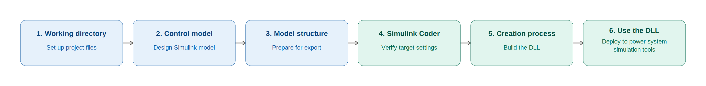
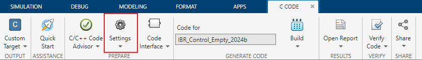
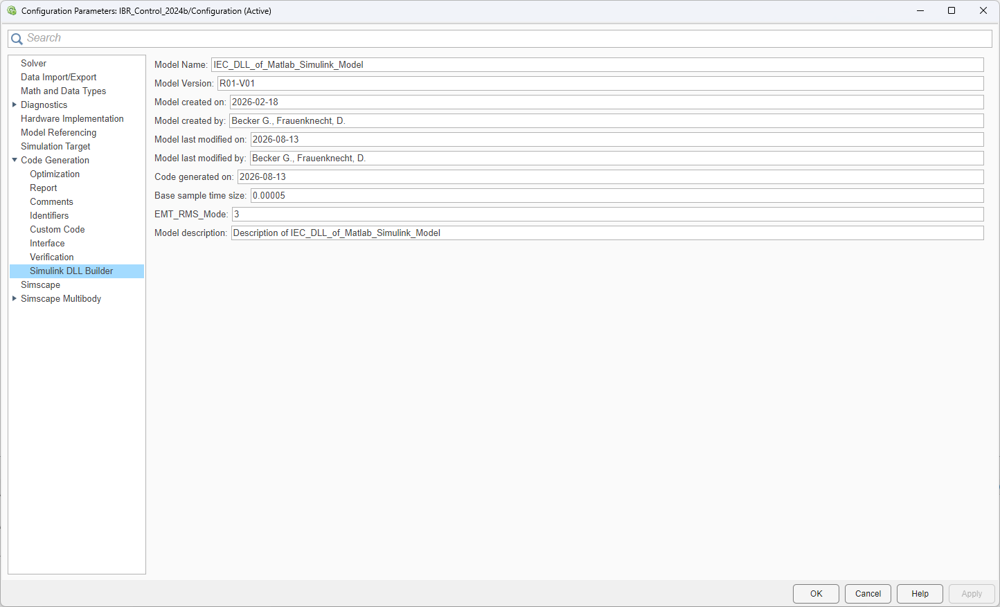

################
General Workflow
################

The IEC 61400-27 DLL Builder converts a Simulink-based model (e.g., a converter control model) 
into a standardized, self-contained DLL that can be used as an external model in power system 
simulation tools such as PSS®NETOMAC, DIgSILENT PowerFactory, or PSCAD™.

The complete process consists of six consecutive steps, which build on one another and are 
described in detail in the corresponding chapters of this documentation.

   Overview of the six-step workflow of the IEC 61400-27 Builder.

.. note::

   The six steps are intended to be executed in the given order. Skipping a step, or executing 
   steps out of order, is a common source of build errors later in the process 
   (see :doc:`troubleshooting` for a list of known issues).

The six steps are:

#. Preparing the working directory
#. Building a Simulink model
#. Adjusting the Simulink model structure for the export process
#. Preparing the Simulink Coder
#. Starting the creation process
#. Using the created DLL file

Prerequisites
-------------
- Matlab/Simulink
- Simulink Coder Toolbox 

1. Preparing the Working Directory
-----------------------------------

Before any modeling work can begin, a correctly structured working directory must be set up. 
The working directory is the folder from which the Simulink model is opened and in which the
Simulink Coder later searches for the System Target File, the Target Language Compiler (TLC)
files, and all supporting header and source files.

The recommended and simplest way to obtain the complete working directory is by cloning the 
project repository. This ensures that all required files are available in the correct folder 
structure and that the latest revisions are used.

.. code-block:: console

    git clone <repository-url>

The following files and folders must be present in (or copied into) the working directory:

+-----------------------------------+------------------------------------------------------------------------------------------------------------------------------+
| File                              | Function                                                                                                                     |
+===================================+==============================================================================================================================+
| `IEC61400_27_DLL.tlc`             | System Target File that controls the Simulink code generation process and the creation of the controller DLL.                |
+-----------------------------------+------------------------------------------------------------------------------------------------------------------------------+
| `IEC61400_27_DLL.tmf`             | Template makefile used during the compilation and linking of the generated C code.                                           |
+-----------------------------------+------------------------------------------------------------------------------------------------------------------------------+
| `IEC61400_27_DLL_make_rtw_hook.m` | Build hook executed after code generation and before the DLL is built. It exports the parameter descriptions, units, and     |
|                                   | limits to `ParameterMetadata.tlc` by invoking `getParamMetadataRTW.m`.                                                       |
+-----------------------------------+------------------------------------------------------------------------------------------------------------------------------+
| `getParamMetadataRTW.m`           | MATLAB script that implements the export of the parameter metadata.                                                          |
+-----------------------------------+------------------------------------------------------------------------------------------------------------------------------+
| `ext_simenv_capi.h`               | C API header that defines the IEC 61400-27 interface every generated DLL must implement.                                     |
+-----------------------------------+------------------------------------------------------------------------------------------------------------------------------+
| `ext_simenv_types.h`              | C API header that defines the data types used by the IEC 61400-27 interface.                                                 |
+-----------------------------------+------------------------------------------------------------------------------------------------------------------------------+
| `sfun_info.mexw64`                | Compiled S-Function that triggers `sfun_info.tlc` during code generation.                                                    |
+-----------------------------------+------------------------------------------------------------------------------------------------------------------------------+
| `sfun_info.tlc`                   | The TLC file generates the additional C source required for the controller DLL.                                              |
+-----------------------------------+------------------------------------------------------------------------------------------------------------------------------+

.. note:: 

   The ``sfun_info.c`` file contains the source code corresponding to the compiled ``sfun_info.mexw64`` 
   file and is therefore only required if modifications to the source code are necessary. It is of 
   secondary importance for the actual build process.

Once the directory is prepared, it should contain everything required by the subsequent steps without 
any additional files needing to be added manually — with the exception of the actual Simulink model 
and its parameter script, which are created in step 2.

2. Building a Simulink Model
----------------------------

In this step, the actual Simulink model is designed — or an existing model (e.g. the IBR control) is 
extended or modified — inside Simulink.

This step typically comprises two parallel activities:

Designing the Simulink model
^^^^^^^^^^^^^^^^^^^^^^^^^^^^

The model to be exported is implemented or adapted as a standard Simulink model, using the block libraries 
and modeling conventions established for the project.

The model may represent any type of dynamic system or component that is intended to be integrated into a 
power system simulation environment. Examples include converter control systems, electrical or mechanical 
components, grid-forming or grid-following models, protection functions, measurement and filtering systems, 
or combinations of these elements. An existing Simulink model can also be used as a starting point and 
extended or modified as required.

During this step, the model is developed with its intended simulation behaviour in mind. The model should 
be functionally complete and produce the expected results when simulated in Simulink. At this stage, however, 
no special modifications for the DLL export process are required; the structural requirements for export are 
addressed in step 3.

Creating the Parameter Script
^^^^^^^^^^^^^^^^^^^^^^^^^^^^^

In parallel to the model itself, a MATLAB parameterization script (for example ``IBR_Control_Parameters.m``) is 
created or adapted. This script is responsible for defining and initializing the parameters required by the 
Simulink model.

Depending on the type of model, the parameter script may, for example:

- define the electrical or mechanical system and its operating conditions,
- define ratings, impedances, setpoints, and other model-specific parameters,
- perform steady-state or load-flow calculations to determine the desired operating point,
- compute consistent initial conditions for model states, and
- calculate model-specific gains, time constants, or other derived parameters for the selected simulation step size.

All model parameters that are intended to be configurable in the generated DLL must be defined as 
`Simulink.Parameter <https://de.mathworks.com/help/simulink/slref/simulink.parameter.html>`_ objects 
rather than ordinary MATLAB variables.

In addition to the parameter value, the following metadata can be assigned to each parameter:

- minimum value,
- maximum value,
- unit, and
- description.

During the DLL build process, this metadata is automatically extracted and exported together with the parameter 
definitions. It is therefore available to applications that interface with the generated DLL.

.. seealso::

   A complete, worked example of such a parameter script is given in :ref:`example-usage`, using 
   ``IBR_Control_Parameters.m`` as a reference implementation.

At the end of this step, the result is a functionally correct, simulatable Simulink model together with a consistent 
and complete parameter set in the MATLAB base workspace.

At this point, the model is **not yet** prepared for DLL export — this is the purpose of step 3.

3. Adjusting the Simulink Model Structure for the Export Process
----------------------------------------------------------------

A dynamic model that simulates correctly in Simulink is not automatically ready to be exported as a DLL. 
Before code generation can be started, the model structure must be adapted so that the Simulink Coder and the
metadata extraction process can interpret it correctly.

This step consists of three sub-tasks:

Adding the Model Information Module
^^^^^^^^^^^^^^^^^^^^^^^^^^^^^^^^^^^

The IEC 61400-27 DLL-specific information is provided through the dedicated ``sfun_info`` block included in the model. 
This block is an integral part of the DLL export process and is required for the generation of the IEC 61400-27-compliant C code.

During code generation, the ``sfun_info`` block triggers the corresponding ``sfun_info.tlc`` file. The TLC code uses the 
information provided by the block to assemble the additional C structures and source code required for the IEC 61400-27 DLL 
interface. The generated C code is subsequently compiled and linked together with the C code generated from the Simulink model 
to create the final DLL.

The block therefore does not represent a simulation function of the model itself. Instead, it provides information required 
during the code-generation process and ensures that the generated DLL contains the necessary IEC 61400-27 interface structures.

To add the block, open model_info.mdl from the working directory and
copy the sfun_info block into the top level of the controller model.

Converting Tunable Parameters to Simulink.Parameter Objects
^^^^^^^^^^^^^^^^^^^^^^^^^^^^^^^^^^^^^^^^^^^^^^^^^^^^^^^^^^^

Only variables of type `Simulink.Parameter <https://de.mathworks.com/help/simulink/slref/simulink.parameter.html>`_ in the base 
workspace are recognized by the metadata extraction of the IEC 61400-27 DLL Builder. All parameters that should be tunable from 
the external simulation environment must therefore be converted from ordinary MATLAB variables into 
`Simulink.Parameter <https://de.mathworks.com/help/simulink/slref/simulink.parameter.html>`_ objects, typically at the end of 
the parameter script created in step 2.

Defining the Top-Level In-/Outports
^^^^^^^^^^^^^^^^^^^^^^^^^^^^^^^^^^^

The generated DLL communicates with the external simulation environment exclusively through the fixed C API declared in 
``ext_simenv_capi.h``. Consequently, every signal that must be accessible externally has to be exposed as a top-level 
``Inport`` or ``Outport`` block:

- Signals buried inside subsystems are **not** picked up by the code generator.
- Port names become the ``Name`` field returned by ``Model_GetInfo()`` and should therefore be descriptive and stable.
- Port ordering determines the layout of the flat ``ExtU``/ ``ExtY`` vectors in the generated code and must be agreed upon with 
  the target simulation environment.
- All port data types should be kept as ``double`` to match the ``real64_T`` pointers used by the C API.

.. note::

   These three sub-tasks are typically performed once per model and only
   need to be repeated when the Simulink model's parameter set or its
   external interface (inputs/outputs) changes.

4. Preparing the Simulink Coder
-------------------------------

Once the model structure has been finalized, the Simulink Coder App is
opened from the Simulink toolbar in order to configure the code
generation process.

.. figure:: ./images/GeneralWorkflow/SimulinkCoder.png
   :alt: Opening the Simulink Coder App

   Opening the Simulink Coder App.

The key configuration step is verifying the **System Target File**
selected under *Settings → Code Generation*:

   Opening the Simulink Coder settings.

.. figure:: ./images/GeneralWorkflow/SimulinkCoderSettingsCodeGeneration.png
   :alt: Code Generation tab

   Selecting the Code Generation tab.

The System Target File must be set to ``IEC61400_27_DLL.tlc``, which must be available in the working directory prepared in 
step 1. If a different target file is selected, it must be changed accordingly before proceeding — otherwise the build will 
not produce a DLL compatible with the IEC 61400-27 external model interface.

Selecting this system target file adds a new menu item, ``Simulink DLL Builder``, to the Simulink menu bar. 
Clicking this menu item opens the metadata dialog, which is pre-populated with the default values of the example. 
These values must be reviewed and adjusted as required for the specific model.

   Filling the Model/DLL Metadata necessary for the DLL Code generation process.

5. Starting the Creation Process
--------------------------------

With the correct target file selected, the build process is started by clicking **Build** in the Simulink Coder App.

.. figure:: ./images/GeneralWorkflow/SimulinkCoderBuild.png
   :alt: Starting the code generation process

   Starting the code generation process.

Depending on the size of the model and the performance of the local system, the build may take anywhere from a few seconds 
to several minutes. During this process, the compiler and linker — configured via ``IEC61400_27_DLL.tmf`` — generate the 
C code from the model, compile it, and link it into the final binary output.

.. note::

   If the corresponding DLL is currently in use by a DIgSILENT PowerFactory project or within the Import Tool for PSCAD 
   (e.g. while updating a control model), ensure that the project is deactivated / the import tool is closed before starting 
   the build process, otherwise the build may fail because the file is locked.

If the build fails, refer to :doc:`troubleshooting` for a list of known
issues and possible solutions.

6. Using the Created DLL File
---------------------------------

After a successful build, three output files are produced in the build folder:

``<ModelName>.dll``
    The compiled shared library itself, exporting the functions declared in ``ext_simenv_capi.h`` (``Model_GetInfo``, 
    ``Model_Instance``, ``Model_Outputs``, ``Model_Update``, ``Model_Derivatives``, ``Model_Terminate``, etc.).

``<ModelName>.lib``
    The import library generated alongside the DLL, used by a calling application to resolve the exported symbols at link time.

``<ModelName>.exp``
    The export file produced as a by-product of the linking process, required internally to build the ``.lib`` file.

Together, these three files package the Simulink model — with all of its tunable parameters, its in-/outport interface, and its
metadata — into a self-contained binary that no longer requires MATLAB/Simulink to execute.

Since the resulting binary conforms to the standardized ``ext_simenv_capi.h`` interface, it can be loaded, without modification,
as a custom model into several power system simulation tools, for example:

- **PSS®NETOMAC** — for time-domain and RMS simulation of a converter controller within a larger grid model.
- **DIgSILENT PowerFactory** — as a custom DSL/DLL model representing the IBR controller, e.g. for compliance studies against IEC 61400-27.
- **PSCAD™** — as an external DLL component within an EMT simulation case.

.. important::

   The three files ``.dll``, ``.lib``, and ``.exp`` must be kept together and distributed as a set. The ``.lib``/``.exp`` files alone 
   are not executable, and the ``.dll`` alone may be insufficient if the target environment expects static linking against the import 
   library.
