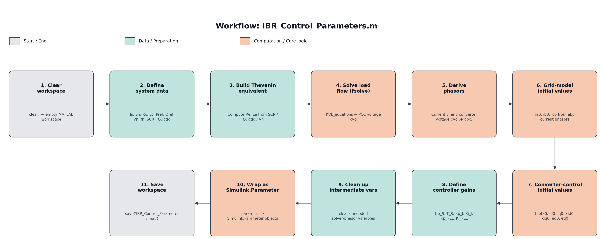
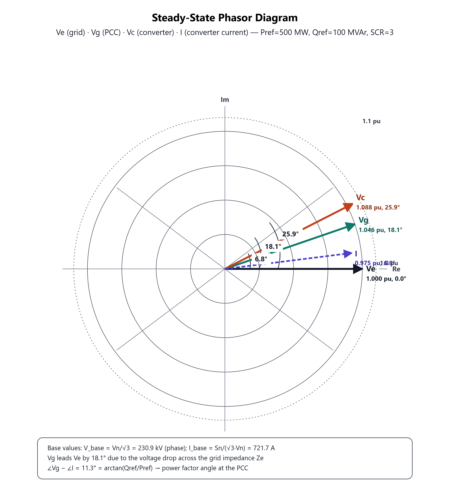
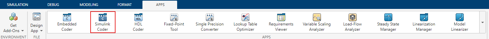
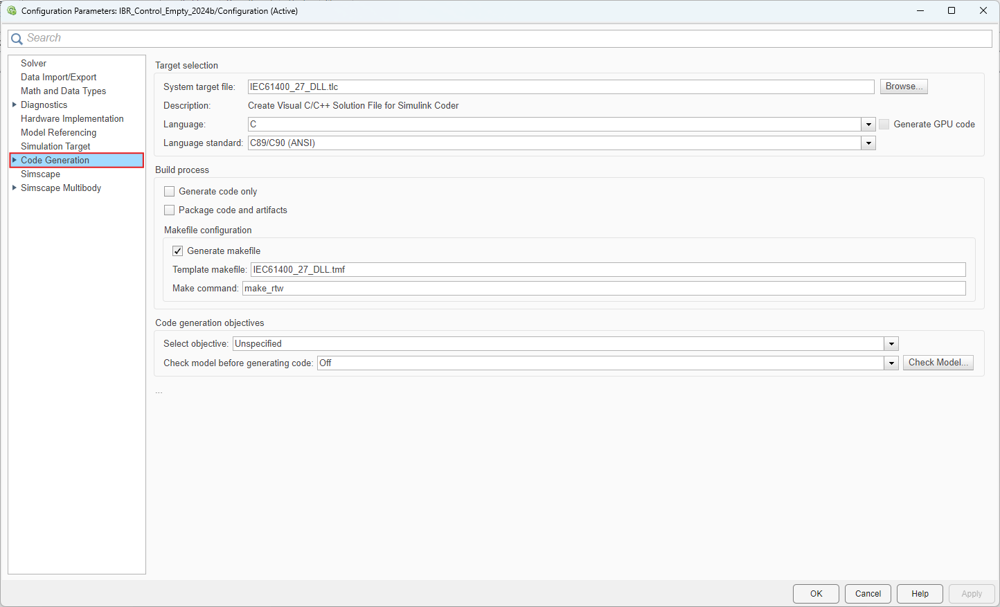
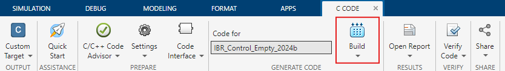

Example Usage
=============

This chapter describes the workflow required to configure, initialize, and build the controller model. The process consists of two major steps: parameter preparation in MATLAB and model execution or code generation using Simulink.

Parameter Preparation (``IBR_Control_Parameters.m``)
----------------------------------------------------

The MATLAB script ``IBR_Control_Parameters.m`` represents the starting point of the complete workflow and must be executed before opening, simulating, or building the Simulink model. Its primary purpose is to generate all controller parameters, compute the required operating point, and initialize the workspace with the data required by the model.

The overall workflow performed by the script is illustrated below:

.. _fig_parameter_workflow:

   Workflow of the parameter initialization process.

Definition of the Electrical System
~~~~~~~~~~~~~~~~~~~~~~~~~~~~~~~~~~~

The script first defines the electrical characteristics of the inverter-based resource (IBR) and the external grid.

The following parameters are specified:

* Converter rated apparent power
* Filter resistance and inductance
* Active and reactive power setpoints
* Nominal grid voltage
* Nominal grid frequency
* Short-circuit ratio (SCR)
* Grid resistance-to-reactance (R/X) ratio

From these values, the equivalent Thevenin representation of the external grid is derived. This electrical model forms the basis for all subsequent steady-state calculations.

Load-Flow Calculation
~~~~~~~~~~~~~~~~~~~~~

After the electrical parameters have been defined, the script determines the steady-state operating point of the converter.

The nonlinear Kirchhoff Voltage Law (KVL) equations implemented in ``KVL_equations`` are solved using MATLAB's ``fsolve`` function. The solution yields the voltage phasor at the Point of Common Coupling (PCC).

Using this voltage, the script calculates

* the converter current phasor,
* the converter terminal voltage,
* and all remaining steady-state electrical quantities.

These quantities define the operating point used for controller initialization.

.. _fig_phasor_diagram:

   Steady-state phasor diagram showing the grid voltage, PCC voltage, converter voltage, and converter current.

Computation of Initial Conditions
~~~~~~~~~~~~~~~~~~~~~~~~~~~~~~~~~

To minimize artificial transients at the beginning of a simulation, the controller is initialized directly at its steady-state operating point.

The calculated phasors are used to determine the initial values of

* the three-phase (``abc``) currents,
* the PLL angle,
* the ``dq`` current components,
* the current-controller integrator states,
* and the voltage feed-forward terms.

Initializing the controller with these values ensures that all internal controller states are consistent with the calculated operating point.

Controller Parameter Calculation
~~~~~~~~~~~~~~~~~~~~~~~~~~~~~~~~

After the operating point has been established, the controller parameters are calculated.

The script computes the gains and time constants for

* the active and reactive power controller,
* the current controller,
* the phase-locked loop (PLL),
* and the associated low-pass filters.

All controller coefficients are calculated using the selected fixed simulation step size ``Ts`` to ensure consistent discrete-time behaviour.

Export of ``Simulink.Parameter`` Objects
~~~~~~~~~~~~~~~~~~~~~~~~~~~~~~~~~~~~~~~~

Once all calculations have been completed, temporary variables are removed from the MATLAB workspace.

Only the parameters required by the controller are converted into ``Simulink.Parameter`` objects and placed in the MATLAB base workspace.

This step is essential for the subsequent code-generation process. The metadata extraction performed by the IEC 61400-27 DLL Builder only recognizes variables of type ``Simulink.Parameter``. Ordinary MATLAB variables are ignored and therefore cannot be exported as tunable parameters.

Workspace Export
~~~~~~~~~~~~~~~~

Finally, all generated parameters are stored in ``IBR_Control_Parameters.mat``.

This file is automatically loaded by the Simulink model, typically via the ``PreLoadFcn`` or ``InitFcn`` callback, ensuring that the required parameters are available whenever the model is opened.

.. note::

   Execute ``IBR_Control_Parameters.m`` whenever a model parameter has been modified. During normal operation, the Simulink model loads the previously generated MAT-file automatically.

The Simulink Model — (IBR_Control_2024b.slx / IBR_Control_Empty_2024b.slx) files
--------------------------------------------------------------------------------
.. error::

    @Domi kannst du das ergänzen also ne kleine Beschreibung der Regelung

Preparing the Simulink Model for the DLL Build process
------------------------------------------------------

Model Information Module
~~~~~~~~~~~~~~~~~~~~~~~~~

Before the model is built, it should contain a dedicated **information block**
that documents the model to anyone opening it in Simulink — independent of the
generated DLL's own metadata.

In this project the info block is implemented as an (almost) empty Level-2
S-Function, ``sfun_info`` (``sfun_info.c``, compiled to ``sfun_info.mexw64``).
It deliberately has:

* no input ports,
* no output ports,
* no states, and
* no sample-time-dependent logic.

Its sole purpose is to act as a carrier block: it is placed on the canvas with
a custom mask/icon (``info_icon.JPG``) and associated documentation
(``model_info.mdl``) that display information such as model version, author,
last-modified date, and a short description directly inside the block
diagram. Because the S-function has no functional ports, it has zero effect
on simulation behaviour or on the generated code's input/output interface —
it exists purely for human-readable documentation at the model level.

**Steps to add the module to a new model:**

1. Copy the ``sfun_info`` block (with its mask and icon) into the top level
   of the model.
2. Open the mask and fill in the metadata fields (version, description,
   author, modification history).
3. Do **not** connect any signals to it — it must remain a standalone,
   unconnected block so that it is excluded from the generated I/O interface.

Defining the In-/Outports
~~~~~~~~~~~~~~~~~~~~~~~~~

The generated DLL communicates with the external simulation environment
through a fixed C API, defined in ``ext_simenv_capi.h``. Two structures are
central to this interface:

.. code-block:: c

   typedef struct
   {
       const char_T * const  Name;       // Input signal name
       const char_T * const  BlockPath;  // Path to block in Simulink model
       const int32_T         Width;      // Signal width
   } StaticESEInputSignal;

   typedef struct
   {
       const char_T * const  Name;       // Output signal name
       const char_T * const  BlockPath;  // Path to block in Simulink model
       const int32_T         Width;      // Signal width
   } StaticESEOutputSignal;

At build time, the code generator populates ``NumInputPorts`` /
``InputPortsInfo`` and ``NumOutputPorts`` / ``OutputPortsInfo`` in the static
model-info structure (``StaticExtSimEnvCapi``) directly from the top-level
**Inport** and **Outport** blocks of the model. This means the in-/outports
must be defined carefully so the generated interface is meaningful to the
calling simulation environment:

* Every signal that the external environment needs to write to or read from
  the model must be exposed as a top-level ``Inport``/``Outport`` block —
  signals buried inside subsystems are not picked up.
* The **block name** of each port becomes the ``Name`` field used by
  ``Model_GetInfo()`` — choose descriptive, stable names, since external
  tooling may bind to them by name rather than by index.
* The **signal width** set on the port directly becomes the ``Width`` field;
  vector signals are supported, so a three-phase quantity can be exposed as
  a single width-3 port instead of three scalar ports.
* Port **ordering** matters: ``ExtU_<model>_T`` / ``ExtY_<model>_T`` in the
  generated code are flat vectors, with each port's values placed
  back-to-back in the order the ports appear in the model — the external
  environment must agree on this ordering (typically alphabetically by port
  name, or by port number, depending on the target's TLC implementation).
* Data types on all in-/outports should be kept as ``double`` (``real64_T``)
  to match the ``real64_T *ExtU_<model>_T`` / ``real64_T *ExtY_<model>_T``
  pointers in ``InstanceExtSimEnvCapi`` — mixed-type ports would require
  additional casting logic in the generated code.

Starting the DLL Build process
------------------------------
The DLL build process is started from the Simulink toolbar by Opening the App **Simulink Coder** App.

.. _simulinkcoder:

   Chose the Simulink Coder App.

Settings
~~~~~~~~

Before generating the code, it is recommended to verify that the correct **System Target File** is selected.
The target file should be ``IEC61400_27_DLL.tlc``, which must be available in your working directory (see :doc:`How_to_use`).

To check this, open **Settings** in the Simulink Coder App and navigate to **Code Generation**

.. _simulinkcodersetting:

.. figure:: images/SimulinkCoderSettings.png
   :align: center  
   :width: 50% 

   Chose the Simulink Coder Settings.

.. _simulinkcodersettingcodegeneration:

   Chose the Code Generations Tab.

If the selected **System Target File** is not ``IEC61400_27_DLL.tlc``, please change it accordingly. 
This ensures that the model is built using the correct code generation process.

Build
~~~~~

Once the correct settings have been verified, click **Build** in the **Simulink Coder** App to start the DLL generation process. 
Depending on the model size and your system configuration, the build process may take a few moments to complete.
If you encounter an error, please refer to :doc:`troubleshooting` for a list of known issues and possible solutions.

.. _simulinkcodersettingcodegenerationbuild:

   Start the code generation process.

.. note:: 

    If the corresponding DLL is currently in use by a DIgSILENT PowerFactory project (e.g. while updating your control model), ensure that the project is deactivated before starting the build process.

Build Output & Target Simulation Environments
---------------------------------------------

After a successful build, the compiler and linker (as configured via
``IEC61400_27_DLL.tmf``) produce three output files in the build folder:

* ``IBR_Control_Empty_2024b.dll`` — the compiled shared library itself,
  exporting the functions declared in ``ext_simenv_capi.h``
  (``Model_GetInfo``, ``Model_Instance``, ``Model_Outputs``, ``Model_Update``,
  ``Model_Derivatives``, ``Model_Terminate``, etc.).
* ``IBR_Control_Empty_2024b.lib`` — the import library generated alongside
  the DLL, used by a calling application to resolve the exported symbols at
  link time (relevant if the host environment links against the DLL
  statically rather than loading it dynamically via ``LoadLibrary``).
* ``IBR_Control_Empty_2024b.exp`` — the export file produced as a
  by-product of the linking process; it lists the exported symbols and is
  required internally to build the ``.lib`` file.

Together, these three files are the actual **deliverable** of the build
process: they package the Simulink control model — with all of its tunable
parameters, in-/outport interface, and metadata — into a self-contained
binary that no longer requires MATLAB/Simulink to execute.

This ``.dll``/``.lib``/``.exp`` triple conforms to the standardized external
model interface (``ext_simenv_capi.h``), which is understood by several
power system simulation tools. In particular, the resulting DLL can be
loaded as a custom model into:

* **NETOMAC** — for time-domain and RMS simulation of the converter
  controller within a larger grid model.
* **DIgSILENT PowerFactory** — as a custom DSL/DLL model representing the
  IBR (Inverter-Based Resource) controller, e.g. for compliance studies
  against IEC 61400-27.
* **PSCAD** — as an external DLL component within an EMT simulation case.

Since all three tools communicate with the model exclusively through the
fixed C API (static model info via ``Model_GetInfo()``, per-instance I/O and
parameters via ``InstanceExtSimEnvCapi``), the same build output can be
reused across all of them without modification — provided the host
environment is able to resolve the exported ``__cdecl`` functions from the
DLL (or link against the accompanying ``.lib``).

.. note::
   All three files (``.dll``, ``.lib``, ``.exp``) should be kept together and
   distributed as a set; the ``.lib``/``.exp`` files alone are not
   executable, and the ``.dll`` alone may be insufficient if the target
   environment expects static linking against the import library.