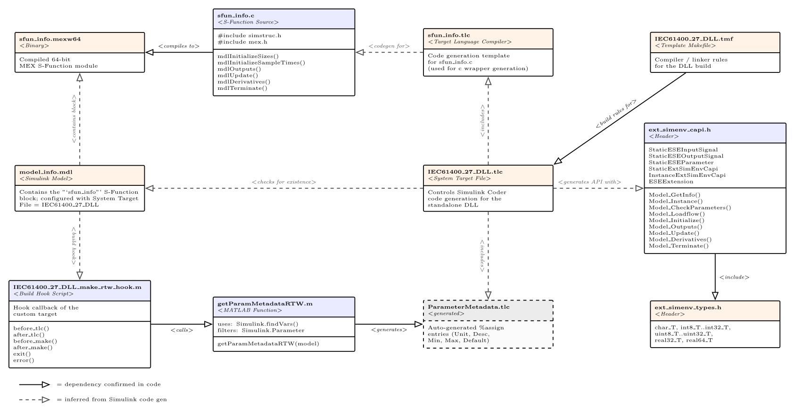

# Summary
The Simulink IEC 61400-27 DLL Builder is an open-source tool that automates the generation of dynamic-link libraries (DLLs) compliant with the IEC 61400-27 interface. Integrated into MATLAB®/Simulink®, it enables control models developed in Simulink to be exported as DLLs and integrated into compatible power system simulation tools, including PSCAD™, DIgSILENT PowerFactory, and PSS®NETOMAC. The Builder automates the integration of C code generated by Simulink Coder into the standardized IEC 61400-27 DLL interface. It generates the required interface code and transfers relevant model and parameter information, eliminating the need for manual reimplementation of the control structure in the target simulation tool. The resulting DLL can be used as a self-contained black-box model, allowing control systems to be integrated without exposing their underlying implementation. This enables the same control model to be reused across different simulation tools while maintaining a consistent implementation. The Builder therefore facilitates model portability and interoperability and supports the reproducible and comparable use of control models in power system simulation.

# Statement of need
The increasing complexity of modern electrical grids has created a growing need for simulation tools capable of accurately analyzing dynamic grid behavior, including system stability and protection system performance. A wide range of power system simulation tools is available, with individual tools differing substantially in their modeling capabilites, simulation methods, and intended applications. Many of these tools are tailored to specific simulation domains, time scales, and levels of model detail. Consequently, the selection of a simulation tool strongly depends on the objectives of the study and the phenomena that need to be represented. 

For example, PSCAD™ is widely used for electromagnetic transient (EMT) simulations, whereas PSS®E is primarily used for phasor-based (RMS) simulations. Other commercial tools, such as PSS®NETOMAC, DIgSILENT PowerFactory, and NEPLAN®, provide capabilities for both RMS and EMT simulations. Despite these differences, many simulation tools are not primarily designed for the development of control structures, nor do they typically provide mechanisms for exporting such control models for a use in other simulation tools. At the same time, the protection of proprietary control strategies and algorithms has contributed to the widespread use of black-box models. Such models allow the external behavior of a control system to be integrated into a simulation environments without exposing its underlying implementation. A standardized mechanism for exchanging dynamic models is therefore beneficial both for interoperability and for protecting model implementations.  

To facilitate the interoperability and portability of dynamic models across simulation tools and vendors, the International Electrotechnical Commission (IEC) specifies a standardized DLL in IEC 61400-27 Annex F [@iec61400_27_1_2016]. The standard defines the required function names, input and output parameters, and interface of the DLL. The standardized interface enables dynamic models to be exchanged and integrated across compatible simulation tools.

MATLAB®/Simulink® is widely used for the design, development, and validation of control systems, including the control structures of power electronic converters. As a general-purpose modeling tool, MATLAB®/Simulink® benefits from a large user base and a comprehensive toolboxes for implementing control algorithms and mathematical functions. These capabilities make the tool particularly well suited for a rapid prototyping and validation of new component models and control strategies. However, the execution speed of general-purpose modeling tools can become a limiting factor when studying large or computationally complex systems [@4907257]. Exporting control models developed in MATLAB®/Simulink® as C code and integrating them into an IEC 61400-27-compliant DLL can adress this limitation. Nevertheless the generated code, still needs to be integrated into the standardized DLL interface. This integration requires additional implementation effort and knowledge of both the generated code and the target interface.

The Simulink IEC 61400-27 DLL Builder addresses this gap by automating this process. It enables C code generated from a control model developed in MATLAB®/Simulink® to be incorperated into an IEC 61400-27-compliant DLL interface. The resulting DLL can then be directly integrated into compatible simulation tools. Thus, the Builder combines the modeling capabilities of Matlab®/Simulink® with the standardized model interface specified by IEC 61400-27 and enables user-defined control models to be transferred between compatible simulation tools without requiring their manual reimplementation.

# State of the field
Several established approaches exist for integrating control systems into power system simulation tools. A straightforward approach is to manually reimplement a control model developed in MATLAB®/Simulink® directly in the selected power system simulation tool. While this approach can be applied broadyly, it requires considerable implementation effort. Moreover discrepancies may aries between the original and the reimplemented models, making the process susceptible to implementation errors. Maintaining consistency between the two implementations becomes particulary challenging when the original control structure is modified or further developed. In addition, manual reimplementation generally prevents the original model from being treated as a black-box model, as its control structure must be recreated in the target simulation tool.

Another approach for exchaning dynamic models between simulation tools is the Functional Mock-up Interface (FMI) [@2106c10aecf74072908cc1e45e4a8597]. FMI provides a standardized framework for exchanging tool-independent models between different simulation tools. Within this framework, a modeling tool such as MATLAB®/Simulink® can export a dynamic system model as a Functional Mock-up Unit (FMU), which can subsequently be imported and executed by a compatible simulation tool. The FMI-approach is conceptually similar to the approach implemented by the DLL Builder, as the control model is developed in one tool and subsequently integrated into another simulation tool without requiring its manual reimplementation. However, support for FMU-based model integration varies between  power system simulation tools. Within the scope considered here, only a limited number of commonly used simulation tools, such as DIgSILENT PowerFactory, provide support for importing and executing FMUs. Consequently, FMU-based models cannot be directly integrated into simulation tools that do not provide the corresponding FMI functionality.

Some simulation tools, such as PSS®NETOMAC and PSCAD™, also provide mechanisms for integrating user-defined DLLs. These interfaces allow custom models to be implemented in compiled code and integrated directly into the simulation tool. However, such interfaces are generally specific to the respective simulation tool. Consequently, a developer must adapt both the interface and implementation to the requirements of the target simulation software.

A further established approach for integrating control systems with power system simulation is co-simulation. In a co-simulation setup, the power system is simulated by a power system simulation tool, while the control model is simulated by a seperate modeling environment, such as MATLAB®/Simulink®. Each simulation tool calculates its respective model using its own solver. Communication and synchronization between the simulation environments are therefore essential for the proper execution. 

Several concepts can be used to establish this communication. For example, the Functional Mock-up Interface (FMI) provides a standarized framework for co-simulation [@2106c10aecf74072908cc1e45e4a8597], while shared memory approaches can be used for data exchange between simulation tools[@8973964], too. However, co-simulation requires both simulation tools to remain available during the simulation, which can increase the computational and implementation effort. Furthermore, the control model remains separated from the power system simulation tool, meaning that the control model must be executed through the coupled modeling tool rather than being directly integrated into the target simulation tool. Consequently, the control model cannot be provided as a self-contained black-box model that can be directly integrated into the target simulation environment.

# Software design
The design of the Simulink IEC 61400-27 DLL Builder is closely aligned with the code-generation workflow provided by MATLAB®/Simulink® and Simulink Coder. The Builder is implemented as a collection of System Target File, Template Makefile, MATLAB, TLC, and C interface components that extend the standard code-generation process. The design emphasizes modularity and extensibility within the Simulink Coder framework. The working directory required for DLL generation contains the files listed in Table 1.

**Table 1:** Files required for IEC 61400-27 DLL generation.

| **File**                         | **Function**                                       |
|----------------------------------|----------------------------------------------------|
| `IEC61400_27_DLL.tlc`            | System Target File controlling the Simulink code-generation process and the creation of the model DLL. |
| `IEC61400_27_DLL.tmf`            | Template Makefile used during compilation and linking of the generated C code. |
| `IEC61400_27_DLL_make_rtw_hook.m` | Build hook executed after code generation and before the DLL is built. It exports the parameter descriptions, units, and limits to `ParameterMetadata.tlc` by invoking `getParamMetadataRTW.m`. |
| `getParamMetadataRTW.m`          | MATLAB® script implementing the export of parameter metadata. |
| `ext_simenv_capi.h`              | C API header defining the IEC 61400-27 interface that each generated DLL must implement. |
| `ext_simenv_types.h`             | C API header defining the data types required by the IEC 61400-27 interface. |
| `sfun_info.mexw64`               | Compiled S-Function that triggers `sfun_info.tlc` during code generation. |
| `sfun_info.tlc`                  | TLC file generating the additional C source code required for the model DLL. |                                                                                               |

The central component of the build process is IEC61400_27_DLL.tlc, which acts as the entry point for DLL generation. The file is detected by Simulink Coder when it is placed in the MATLAB working directory and selected as the System Target File. After the required DLL metadata have been specified through the Builder's graphical interface, the DLL generation process can be initiated. The relationship between the individual files and their respective functions is illustrated in Figure 1.

During DLL generation, the Simulink Coder uses the Template Makefile (TMF) to generate a makefile defining the compilation, linking, and build process for the Simulink model. Since the target artifact is a DLL, the linking and build steps follow a largely predefined structure. The components provided by the DLL Builder primarily influence the compilation of the generated model code and determine which generated source files are included in the final DLL.

The overall build process is controlled by `IEC61400_27_DLL.tlc`. During code generation, this Target Language Compiler (TLC) file accesses the model information file `model_info.mdl`, which contains metadata associated with the Simulink® model being built, together with the compiled S-Function `sfun_info.mexw64`. This initiates the execution of `IEC61400_27_DLL_make_rtw_hook.m` and `sfun_info.tlc`. 

The `IEC61400_27_DLL_make_rtw_hook.m` script extracts the relevant Simulink® parameter information, including parameter names, values, minimum and maximum limits, and units. This information is stored in `ParameterMetadata.tlc` and is subsequently used during the generation of the C source code implementing the IEC 61400-27 interface.

The generation of this interface source code is performed by `sfun_info.tlc`. This TLC file creates a temporary `IEC61400_27.c` source file that implements the syntactic and semantic requirements defined by IEC 61400-27 Annex F [@iec61400_27_1_2016]. To achieve this, the TLC files combines the extracted parameter information with the generated model code and maps the corresponding Simulink® code methods to the methods defined in the standard.

Once the `IEC61400_27.c` file has been generated, the compilation, linking, and build process is initiated. The generated source files and the required interface files are compiled and linked according to the specifications defined by the TMF and the corresponding build configuration. The resulting output is an IEC 61400-27-compliant DLL that can be integrated into compatible power system simulation tools.

# Research impact statement
The main contribution of the developed tool is the abstraction of control models from specific simulation environments. Models can be exchanged and integrated as black-box components, reducing the dependency between the controller and individual simulation frameworks. This facilitates the reuse of existing models and the transfer of control approaches between different simulation environments.

The tool has already been applied in several research and development projects, as well as in student projects and academic work. Although publications explicitly reporting results obtained with the tool are not yet available, discussions in online forums, open repositories, and with industry partners indicate a recurring need for solutions that support the exchange and reproducible use of control models across simulation environments. The developed approach therefore addresses a practical gap in heterogeneous simulation ecosystems and has the potential to improve the reusability, comparability, and transferability of simulation-based control research [@doi:10.1177/00375497261444678].

# AI usage disclosure
OpenAI ChatGPT was used for language editing, and restructuring suggestions. 
All AI-generated suggestions were reviewed, edited, and validated by the authors before inclusion.

# References
